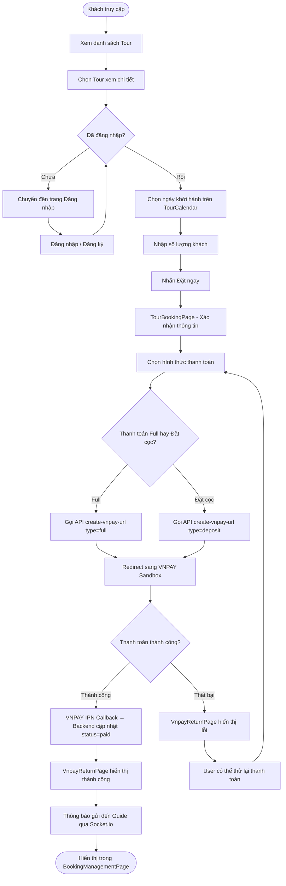
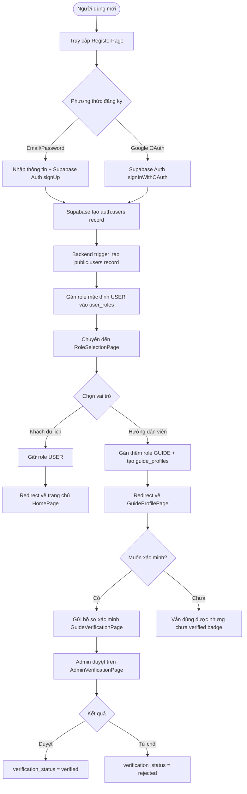
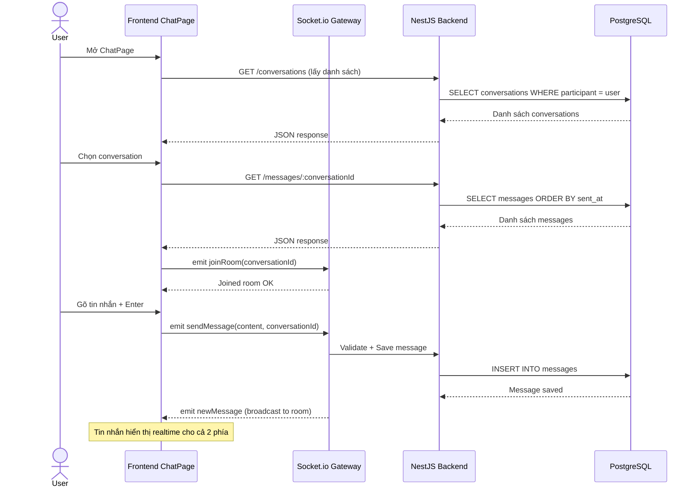
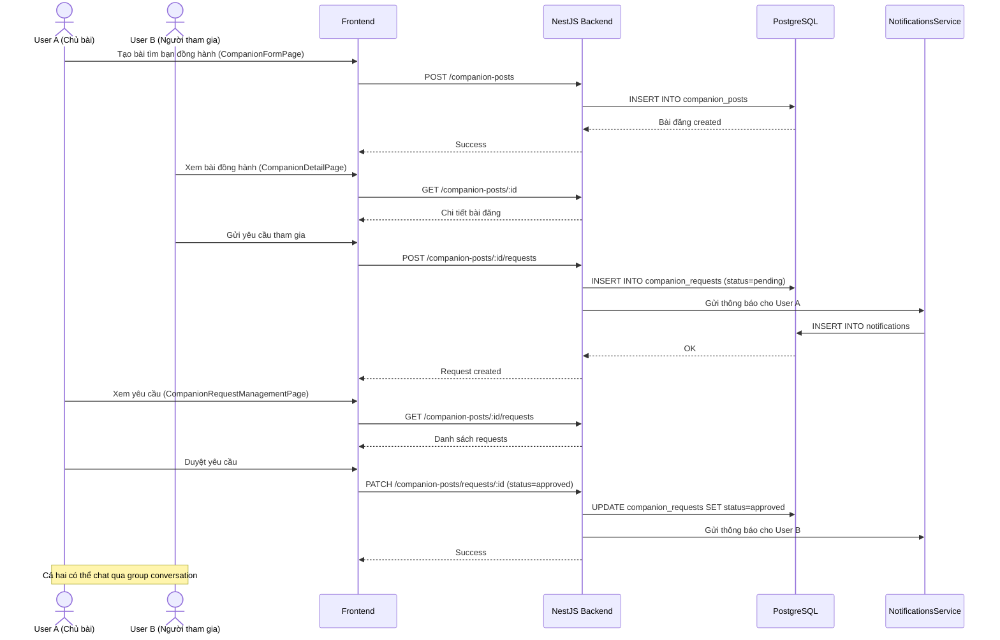
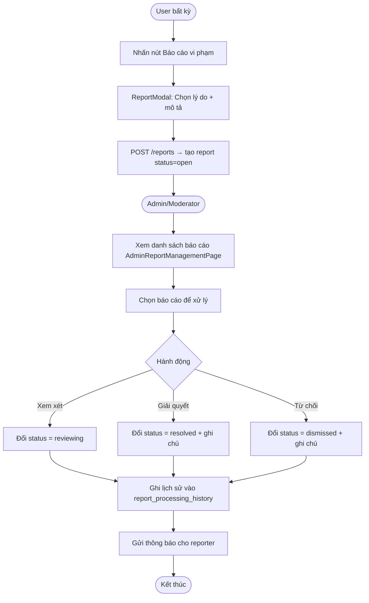
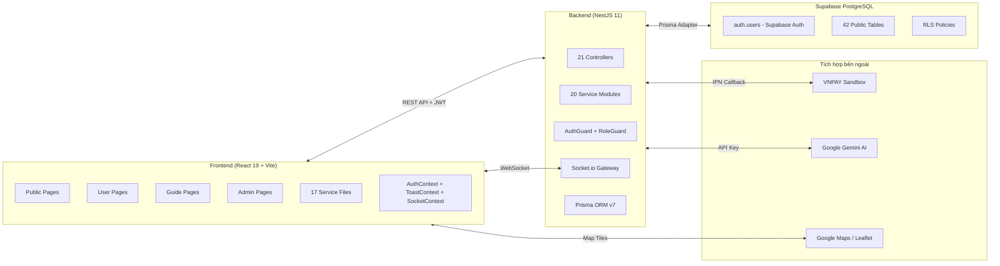

# SƠ ĐỒ UML — TRAVELCONNECTVN

> Tài liệu này chứa các sơ đồ UML (Activity Diagram, Sequence Diagram) cho các luồng nghiệp vụ chính của hệ thống, được trích xuất từ source code thực tế.

---

## 1. Activity Diagram — Luồng Đặt Tour & Thanh Toán

---

## 2. Activity Diagram — Đăng ký & Phân quyền RBAC

---

## 3. Sequence Diagram — Luồng Chat Realtime

---

## 4. Sequence Diagram — Luồng Tìm Bạn Đồng Hành

---

## 5. Activity Diagram — Admin Quản lý Báo cáo Vi phạm

---

## 6. Component Diagram — Kiến trúc tổng thể

---

*Các sơ đồ UML trên được tạo tự động dựa trên phân tích source code thực tế của dự án TravelConnectVN. Render bằng Mermaid.*
