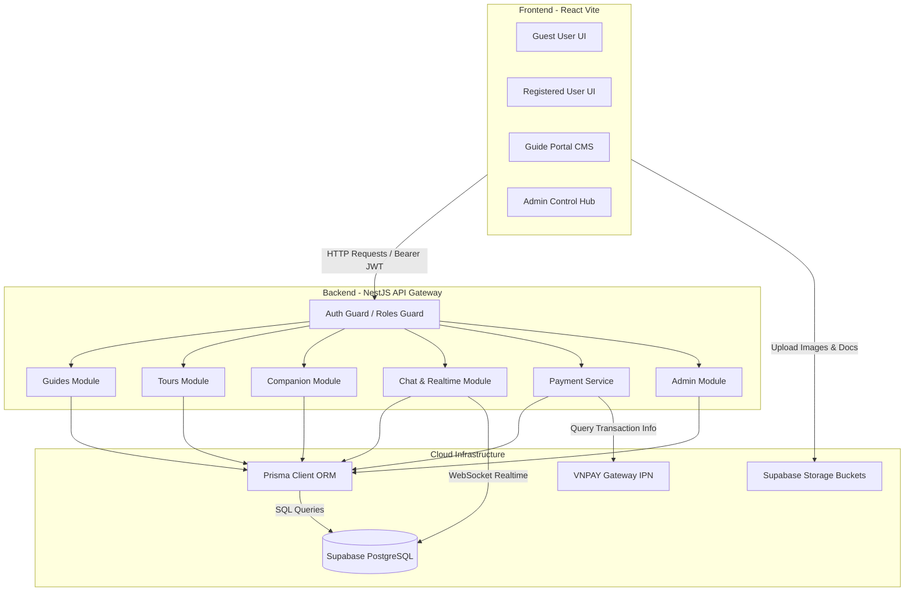

# 🌍 TravelConnectVN

**Nền tảng kết nối du lịch thông minh: Hướng dẫn viên địa phương & Bạn đồng hành xê dịch**

[-green.svg?style=for-the-badge)](https://github.com/zTwotz/TravelConnectVN)
[](https://github.com/zTwotz/TravelConnectVN)
[](LICENSE)

---

## 📖 Mục lục
1. [Tổng quan dự án](#-tong-quan-du-an)
2. [Các phân hệ & Nghiệp vụ cốt lõi](#-cac-phan-he--nghiep-vu-cot-loi)
3. [Công nghệ sử dụng](#-cong-nghe-su-dung-tech-stack)
4. [Kiến trúc hệ thống](#-kien-truc-he-thong)
5. [Thiết kế Cơ sở dữ liệu (Schema)](#-thiet-ke-co-so-du-lieu-schema)
6. [Hướng dẫn cài đặt & Khởi chạy](#-huong-dan-cai-dat--khoi-chay)
7. [Quy chuẩn Git & Làm việc nhóm](#-quy-chuan-git--lam-viec-nhom)
8. [Thông tin thanh toán thử nghiệm (VNPAY NCB)](#-thong-tin-thanh-toan-thu-nghiem-vnpay-sandbox)
9. [Tác giả & Bản quyền](#-tac-gia--ban-quyen)

---

## 🌍 Tổng quan dự án

**TravelConnectVN** không chỉ dừng lại ở một nền tảng thương mại điện tử đặt tour thông thường (OTA). Đây là một hệ sinh thái kết nối xã hội và dịch vụ du lịch trải nghiệm đột phá tại Việt Nam:
*   **Với Khách du lịch (User):** Tìm kiếm và kết nối trực tiếp với Hướng dẫn viên (HDV) bản địa am hiểu sâu sắc văn hóa, lịch sử và ẩm thực địa phương thay vì đi các tour công nghiệp gò bó.
*   **Với Người xê dịch tự do (Travel Companions):** Tạo cộng đồng giao lưu, đăng bài viết tìm kiếm bạn đồng hành có chung sở thích, chia sẻ chi phí hành trình và lên lịch trình chung.
*   **Với Hướng dẫn viên (Guide):** Cung cấp công cụ quản trị (CMS) mạnh mẽ để tự thiết kế tour cá nhân hóa, quảng bá thương hiệu cá nhân, quản lý khách hàng và nhận thanh toán an toàn.

Hệ thống được thiết kế theo cấu trúc **Modular Architecture**, chia vùng nghiệp vụ rõ ràng nhằm tối ưu hóa hiệu năng tải trang, bảo mật phân quyền đa cấp, tích hợp bản đồ số lộ trình trực quan và hỗ trợ tư vấn từ Trợ lý ảo AI thông minh.

---

## ✨ Các phân hệ & Nghiệp vụ cốt lõi

### 1. Quản lý Tài khoản & Phân quyền Đa cấp (RBAC)
*   **Auth**: Đăng ký, đăng nhập bảo mật qua Supabase Auth, tích hợp đăng nhập nhanh Google OAuth.
*   **Hệ thống Phân quyền (Role-Based Access Control)**:
    *   `Guest`: Người dùng chưa đăng nhập (Xem danh sách tour công khai, bài đăng đồng hành).
    *   `User`: Thành viên (Đặt tour, thanh toán, đăng bài tìm bạn đồng hành, tham gia phòng chat).
    *   `Guide`: Hướng dẫn viên (Thiết kế tour, phê duyệt yêu cầu đặt tour, quản lý lịch rảnh).
    *   `Admin`: Quản trị viên (Kiểm duyệt hồ sơ HDV, phê duyệt bài báo cáo vi phạm, quản lý danh mục và thống kê).

### 2. Hồ sơ Hướng dẫn viên & Xác thực Chuyên sâu
*   **Độ hoàn thiện hồ sơ (Profile Completeness)**: Hiển thị trực quan thanh phần trăm độ hoàn thiện hồ sơ kèm danh sách chi tiết các thông tin còn thiếu (ảnh đại diện, bio, ngôn ngữ, kỹ năng, tỉnh hoạt động...) để HDV dễ dàng cập nhật.
*   **Tỉnh thành hoạt động**: Hiển thị nhanh danh sách *Tỉnh thành hoạt động chính* và *Các tỉnh thành lân cận am hiểu khác* giúp tăng tính tiếp cận, không bắt buộc người dùng chọn bộ lọc miền trước mới hiển thị.
*   **Xác minh chứng chỉ**: Hệ thống tải lên tài liệu xác thực (Thẻ HDV, CCCD), chuyển trạng thái yêu cầu (`not_submitted` ➡️ `pending` ➡️ `approved` / `rejected`). Chỉ những HDV đã được Admin xác minh (`approved`) mới được xuất bản tour ra công chúng.

### 3. Hệ thống Thiết kế & Quản lý Tour (CMS Guide)
*   **Tạo lịch trình trực quan**: HDV tự thiết kế lịch trình tour chi tiết từng ngày, gán địa điểm dừng chân, dịch vụ lưu trú đối tác, thông tin ăn uống (Sáng, Trưa, Tối).
*   **Giới hạn số ngày đêm**: Để đảm bảo tính khả thi và an toàn của các tour tự túc kết nối, số ngày đêm thiết kế tour được giới hạn tối đa là **15 ngày 15 đêm** (15N 15D).
*   **Trạng thái Tour**: Quản lý vòng đời tour chặt chẽ thông qua các trạng thái: `Draft` (Nháp) ➡️ `Published` (Đã xuất bản) ➡️ `Closed` (Đóng đăng ký).

### 4. Luồng Đặt chỗ & Thanh toán B2B (VNPAY Gateway)
*   **Luồng phê duyệt**: Khách gửi yêu cầu đặt chỗ ➡️ HDV duyệt lịch rảnh và chấp nhận yêu cầu ➡️ Khách tiến hành thanh toán giữ chỗ trực tuyến.
*   **Cổng VNPAY Sandbox**: Tích hợp cổng thanh toán điện tử VNPAY, xử lý giao dịch thời gian thực, cập nhật trạng thái đặt tour và lưu vết lịch sử giao dịch rõ ràng.

### 5. Mạng xã hội Bạn đồng hành (Companion Network)
*   **Đăng bài kết bạn**: Tìm kiếm bạn đi cùng dựa trên các tiêu chí cụ thể (Thời gian, Ngân sách ước lượng, Điểm đến lý thú, Yêu cầu thành viên).
*   **Yêu cầu tham gia**: Gửi tin nhắn xin tham gia hành trình, trưởng nhóm phê duyệt thành viên vào nhóm đi chung.
*   **Chat nhóm tự động**: Khi yêu cầu tham gia được phê duyệt, hệ thống tự động thêm thành viên vào Phòng chat nhóm dành riêng cho chuyến đi đó để bàn bạc lịch trình.

### 6. Trung tâm Tin nhắn Realtime & Trợ lý ảo AI
*   **Realtime Chat**: Hệ thống phòng chat riêng tư (1:1 giữa Khách và HDV) và chat nhóm (Bạn đồng hành) vận hành thời gian thực.
*   **AI Chatbot Assistant**: Trợ lý ảo AI được tích hợp sẵn, hỗ trợ giải đáp nhanh các thắc mắc về điểm đến, gợi ý lịch trình và hướng dẫn sử dụng nền tảng.

### 7. Bảng quản trị hệ thống (Admin Dashboard)
*   **Kiểm duyệt nội dung**: Xem chi tiết tài liệu chứng chỉ HDV, duyệt hoặc từ chối kèm lý do cụ thể.
*   **Báo cáo vi phạm (Reports)**: Tiếp nhận các báo cáo vi phạm từ người dùng về tour kém chất lượng hoặc bài đăng phản cảm, xử lý khóa tài khoản/tour vi phạm và lưu lịch sử xử lý.
*   **Hoạt động kiểm toán (Audit Logs)**: Ghi lại mọi dấu vết thao tác nhạy cảm của Admin để phục vụ công tác giám sát hệ thống.

---

## 🛠 Công nghệ sử dụng (Tech Stack)

### Giao diện người dùng (Frontend)
*   **Framework chính:** ReactJS (phiên bản khởi tạo bằng Vite cho tốc độ phản hồi cực nhanh).
*   **Ngôn ngữ:** TypeScript (Type-safe, giảm thiểu lỗi runtime).
*   **Kiểm soát trạng thái & Gọi API:** Context API, Axios Client tích hợp Interceptor tự động gắn JWT Token của Supabase.
*   **Styling (Giao diện):** CSS thuần (Vanilla CSS) cao cấp được thiết kế theo hệ thống Token màu sắc hiện đại, mang lại trải nghiệm tối giản sang trọng (Dark/Light mode).
*   **Thư viện hỗ trợ:** `lucide-react` (icons), `leaflet`/`mapbox-gl` (bản đồ số), `chart.js` (biểu đồ thống kê).

### Dịch vụ máy chủ (Backend)
*   **Framework chính:** NestJS (Node.js framework theo kiến trúc hướng đối tượng, Modular vững chắc).
*   **ORM truy vấn CSDL:** Prisma ORM (Tự động phát sinh Client Type-safe, quản lý quan hệ bảng phức tạp).
*   **Tài liệu API:** Swagger UI (`@nestjs/swagger`) tích hợp sẵn tại `/api/docs`.
*   **Bảo mật:** JWT Authentication, NestJS Guards phân quyền theo vai trò người dùng (Roles Guard).

### Cơ sở dữ liệu & Cơ sở hạ tầng (Database & Infrastructure)
*   **CSDL chính:** PostgreSQL (lưu trữ trên cloud nền tảng Supabase).
*   **Lưu trữ file:** Supabase Storage (lưu ảnh đại diện, ảnh bìa tour, ảnh bài đăng đồng hành và tài liệu chứng minh HDV).
*   **Cơ chế Realtime:** Supabase Realtime Channels (phục vụ tính năng nhắn tin và thông báo tức thời).

---

## 🏗 Kiến trúc hệ thống



---

## 🗄 Thiết kế Cơ sở dữ liệu (Schema)

CSDL PostgreSQL được chia thành hai schema chính để bảo mật tối đa:
1.  **Schema `auth`**: Quản lý tài khoản đăng nhập do Supabase Auth quản lý trực tiếp.
2.  **Schema `public`**: Quản lý toàn bộ nghiệp vụ ứng dụng, bao gồm các bảng chính:
    *   `users`: Thông tin chi tiết hồ sơ người dùng (liên kết 1:1 với `auth.users`).
    *   `guide_profiles`: Hồ sơ chuyên sâu của HDV (kinh nghiệm, kỹ năng, tỉnh thành am hiểu, trạng thái xác thực).
    *   `tours`: Chứa thông tin tour (tiêu đề, giá cả, thời gian, mô tả, giới hạn ngày đêm).
    *   `tour_locations` & `tour_destinations`: Các điểm dừng chân và tọa độ hiển thị bản đồ của tour.
    *   `tour_requests`: Yêu cầu đặt chỗ của khách hàng (lịch rảnh, trạng thái đặt).
    *   `payment_transactions`: Lưu vết giao dịch thanh toán qua cổng VNPAY.
    *   `companion_posts` & `companion_requests`: Bài đăng tìm bạn đồng hành và các yêu cầu tham gia nhóm.
    *   `conversations`, `conversation_participants`, `messages`: Hệ thống lưu trữ tin nhắn realtime.
    *   `reports` & `report_processing_history`: Hệ thống tiếp nhận và xử lý báo cáo vi phạm.
    *   `admin_activity_logs`: Nhật ký kiểm toán hành vi của quản trị viên.

---

## 🚀 Hướng dẫn cài đặt & Khởi chạy

### Yêu cầu hệ thống trước khi cài
*   **Node.js**: Phiên bản `v24` trở lên.
*   **Git Bash** (Bắt buộc đối với người dùng hệ điều hành **Windows** để chạy các tập lệnh Bash `.sh`).
*   **Tài khoản Supabase** đã được khởi tạo dự án.

---

### Các bước cài đặt chi tiết

#### 1. Clone Source Code từ GitHub
```bash
git clone https://github.com/zTwotz/TravelConnectVN.git
cd TravelConnectVN
```

#### 2. Cài đặt tự động bằng Công cụ Đa nền tảng (Khuyên dùng)
Dự án được tích hợp sẵn công cụ quản lý đa nền tảng bằng Node.js cực kỳ mạnh mẽ và trực quan. Công cụ này hoạt động mượt mà trên cả **macOS, Linux và Windows** mà không cần bất kỳ cài đặt bổ sung nào.

*   **Để cài đặt toàn bộ dự án chỉ bằng 1 câu lệnh, hãy mở Terminal ở thư mục gốc và chạy:**
```bash
node run.js setup
```
*(Lệnh này sẽ tự động cài đặt các dependency (node_modules) cho cả Frontend và Backend và khởi tạo Prisma Client để dự án sẵn sàng hoạt động!)*

---

#### 3. Cấu hình các biến môi trường (.env)
Sau khi chạy lệnh setup ở trên, hệ thống sẽ tự động tạo sẵn các tệp cấu hình môi trường mặc định có sẵn key chạy thử của VNPAY Sandbox, Supabase và Gemini AI:
*   **Backend:** Tệp `backend/.env` chứa kết nối PostgreSQL DB và API Key.
*   **Frontend:** Tệp `frontend/.env.local` chứa kết nối client.

*(Bạn có thể thay đổi các giá trị trong này nếu muốn kết nối tới database hoặc tài khoản AI cá nhân của mình).*

---

#### 4. Đẩy schema lên cơ sở dữ liệu
Nếu kết nối vào một database mới và trống, hãy đẩy toàn bộ cấu trúc bảng và quan hệ lên:
```bash
cd backend
npx prisma db push
cd ..
```

---

#### 5. Khởi chạy dự án local (Đồng thời cả Frontend & Backend)
Thông thường bạn phải mở 2 terminal để chạy riêng Backend và Frontend. Nhưng với công cụ mới, bạn chỉ cần mở **1 cửa sổ Terminal duy nhất** ở thư mục gốc và chạy:

```bash
node run.js start
```
*Lệnh này sẽ khởi động đồng thời cả NestJS Backend (chạy ở `http://localhost:3000`) và React Vite Frontend (chạy ở `http://localhost:5173`), tự động gộp và phân biệt luồng log hiển thị trên màn hình vô cùng trực quan! Nhấn `Ctrl + C` để tắt đồng thời cả hai máy chủ.*

*(Nếu bạn vẫn muốn chạy thủ công bằng 2 terminal riêng biệt, hãy chạy `cd backend && npm run start:dev` ở terminal 1 và `cd frontend && npm run dev` ở terminal 2).*

---

### 🛠️ Bộ công cụ CLI đa năng (`run.js` / `TCVN`)

Để hỗ trợ phát triển nhanh và tự động hóa các thao tác lặp đi lặp lại, dự án đi kèm một công cụ quản lý chuyên dụng chạy bằng Node.js. 

#### 1. Cách chạy thông thường:
Bạn có thể chạy bằng lệnh `node run.js`:
```bash
node run.js --help
```

#### 2. Cách chạy nhanh (Short Local Alias):
Dự án cung cấp sẵn các tập lệnh viết tắt `tcvn` trong thư mục gốc. Từ terminal tại thư mục dự án, bạn có thể gõ trực tiếp:
* **Windows (Command Prompt):** `tcvn` hoặc `tcvn <lệnh>`
* **Windows (PowerShell):** `.\tcvn` hoặc `.\tcvn <lệnh>`
* **macOS / Linux:** `./tcvn` hoặc `./tcvn <lệnh>`

#### 3. Cài đặt lệnh toàn cục (Global CLI):
Để có thể gõ chữ **`TCVN`** hoặc **`tcvn`** từ **bất kỳ thư mục nào** trong hệ thống terminal của bạn mà không cần gõ `node run.js` hay `.\tcvn`, bạn chỉ cần chạy lệnh liên kết một lần duy nhất tại thư mục gốc:
```bash
npm link
```
Sau đó, từ bất kỳ đâu, bạn chỉ cần gõ:
```bash
TCVN
```
Hoặc:
```bash
tcvn <lệnh> (ví dụ: tcvn start)
```

#### Bảng danh sách các lệnh thực thi:
```text
CÁCH SỬ DỤNG TRAVELCONNECTVN CLI TOOL:
  tcvn            - Khởi chạy ở chế độ menu tương tác
  tcvn setup      - Cài đặt dependency & Prisma Client
  tcvn start      - Khởi chạy đồng thời cả Backend & Frontend
  tcvn clean      - Xóa các file rác và thư mục build dist
  tcvn clean-all  - Xóa toàn bộ build dist và node_modules
```

---

### Các công cụ hữu ích khi chạy
*   **Menu Tương tác (Interactive CLI):** Bạn chỉ cần chạy `node run.js` không đối số để mở menu trực quan, lựa chọn Setup, Start, Clean bằng cách gõ phím số `1-5`.
*   **Swagger API Docs:** Truy cập `http://localhost:3000/api/docs` để xem tài liệu API Endpoint.
*   **Prisma Studio (Quản trị CSDL trực quan):** Mở Terminal mới và chạy:
    ```bash
    cd backend
    npx prisma studio
    ```
    *Giao diện xem bảng sẽ mở tại: `http://localhost:5555`*
*   **Dọn dẹp môi trường local:** Sau một thời gian phát triển dài và muốn xóa sạch file rác biên dịch, thư mục tạm, bạn chỉ cần chạy:
    ```bash
    node run.js clean
    ```
    *(Để xóa sạch cả các thư mục `node_modules` cũ nhằm tải mới hoàn toàn, chạy: `node run.js clean-all`).*

---

## 👥 Quy chuẩn Git & Làm việc nhóm

Để lịch sử Git của dự án luôn sạch đẹp, dễ theo dõi và tránh đè code của nhau, mọi thành viên và AI Agent khi tham gia đóng góp code đều phải tuân thủ nghiêm ngặt quy trình **Git Flow rút gọn** đã được quy định chi tiết tại [git-workflows.md](file:///Users/twot/Documents/CODE/DACS_TravelConnect_VN/TravelConnectVN/git-workflows.md):

1.  **Nguyên tắc phân nhánh:**
    *   `main`: Nhánh chạy ổn định, tuyệt đối không commit trực tiếp.
    *   `develop`: Nhánh gom code kiểm thử chính, mọi nhánh con đều bắt đầu từ đây.
    *   `feature/*` hoặc `fix/*`: Nhánh làm chức năng/sửa lỗi riêng của từng người.
2.  **Đặt tên Commit (Conventional Commits):**
    *   `feat: ...` (Tính năng mới), `fix: ...` (Sửa lỗi), `docs: ...` (Tài liệu), `style: ...` (Giao diện/Format), `refactor: ...` (Tối ưu code).
3.  **Quy trình AI Assistant:**
    *   Chỉ commit và push khi người dùng ra lệnh rõ ràng.
    *   **Bắt buộc** sử dụng merge ở chế độ `--no-ff` (no fast-forward) để lưu lại dấu vết gộp nhánh rõ ràng trong commit tree.

---

## 💳 Thông tin Thanh toán Thử nghiệm (VNPAY Sandbox)

Khi thực hiện thử nghiệm luồng đặt tour và thực hiện thanh toán qua cổng VNPAY trong môi trường phát triển, vui lòng sử dụng thông tin thẻ thử nghiệm chính thức dưới đây (Tuyệt đối không dùng thẻ ngân hàng thật):

*   **Cổng thanh toán demo:** [VNPAY Sandbox Demo](https://sandbox.vnpayment.vn/apis/vnpay-demo/)
*   **Tên Ngân hàng chọn khi thanh toán:** `NCB` (Ngân hàng Quốc Dân)
*   **Số thẻ:** `9704198526191432198`
*   **Tên chủ thẻ (không dấu):** `NGUYEN VAN A`
*   **Ngày phát hành:** `07/15` (Tháng 7 năm 2015)
*   **Mã OTP xác thực giao dịch:** `123456`

---

## ✍️ Tác giả & Liên hệ

*   **Dự án:** Đồ án Cơ sở - TravelConnectVN
*   **Phiên bản phát hành:** `1.0.0 (Build 2026)`
*   **Được thực hiện bởi:** [zTwotz](https://github.com/zTwotz)
*   **Giấy phép bản quyền:** [MIT License](LICENSE)

---
*© 2026 TravelConnectVN. Bảo lưu mọi quyền.*
