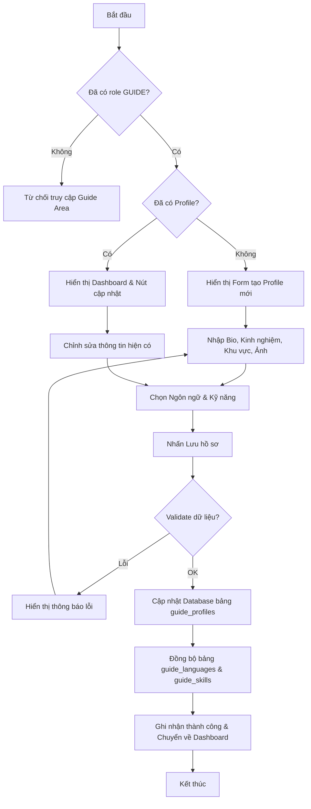

# SPRINT 04 – Triển khai hồ sơ hướng dẫn viên và khu vực công khai của hướng dẫn viên

## 1. Mục tiêu sprint

Sprint 04 là sprint chuyển trọng tâm của hệ thống từ **“xem tour”** sang **“xem và lựa chọn người tổ chức tour”**. Sau khi Sprint 03 đã dựng được khu vực public cho tour, Sprint 04 phải làm rõ vai trò của **hướng dẫn viên địa phương** trong toàn bộ đề tài bằng cách hiện thực hồ sơ nghề nghiệp của guide và khu vực công khai để khách du lịch có thể tra cứu, so sánh và đánh giá sơ bộ trước khi quyết định tham gia tour.

Đây là sprint có ý nghĩa chiến lược vì nó tạo cầu nối trực tiếp giữa:
- tài khoản người dùng đã có từ Sprint 02;
- khu vực public tour đã có từ Sprint 03;
- các sprint tiếp theo như quản lý tour, yêu cầu tham gia tour, review và verification.

### Mục tiêu chính
- Hiện thực hoàn chỉnh nhóm chức năng:
  - **F08:** Quản lý hồ sơ hướng dẫn viên
- Chuẩn hóa cơ chế để một tài khoản có thể trở thành **Guide** theo hướng rõ ràng, dễ kiểm soát.
- Cho phép hướng dẫn viên tạo mới và cập nhật hồ sơ nghề nghiệp của chính mình.
- Tạo khu vực công khai để khách du lịch xem:
  - danh sách hướng dẫn viên;
  - hồ sơ hướng dẫn viên chi tiết.
- Dựng **Dashboard Guide** ở mức cơ bản để làm điểm vào cho Guide Area.
- Hoàn thiện cụm dữ liệu nghề nghiệp của hướng dẫn viên:
  - hồ sơ nghề nghiệp;
  - kỹ năng;
  - ngôn ngữ hỗ trợ;
  - đánh giá hướng dẫn viên.
- Chuẩn hóa điều kiện hiển thị công khai của guide profile để không bị lệch giữa frontend, backend và database.
- Chuẩn bị nền dữ liệu và điều hướng cho Sprint 05:
  - quản lý tour;
  - gắn tour với hồ sơ guide;
  - hiển thị guide trên tour public.

### Ý nghĩa của sprint này
Nếu Sprint 04 được làm chắc, hệ thống sẽ thể hiện rõ hơn bản chất của đề tài: **khách du lịch không chỉ chọn tour, mà còn chọn người dẫn tour**. Sprint này cũng giúp:
- tăng chiều sâu nghiệp vụ cho đồ án;
- làm demo thuyết phục hơn;
- tạo nền để dữ liệu tour ở các sprint sau “gắn đúng chủ thể”;
- đồng bộ tốt hơn giữa phân quyền, hồ sơ nghề nghiệp và khu vực public.

---

## 2. Lưu ý trước khi triển khai

## 2.1. Phải chốt duy nhất một cơ chế trở thành hướng dẫn viên
Trước khi code, cần quyết định dứt khoát một tài khoản trở thành guide bằng cách nào. Ở bộ tài liệu chốt, hướng phù hợp nhất là:
- user được gán role `GUIDE` trước;
- sau đó mới được tạo hồ sơ nghề nghiệp.

Không nên để đồng thời tồn tại nhiều luồng như:
- user tự tạo hồ sơ guide trước rồi xin role sau;
- admin vừa cấp role vừa tự tạo profile hộ;
- frontend tự mở Guide Area dù chưa có role thật.

## 2.2. Phải xác định rõ các trường bắt buộc để public
Hồ sơ hướng dẫn viên công khai không thể chỉ là một record trống. Cần khóa trước tập dữ liệu tối thiểu để profile đủ giá trị khi hiển thị:
- mô tả nghề nghiệp;
- số năm kinh nghiệm;
- khu vực hoạt động;
- ngôn ngữ hỗ trợ;
- kỹ năng;
- ảnh hồ sơ;
- trạng thái xác minh.

Nếu không chốt sớm, frontend dễ làm form thiếu trường còn backend lại thiếu rule kiểm tra công khai.

## 2.3. Sprint này chỉ làm profile guide, không kéo verification đi quá sâu
Dù schema đã có nhóm bảng xác minh hồ sơ, Sprint 04 chỉ nên:
- hiển thị `verification_status` ở mức badge/trạng thái;
- chuẩn bị chỗ đứng cho verification ở các sprint sau.

Không nên làm sâu ngay:
- upload giấy tờ;
- nhiều vòng duyệt;
- xử lý hồ sơ xác minh;
- moderation chi tiết.

Các phần đó phù hợp hơn ở Sprint 10 hoặc sprint admin liên quan.

## 2.4. Dashboard Guide chỉ cần ở mức cơ bản
Dashboard hướng dẫn viên trong Sprint 04 chủ yếu là màn hình đầu vào để:
- hiển thị trạng thái hồ sơ;
- hiển thị một vài chỉ số cơ bản;
- điều hướng tới màn hình quản lý hồ sơ;
- chuẩn bị link sang quản lý tour ở Sprint 05.

Không nên biến dashboard thành màn hình analytics phức tạp quá sớm.

## 2.5. Phải định nghĩa rõ “xong sprint” là gì
Sprint 04 chỉ được xem là hoàn thành khi có đủ:
- guide có thể vào Guide Area;
- guide có thể tạo/cập nhật hồ sơ nghề nghiệp;
- danh mục `languages` và `skills` dùng được;
- khách du lịch xem được danh sách hướng dẫn viên công khai;
- khách du lịch xem được chi tiết hồ sơ hướng dẫn viên công khai;
- dữ liệu seed đủ để test;
- Activity Diagram cho quản lý hồ sơ hướng dẫn viên được cập nhật.

---

## 3. Các vấn đề cần xác định trong sprint này

## 3.1. Cơ chế trở thành guide
Cần chốt:
- ai được gán role `GUIDE`;
- role này được gán ở sprint nào và bởi ai;
- khi đã có role thì guide có bắt buộc tạo profile ngay không;
- nếu có role nhưng chưa có profile thì Guide Area hiển thị gì.

## 3.2. Các trường bắt buộc của hồ sơ hướng dẫn viên
Cần xác định rõ trường nào là:
- bắt buộc để lưu hồ sơ;
- bắt buộc để hiển thị public;
- tùy chọn nhưng nên có;
- chưa cần làm ở sprint này.

## 3.3. Điều kiện công khai của guide profile
Phải chốt rõ một hồ sơ guide được lên public khi nào. Tối thiểu cần xét:
- `visibility_status`;
- `verification_status`;
- `is_deleted`;
- trạng thái tài khoản user liên quan;
- mức dữ liệu tối thiểu đã hoàn thiện hay chưa.

## 3.4. Quan hệ giữa profile guide và role
Không phải cứ có profile là được xem là guide hợp lệ. Cần thống nhất:
- role `GUIDE` là điều kiện truy cập Guide Area;
- `guide_profiles` là hồ sơ nghề nghiệp;
- `user_roles` quyết định quyền;
- `guide_profiles` quyết định dữ liệu hiển thị và khả năng gắn tour.

## 3.5. Quan hệ giữa guide profile và tour
Sprint này chưa làm tour management sâu, nhưng cần chốt sẵn:
- mỗi guide profile gắn với một `user_id` duy nhất;
- tour sau này sẽ tham chiếu `guide_profile_id`;
- hồ sơ guide phải ổn trước khi Sprint 05 tạo tour.

## 3.6. Cách hiển thị review guide ở giai đoạn đầu
Cần chốt rõ:
- Sprint 04 có cần cho phép tạo review hay chỉ hiển thị review mẫu;
- nếu hiển thị review thì dùng review công khai;
- có cần rating trung bình trên list/detail hay không.

Phương án hợp lý là:
- chưa mở luồng tạo review trong Sprint 04;
- chỉ hỗ trợ hiển thị review/rating mẫu nếu dữ liệu có sẵn.

---

## 4. Hạng mục cần chốt

Các hạng mục phải khóa trước khi code sâu trong Sprint 04 gồm:
- luồng chuyển role sang Guide;
- cấu trúc bảng `guide_profiles`;
- tập trường bắt buộc để hồ sơ có thể public;
- phạm vi hiển thị công khai của guide;
- quan hệ giữa `guide_profiles` với `guide_languages` và `guide_skills`;
- cách dùng `guide_reviews` ở giai đoạn đầu;
- phạm vi của Dashboard Guide;
- chuẩn response cho API list và detail của guide;
- rule phân quyền cho Guide Area;
- dữ liệu seed chuẩn cho guide mẫu.

---

## 5. Phương án được chọn

## 5.1. Luồng trở thành hướng dẫn viên
Phương án được chọn là:
- tài khoản phải có role `GUIDE` trước;
- sau đó mới tạo hồ sơ nghề nghiệp ở `guide_profiles`;
- Guide Area chỉ mở cho user có role `GUIDE`;
- nếu có role nhưng chưa có profile, hệ thống điều hướng về màn hình tạo hồ sơ.

Đây là hướng phù hợp nhất để tránh rối quyền giữa Sprint 04, Sprint 08 và Sprint 10.

## 5.2. Bộ dữ liệu tối thiểu của hồ sơ guide
Hồ sơ công khai tối thiểu nên có:
- `bio`;
- `years_of_experience`;
- `working_area`;
- `avatar_url`;
- danh sách ngôn ngữ;
- danh sách kỹ năng;
- `verification_status`.

Ngoài ra có thể tận dụng thêm từ bảng `users`:
- `full_name`;
- `avatar_url` chung nếu cần fallback;
- trạng thái tài khoản để kiểm soát hiển thị.

## 5.3. Điều kiện hiển thị public của guide profile
Phương án an toàn cho Sprint 04 là chỉ hiển thị guide profile công khai khi:
- profile chưa bị xóa mềm;
- `visibility_status = 'visible'`;
- user liên quan đang ở trạng thái hoạt động phù hợp;
- hồ sơ có đủ dữ liệu tối thiểu để hiển thị;
- `verification_status` được hiển thị như thông tin tham khảo, chưa biến thành rule moderation phức tạp.

Trong phạm vi sprint này, có thể cho phép profile xuất hiện public dù `verification_status` chưa phải `approved`, miễn là trạng thái hiển thị phù hợp và dữ liệu đủ tối thiểu. Tuy nhiên badge xác minh phải thể hiện trung thực.

## 5.4. Phạm vi của verification trong Sprint 04
Verification chỉ ở mức:
- lưu và hiển thị `verification_status`;
- phục vụ badge “chưa gửi / chờ duyệt / đã duyệt / bị từ chối”.

Không triển khai:
- form nộp giấy tờ;
- danh sách yêu cầu xác minh;
- xử lý phản hồi xác minh;
- admin verification flow.

## 5.5. Phạm vi của Dashboard Guide
Dashboard Guide chỉ cần:
- thẻ thông tin hồ sơ;
- trạng thái xác minh;
- số tour hiện có hoặc giá trị mặc định 0;
- điểm đánh giá trung bình hoặc placeholder;
- shortcut tới:
  - quản lý hồ sơ guide;
  - danh sách tour của tôi;
  - yêu cầu tham gia tour.

Các link tới tour/request có thể là placeholder chuẩn bị cho sprint sau.

## 5.6. Phạm vi hiển thị review
Ở Sprint 04:
- `guide_reviews` chủ yếu dùng để hiển thị ở hồ sơ công khai;
- chỉ lấy các review có `visibility_status = 'visible'`;
- chưa mở sâu luồng tạo review;
- có thể tính rating trung bình để hiển thị ở list/detail nếu dữ liệu seed có sẵn.

## 5.7. Quan hệ many-to-many cho ngôn ngữ và kỹ năng
Ngôn ngữ và kỹ năng được triển khai theo hướng:
- danh mục chuẩn ở `languages` và `skills`;
- liên kết nhiều-nhiều qua:
  - `guide_languages`;
  - `guide_skills`.

Frontend không được hardcode text tự do cho các giá trị chuẩn ngay trong sprint này, để tránh lệch dữ liệu giữa UI và database.

---

## 6. Ghi chú triển khai

- Sprint 04 phải ưu tiên **CRUD hồ sơ guide của chính mình** trước, rồi mới mở rộng khu vực public.
- Không nên làm xác minh hồ sơ quá sâu trong sprint này.
- Cần seed đủ dữ liệu guide mẫu để danh sách guide và chi tiết guide nhìn có chiều sâu khi demo.
- Nên chuẩn hóa sớm cấu trúc DTO cho `guide profile`, `languages`, `skills` vì Sprint 05 sẽ dùng lại nhiều dữ liệu này.
- Guide Area cần được dựng theo hướng có thể mở rộng ngay sang:
  - danh sách tour của tôi;
  - tạo/cập nhật tour;
  - quản lý yêu cầu tham gia tour.

---

## 7. Chức năng trọng tâm

Chức năng trọng tâm của Sprint 04 là:

- **F08 – Quản lý hồ sơ hướng dẫn viên**

Chức năng này bao gồm:
- tạo hồ sơ nghề nghiệp;
- cập nhật hồ sơ nghề nghiệp;
- quản lý ngôn ngữ hỗ trợ;
- quản lý kỹ năng;
- hiển thị hồ sơ công khai;
- hiển thị danh sách hướng dẫn viên công khai;
- chuẩn bị dữ liệu cho tour và review guide.

Đây là chức năng có vai trò nền cho:
- F10 Quản lý tour;
- F11 Quản lý yêu cầu tham gia tour;
- F18 Đánh giá hướng dẫn viên;
- F25 Quản trị dữ liệu liên quan đến guide.

---

## 8. Màn hình triển khai

## 8.1. Mục tiêu của phần màn hình
Phần màn hình của Sprint 04 phải làm nổi bật được hai chiều:
- **Guide tự quản lý hồ sơ nghề nghiệp của mình**;
- **Khách du lịch xem được guide ở khu vực công khai**.

## 8.2. Các màn hình cần triển khai trong Sprint 04

### M08 – Danh sách hướng dẫn viên công khai
Mục tiêu:
- cho khách truy cập và người dùng xem danh sách guide đang hiển thị công khai.

Nội dung hiển thị nên có:
- ảnh đại diện;
- tên hướng dẫn viên;
- khu vực hoạt động;
- số năm kinh nghiệm;
- ngôn ngữ hỗ trợ;
- điểm đánh giá trung bình;
- badge xác minh;
- nút xem chi tiết.

Yêu cầu:
- hỗ trợ filter nhẹ theo khu vực hoặc từ khóa nếu còn thời gian;
- phân trang hoặc load-more;
- chỉ hiển thị dữ liệu public hợp lệ.

### M09 – Hồ sơ hướng dẫn viên công khai
Mục tiêu:
- hiển thị đầy đủ hồ sơ nghề nghiệp của một guide cụ thể.

Nội dung hiển thị nên có:
- ảnh đại diện;
- họ tên;
- mô tả nghề nghiệp;
- kinh nghiệm;
- khu vực hoạt động;
- ngôn ngữ;
- kỹ năng;
- badge xác minh;
- rating trung bình;
- danh sách review công khai;
- danh sách tour liên quan ở mức teaser hoặc block điều hướng.

Yêu cầu:
- dữ liệu phải đồng nhất với `guide_profiles`;
- review chỉ hiển thị review public;
- các thao tác nâng cao như yêu thích hoặc báo cáo có thể để placeholder cho sprint sau.

### M31 – Dashboard hướng dẫn viên
Mục tiêu:
- làm màn hình đầu vào của Guide Area.

Nội dung hiển thị nên có:
- tóm tắt hồ sơ nghề nghiệp;
- trạng thái xác minh;
- số tour hiện có;
- số yêu cầu chờ duyệt;
- điểm đánh giá trung bình;
- các shortcut chính.

Yêu cầu:
- không cần analytics sâu;
- tập trung vào điều hướng;
- bố cục rõ và gọn.

### M32 – Quản lý hồ sơ hướng dẫn viên của tôi
Mục tiêu:
- cho phép guide tạo mới hoặc cập nhật hồ sơ nghề nghiệp.

Nội dung hiển thị nên có:
- mô tả nghề nghiệp;
- số năm kinh nghiệm;
- khu vực hoạt động;
- ảnh hồ sơ;
- chọn ngôn ngữ;
- chọn kỹ năng;
- trạng thái hiển thị;
- badge xác minh;
- nút lưu.

Yêu cầu:
- hỗ trợ cả trường hợp chưa có profile và đã có profile;
- validate rõ các trường bắt buộc;
- đồng bộ tốt với API create/update.

## 8.3. Thành phần UI dùng chung cần tận dụng
Từ Sprint 01 và Sprint 02 có thể tận dụng:
- app layout;
- guide area layout;
- card;
- form field;
- multi-select;
- badge trạng thái;
- table/list container;
- loading state;
- empty state;
- toast thông báo.

## 8.4. Kết quả mong đợi của phần màn hình
Kết thúc Sprint 04:
- guide vào được Guide Area;
- guide tạo/cập nhật được hồ sơ;
- khách xem được list guide;
- khách xem được detail guide;
- UI đủ chắc để nối tiếp Sprint 05.

---

## 9. Bảng CSDL chính

## 9.1. `guide_profiles`
### Vai trò
Là bảng hồ sơ nghề nghiệp trung tâm của hướng dẫn viên.

### Trường quan trọng
- `id`
- `user_id`
- `bio`
- `years_of_experience`
- `working_area`
- `avatar_url`
- `verification_status`
- `visibility_status`
- `is_accepting_tours`
- `is_deleted`
- `created_at`
- `updated_at`

### Vai trò trong Sprint 04
- lưu hồ sơ nghề nghiệp;
- điều khiển hiển thị public;
- làm đầu mối gắn với tour về sau;
- làm đối tượng chính của Guide Area.

## 9.2. `languages`
### Vai trò
Lưu danh mục ngôn ngữ chuẩn dùng cho hướng dẫn viên.

### Trường quan trọng
- `id`
- `name`
- `is_active`

### Vai trò trong Sprint 04
- cung cấp dữ liệu cho form chọn ngôn ngữ;
- dùng cho filter và hiển thị public.

## 9.3. `skills`
### Vai trò
Lưu danh mục kỹ năng/thế mạnh của hướng dẫn viên.

### Trường quan trọng
- `id`
- `name`
- `is_active`

### Vai trò trong Sprint 04
- cung cấp dữ liệu cho form chọn kỹ năng;
- chuẩn hóa dữ liệu nghề nghiệp của guide.

## 9.4. `guide_languages`
### Vai trò
Bảng liên kết nhiều-nhiều giữa hồ sơ guide và danh mục ngôn ngữ.

### Trường quan trọng
- `guide_profile_id`
- `language_id`

### Vai trò trong Sprint 04
- lưu danh sách ngôn ngữ mà guide hỗ trợ;
- phục vụ hiển thị ở list/detail và dashboard.

## 9.5. `guide_skills`
### Vai trò
Bảng liên kết nhiều-nhiều giữa hồ sơ guide và danh mục kỹ năng.

### Trường quan trọng
- `guide_profile_id`
- `skill_id`

### Vai trò trong Sprint 04
- lưu kỹ năng nghề nghiệp của guide;
- phục vụ hiển thị hồ sơ công khai.

## 9.6. `guide_reviews`
### Vai trò
Lưu đánh giá của người dùng dành cho hướng dẫn viên.

### Trường quan trọng
- `id`
- `guide_profile_id`
- `tour_id`
- `tour_request_id`
- `user_id`
- `rating`
- `comment`
- `visibility_status`
- `created_at`

### Vai trò trong Sprint 04
- chưa phải trọng tâm tạo mới;
- chủ yếu phục vụ hiển thị review/rating công khai ở profile guide;
- chuẩn bị cho sprint review phía sau.

## 9.7. Bảng hỗ trợ cần lưu ý thêm
Ngoài các bảng chính trên, Sprint 04 còn liên quan gián tiếp tới:
- `users`: lấy `full_name`, `avatar_url`, trạng thái tài khoản;
- `user_roles`: kiểm tra role `GUIDE`;
- `roles`: xác nhận danh mục role chính thức;
- `tours`: có thể dùng ở mức teaser “tour đã đăng” nếu muốn hiển thị ở hồ sơ guide.

## 9.8. Ghi chú triển khai dữ liệu
- Không để frontend tự giữ danh sách kỹ năng/ngôn ngữ cố định.
- Cần chốt dữ liệu demo cho tối thiểu 3–5 guide mẫu.
- Cần có index hỗ trợ truy vấn public theo `visibility_status`, `verification_status`, `is_deleted`.
- Không nên dùng dữ liệu review ảo quá nhiều; chỉ seed vừa đủ để giao diện có chiều sâu.

---

## 10. API cần thiết

## 10.1. `GET /guides`
### Mục đích
Lấy danh sách hướng dẫn viên công khai.

### Query gợi ý
```http
GET /guides?page=1&limit=12&keyword=da%20nang&workingArea=Da%20Nang
```

### Kết quả mong đợi
- trả về danh sách guide public;
- có phân trang;
- có thông tin cơ bản đủ hiển thị card;
- có rating trung bình nếu dữ liệu có sẵn.

## 10.2. `GET /guides/:id`
### Mục đích
Lấy chi tiết hồ sơ hướng dẫn viên công khai.

### Kết quả mong đợi
- trả về dữ liệu chi tiết của guide;
- bao gồm mô tả, kinh nghiệm, ngôn ngữ, kỹ năng;
- có review công khai;
- có thể kèm danh sách tour liên quan ở mức gợi ý.

## 10.3. `POST /guide-profile`
### Mục đích
Tạo hồ sơ nghề nghiệp cho hướng dẫn viên hiện tại.

### Request gợi ý
```json
{
  "bio": "Huong dan vien dia phuong tai Da Nang, chuyen tour trai nghiem va am thuc.",
  "yearsOfExperience": 4,
  "workingArea": "Da Nang",
  "avatarUrl": "https://example.com/guide-avatar.jpg",
  "visibilityStatus": "visible",
  "isAcceptingTours": true
}
```

### Kết quả mong đợi
- tạo bản ghi `guide_profiles`;
- gắn đúng `user_id` của guide hiện tại;
- kiểm tra role `GUIDE`;
- trả về profile sau khi tạo.

## 10.4. `PATCH /guide-profile/:id`
### Mục đích
Cập nhật hồ sơ nghề nghiệp của guide.

### Request gợi ý
```json
{
  "bio": "Cap nhat mo ta nghe nghiep",
  "yearsOfExperience": 5,
  "workingArea": "Da Nang - Hoi An",
  "avatarUrl": "https://example.com/new-avatar.jpg",
  "visibilityStatus": "visible",
  "isAcceptingTours": true
}
```

### Kết quả mong đợi
- chỉ cho phép chủ hồ sơ cập nhật hồ sơ của mình;
- validate dữ liệu hợp lệ;
- trả về profile sau cập nhật.

## 10.5. `PUT /guide-profile/:id/languages`
### Mục đích
Cập nhật danh sách ngôn ngữ hỗ trợ của hướng dẫn viên.

### Request gợi ý
```json
{
  "languageIds": [1, 2, 4]
}
```

### Kết quả mong đợi
- thay thế hoặc đồng bộ dữ liệu `guide_languages`;
- kiểm tra danh mục ngôn ngữ hợp lệ;
- trả về danh sách ngôn ngữ mới.

## 10.6. `PUT /guide-profile/:id/skills`
### Mục đích
Cập nhật danh sách kỹ năng của hướng dẫn viên.

### Request gợi ý
```json
{
  "skillIds": [1, 3, 5]
}
```

### Kết quả mong đợi
- đồng bộ dữ liệu `guide_skills`;
- kiểm tra danh mục kỹ năng hợp lệ;
- trả về danh sách kỹ năng mới.

## 10.7. `GET /languages`
### Mục đích
Lấy danh mục ngôn ngữ đang hoạt động.

### Kết quả mong đợi
- trả về danh sách phục vụ form;
- chỉ lấy giá trị `is_active = true`.

## 10.8. `GET /skills`
### Mục đích
Lấy danh mục kỹ năng đang hoạt động.

### Kết quả mong đợi
- trả về danh sách phục vụ form;
- chỉ lấy giá trị `is_active = true`.

## 10.9. API hỗ trợ nên cân nhắc thêm
Nếu muốn triển khai thuận tiện hơn cho frontend, có thể bổ sung:
- `GET /me/guide-profile`
- `GET /guides/:id/reviews`

Hai API này không bắt buộc theo khung kế hoạch, nhưng rất hữu ích khi nối UI thực tế.

## 10.10. Yêu cầu kỹ thuật chung cho API
Tất cả API trong Sprint 04 phải thống nhất:
- response envelope chung;
- validate DTO rõ ràng;
- phân biệt `401` và `403`;
- check ownership với guide profile;
- không trả dữ liệu private cho route public;
- log lỗi tối thiểu;
- có thể test bằng Swagger/Postman.

---

## 11. Công việc frontend

## 11.1. Dựng Guide Area cơ bản
- tạo route cho Guide Area;
- áp dụng guard theo role `GUIDE`;
- dựng dashboard guide cơ bản;
- chuẩn hóa menu điều hướng guide.

## 11.2. Dựng màn hình quản lý hồ sơ hướng dẫn viên
- form tạo profile;
- form cập nhật profile;
- validate trường bắt buộc;
- xử lý trạng thái chưa có profile;
- hiển thị badge xác minh và hiển thị.

## 11.3. Dựng chọn ngôn ngữ và kỹ năng
- gọi `GET /languages`;
- gọi `GET /skills`;
- hiển thị multi-select hoặc checkbox group;
- đồng bộ với API update many-to-many.

## 11.4. Dựng danh sách guide công khai
- card guide public;
- phân trang hoặc load-more;
- trạng thái loading/empty/error;
- search hoặc filter nhẹ nếu còn thời gian.

## 11.5. Dựng chi tiết guide công khai
- block thông tin nghề nghiệp;
- block ngôn ngữ;
- block kỹ năng;
- block review công khai;
- block tour liên quan hoặc placeholder.

## 11.6. Đồng bộ badge trạng thái
Frontend cần hiển thị rõ:
- `verification_status`;
- `visibility_status`;
- trạng thái nhận tour nếu dùng `is_accepting_tours`.

## 11.7. Chuẩn hóa trải nghiệm nhập liệu
- kiểm tra giới hạn ký tự cho `bio`;
- kiểm tra số năm kinh nghiệm không âm;
- kiểm tra bắt buộc chọn ít nhất một ngôn ngữ/kỹ năng nếu rule được áp dụng;
- thông báo lỗi thân thiện.

## 11.8. Test flow phía frontend
Cần test tối thiểu:
- guide chưa có profile;
- guide đã có profile;
- khách xem list guide;
- khách xem detail guide;
- user thường cố truy cập Guide Area;
- profile ở trạng thái ẩn không xuất hiện ở public.

## 11.9. Kết quả mong đợi phía frontend
- Guide Area dùng được;
- form profile guide hoạt động ổn;
- list/detail guide công khai mạch lạc;
- dễ nối tiếp với quản lý tour ở Sprint 05.

---

## 12. Công việc backend

## 12.1. Hoàn thiện module `guides`
Nên tách riêng module `guides` để xử lý:
- query public;
- CRUD hồ sơ cá nhân của guide;
- mapping dữ liệu với `users`, `guide_languages`, `guide_skills`, `guide_reviews`.

## 12.2. Kiểm tra role và ownership
Backend phải kiểm tra:
- chỉ tài khoản có role `GUIDE` mới được tạo/cập nhật guide profile;
- chỉ chủ hồ sơ mới được sửa hồ sơ của mình;
- route public không để lộ dữ liệu nội bộ.

## 12.3. Xử lý create/update profile
- validate dữ liệu đầu vào;
- tránh tạo nhiều profile cho một user;
- xử lý create lần đầu và update các lần sau rõ ràng;
- chuẩn hóa response cho frontend.

## 12.4. Xử lý many-to-many cho ngôn ngữ và kỹ năng
- đồng bộ `guide_languages`;
- đồng bộ `guide_skills`;
- kiểm tra id danh mục hợp lệ;
- dùng transaction khi cần để tránh lệch dữ liệu.

## 12.5. Xử lý query public cho danh sách guide
- chỉ lấy profile thỏa điều kiện public;
- join dữ liệu cần thiết từ `users`;
- tính hoặc đính kèm rating trung bình nếu cần;
- tránh trả về dữ liệu quá nặng.

## 12.6. Xử lý query chi tiết guide
- lấy profile đầy đủ;
- lấy danh sách ngôn ngữ;
- lấy danh sách kỹ năng;
- lấy review công khai;
- có thể lấy tour liên quan nếu muốn gợi ý.

## 12.7. Chuẩn hóa rule public dùng chung
Nên có hàm/service dùng chung để xác định:
- profile nào được hiển thị public;
- review nào được hiển thị public;
- dữ liệu nào chỉ dành cho owner.

## 12.8. Logging và xử lý lỗi
- log lỗi validation;
- log lỗi không đủ quyền;
- log lỗi không tìm thấy profile;
- thống nhất mã lỗi để frontend dễ xử lý.

## 12.9. Chuẩn bị nền cho Sprint 05
Backend nên tổ chức dữ liệu sao cho Sprint 05 có thể dùng lại trực tiếp:
- `guide_profile_id`;
- trạng thái nhận tour;
- profile summary;
- join guide với tour.

## 12.10. Kết quả mong đợi phía backend
- API guide hoạt động ổn định;
- rule quyền rõ ràng;
- query public và query owner tách bạch;
- sẵn sàng mở sang module tour.

---

## 13. Công việc database

## 13.1. Seed danh mục ngôn ngữ
Chuẩn bị danh mục ngôn ngữ tối thiểu:
- tiếng Việt;
- tiếng Anh;
- tiếng Trung;
- tiếng Hàn;
- tiếng Nhật.

Có thể mở rộng thêm tùy phạm vi demo.

## 13.2. Seed danh mục kỹ năng
Chuẩn bị danh mục kỹ năng mẫu như:
- am hiểu văn hóa địa phương;
- hướng dẫn ẩm thực;
- chụp ảnh;
- hỗ trợ tiếng Anh;
- tổ chức nhóm nhỏ;
- du lịch trải nghiệm.

## 13.3. Seed guide profile mẫu
Cần có nhiều profile mẫu với mức độ hoàn thiện khác nhau:
- profile hoàn chỉnh và đang public;
- profile có badge xác minh khác nhau;
- profile bị ẩn để test rule public;
- profile chưa đủ dữ liệu để test form.

## 13.4. Seed liên kết ngôn ngữ và kỹ năng
- gắn mỗi guide với 2–4 ngôn ngữ/kỹ năng;
- bảo đảm list/detail hiển thị phong phú;
- tránh toàn bộ guide có cùng bộ dữ liệu.

## 13.5. Seed review guide mẫu
- chuẩn bị một số review công khai;
- có rating khác nhau để tính điểm trung bình;
- nếu chưa có luồng review thật, vẫn cần seed đủ để UI public có chiều sâu.

## 13.6. Kiểm tra toàn vẹn dữ liệu
Cần kiểm tra:
- mỗi `user_id` chỉ có một `guide_profile`;
- các id trong bảng liên kết là hợp lệ;
- không có profile public bị thiếu dữ liệu tối thiểu;
- không có profile public thuộc user bị khóa hoặc không phù hợp.

## 13.7. Tối ưu index
Các index quan trọng cần lưu ý:
- index theo `user_id` của `guide_profiles`;
- index theo `visibility_status`, `verification_status`, `is_deleted`;
- index ở bảng liên kết để join nhanh hơn khi lấy detail.

## 13.8. Kết quả mong đợi phía database
- dữ liệu guide sạch và nhất quán;
- đủ bản ghi cho list/detail;
- đủ dữ liệu để demo dashboard guide;
- sẵn sàng cho Sprint 05 gắn tour vào guide profile.

---

## 14. Tài liệu/UML

## 14.1. Tài liệu cần hoàn thiện
Trong Sprint 04 nên cập nhật:
- mô tả chức năng F08;
- mô tả vai trò Guide trong báo cáo phân quyền;
- mô tả màn hình M08, M09, M31, M32;
- mô tả dữ liệu nhóm guide profile trong báo cáo CSDL.

## 14.2. Activity Diagram cần cập nhật
Cần hoàn thiện tối thiểu Activity Diagram cho:
- tạo/cập nhật hồ sơ hướng dẫn viên;
- xem danh sách hướng dẫn viên công khai;
- xem hồ sơ hướng dẫn viên công khai.

## 14.3. Nội dung nên mô tả rõ trong UML
- actor tham gia: Guide, Guest/User;
- tiền điều kiện: có role `GUIDE` với luồng quản lý hồ sơ;
- kiểm tra điều kiện public;
- luồng chọn ngôn ngữ/kỹ năng;
- hậu điều kiện sau khi lưu hồ sơ;
- trường hợp ngoại lệ khi chưa đủ quyền hoặc dữ liệu không hợp lệ.

## 14.4. Mục tiêu của phần tài liệu/UML
- làm rõ luồng nghề nghiệp của guide;
- liên kết chặt giữa role, dữ liệu và giao diện;
- tạo nền cho sequence/class diagram liên quan ở các sprint sau.

---

## 15. Đầu ra

## 15.1. Đầu ra chức năng
- Guide có thể tạo hồ sơ nghề nghiệp của mình.
- Guide có thể cập nhật hồ sơ nghề nghiệp của mình.
- Khách du lịch có thể xem danh sách guide công khai.
- Khách du lịch có thể xem chi tiết hồ sơ guide công khai.

## 15.2. Đầu ra giao diện
- hoàn thành M08;
- hoàn thành M09;
- hoàn thành M31 ở mức cơ bản;
- hoàn thành M32.

## 15.3. Đầu ra API
- `GET /guides`
- `GET /guides/:id`
- `POST /guide-profile`
- `PATCH /guide-profile/:id`
- `PUT /guide-profile/:id/languages`
- `PUT /guide-profile/:id/skills`
- `GET /languages`
- `GET /skills`

## 15.4. Đầu ra dữ liệu
- seed languages và skills;
- seed guide profile mẫu;
- seed liên kết many-to-many;
- seed guide review mẫu;
- tối ưu index phục vụ query public.

## 15.5. Đầu ra tài liệu
- cập nhật Activity Diagram quản lý hồ sơ hướng dẫn viên;
- cập nhật mô tả vai trò Guide;
- cập nhật phần màn hình guide public và guide area;
- cập nhật mô tả bảng liên quan tới guide profile.

## 15.6. Tiêu chí sẵn sàng sang Sprint 05
Chỉ nên sang Sprint 05 khi:
- role `GUIDE` hoạt động đúng;
- guide profile đã tạo/cập nhật ổn định;
- guide list/detail public hoạt động đúng rule;
- seed dữ liệu guide đủ dùng;
- frontend, backend và database thống nhất cách hiểu về guide public;
- `guide_profile_id` đã sẵn sàng để gắn với tour.

---

## 16. Kết luận sprint

Sprint 04 là sprint hoàn thiện **bản sắc nghề nghiệp của hướng dẫn viên** trong hệ thống. Nếu Sprint 03 giúp người dùng thấy được “tour đang có gì”, thì Sprint 04 giúp họ thấy được “ai là người dẫn tour”. Đây là bước rất quan trọng để đồ án thể hiện đúng giá trị kết nối giữa khách du lịch và hướng dẫn viên địa phương.

Khi kết thúc sprint này, hệ thống phải đạt được một nền tảng đủ chắc để bước sang Sprint 05 với trọng tâm là **quản lý tour cho hướng dẫn viên**, trong đó mọi tour đều gắn với một hồ sơ guide rõ ràng, có thể hiển thị công khai và có giá trị thuyết phục khi demo.

---

## 17. Phụ lục: Sơ đồ UML & Quy tắc bổ sung

### 17.1. Activity Diagram: Tạo và cập nhật hồ sơ Guide


### 17.2. Rule: Trở thành Guide và Hiển thị Public
1. **Điều kiện truy cập Guide Area**: 
    - Tài khoản phải có `role_code = 'GUIDE'`.
    - Session JWT phải chứa role này (đã được backend validate qua Guard).
2. **Quy tắc tạo hồ sơ**:
    - Mỗi `user_id` chỉ được sở hữu tối đa 01 `guide_profile`.
    - Phải chọn ít nhất 01 Ngôn ngữ và 01 Kỹ năng để hồ sơ đạt mức "Hoàn thiện".
3. **Điều kiện hiển thị công khai (Public Visibility)**:
    - `visibility_status = 'visible'`.
    - `is_deleted = false`.
    - Tài khoản User không ở trạng thái `locked` hoặc `suspended`.
    - *Lưu ý*: Hồ sơ mới tạo mặc định có `verification_status = 'pending'`, vẫn có thể hiển thị public nhưng không có badge "Đã xác minh".

### 17.3. Rule: Quản lý Ngôn ngữ & Kỹ năng
- Guide không được tự ý thêm text tự do cho ngôn ngữ/kỹ năng.
- Phải chọn từ danh mục chuẩn (`languages`, `skills`) do Admin quản lý để phục vụ bộ lọc tìm kiếm chính xác.
