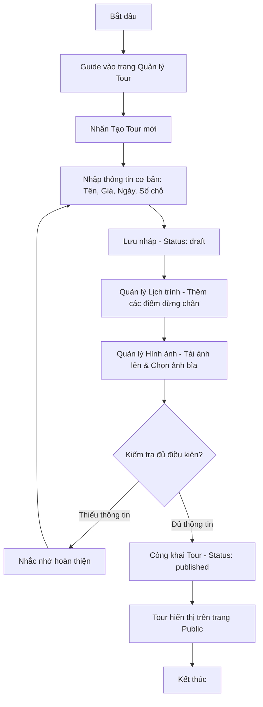

# SPRINT 05 – Triển khai chức năng quản lý tour cho hướng dẫn viên

## 1. Mục tiêu sprint

Sprint 05 là sprint hiện thực **trục nghiệp vụ cốt lõi phía hướng dẫn viên**: tạo tour, cập nhật tour, quản lý ảnh tour và quản lý lịch trình/địa điểm của tour. Sau khi Sprint 04 đã hình thành được hồ sơ nghề nghiệp và khu vực công khai của hướng dẫn viên, Sprint 05 phải giúp hệ thống đi thêm một bước rất quan trọng: **Guide bắt đầu tạo ra dữ liệu tour thật để toàn bộ nền tảng vận hành đúng bản chất đề tài**.

Đây là sprint mang tính bản lề vì nó kết nối trực tiếp giữa:
- hồ sơ hướng dẫn viên đã có từ Sprint 04;
- khu vực công khai tour đã có từ Sprint 03;
- luồng yêu cầu tham gia tour sẽ triển khai ở Sprint 06;
- quản trị tour và kiểm duyệt tour ở các sprint sau.

### Mục tiêu chính
- Hiện thực hoàn chỉnh nhóm chức năng:
  - **F10:** Quản lý tour
- Cho phép hướng dẫn viên:
  - tạo tour mới;
  - cập nhật tour đã tạo;
  - quản lý bộ ảnh tour;
  - quản lý lịch trình/địa điểm theo thứ tự hành trình;
  - thay đổi trạng thái tour theo phạm vi cho phép.
- Dựng đầy đủ cụm màn hình Guide Area liên quan tới tour:
  - danh sách tour của tôi;
  - tạo/cập nhật tour;
  - quản lý lịch trình/địa điểm tour.
- Chuẩn hóa dữ liệu tour để dùng lại cho:
  - danh sách tour public;
  - chi tiết tour;
  - yêu cầu tham gia tour;
  - quản trị tour;
  - review tour;
  - bản đồ lộ trình tour.
- Chốt rõ mối quan hệ giữa:
  - `guide_profiles`;
  - `tours`;
  - `tour_images`;
  - `tour_locations`;
  - `tour_categories`;
  - `tour_accommodations`.
- Chốt rõ logic trạng thái của tour để frontend, backend và database không lệch nhau.
- Chuẩn bị dữ liệu demo tour đủ tốt để các sprint sau có thể test thật thay vì chỉ dùng dữ liệu giả nghèo nàn.

### Ý nghĩa của sprint này
Nếu Sprint 05 được làm chắc, hệ thống sẽ bắt đầu thể hiện đầy đủ bản chất nghiệp vụ của đề tài:
- hướng dẫn viên không chỉ có hồ sơ, mà còn có **nội dung tour thật để kinh doanh và kết nối**;
- khách du lịch có dữ liệu thật để xem ở khu vực public;
- Sprint 06 có đầu vào đúng để triển khai yêu cầu tham gia tour;
- Demo hệ thống trở nên thuyết phục hơn rất nhiều vì đã có chuỗi logic:
  - có guide;
  - guide tạo tour;
  - tour hiển thị công khai;
  - user xem tour và chuẩn bị tham gia.

---

## 2. Lưu ý trước khi triển khai

## 2.1. Phải chốt cấu trúc một tour chuẩn ngay từ đầu
Sprint này rất dễ bị rối nếu không thống nhất sớm một tour gồm những phần bắt buộc nào. Cần chốt ngay:
- thông tin chính của tour;
- bộ ảnh tour;
- lịch trình/địa điểm;
- loại tour;
- trạng thái nghiệp vụ;
- trạng thái hiển thị.

Không nên để:
- mỗi màn hình dùng một bộ field khác nhau;
- frontend nhập một kiểu nhưng backend validate kiểu khác;
- dữ liệu hiển thị public khác dữ liệu guide vừa tạo.

## 2.2. Phải tách rõ trạng thái nghiệp vụ và trạng thái hiển thị
Tour cần được quản lý ít nhất theo hai lớp trạng thái:
- **`business_status`**: phản ánh trạng thái nghiệp vụ như nháp, công khai, đóng tour, hủy;
- **`visibility_status`**: phản ánh trạng thái hiển thị hoặc moderation như visible, hidden, flagged.

Nếu không tách rõ hai lớp này:
- guide sẽ khó hiểu tour của mình “đang ở đâu”;
- public query sẽ dễ sai;
- admin moderation về sau sẽ phải sửa lại logic.

## 2.3. Không làm quá sâu `tour_accommodations` ở sprint này
Theo tài liệu chốt, `tour_accommodations` vẫn là một phần của schema tổng thể, nhưng trong Sprint 05 chỉ nên:
- giữ đúng cấu trúc bảng;
- chuẩn bị quan hệ dữ liệu;
- sẵn sàng cho mở rộng sau.

Không nên làm sâu:
- giao diện chọn đối tác lưu trú hoàn chỉnh;
- luồng booking;
- liên kết thanh toán lưu trú;
- module accommodation đầy đủ.

## 2.4. Phải kiểm tra ownership rất chặt
Sprint này là nơi bắt đầu xuất hiện dữ liệu do Guide tự tạo. Vì vậy phải kiểm tra nghiêm:
- guide chỉ được xem tour của chính mình ở Guide Area;
- guide chỉ được sửa tour của chính mình;
- guide chỉ được thay đổi ảnh và lịch trình của tour thuộc quyền sở hữu;
- guide không được truy cập tour của guide khác qua URL trực tiếp.

## 2.5. “Xong sprint” không phải chỉ là tạo được tour
Sprint 05 chỉ được xem là hoàn thành khi đạt đủ:
- tạo được tour;
- sửa được tour;
- thêm/xóa ảnh tour;
- cập nhật được lịch trình/địa điểm;
- trạng thái tour hiển thị đúng;
- tour public lấy được dữ liệu đúng theo rule đã chốt;
- có seed dữ liệu tour đủ sâu để demo;
- UML được cập nhật theo đúng flow.

---

## 3. Các vấn đề cần xác định trong sprint này

## 3.1. Bộ trường bắt buộc của tour
Cần xác định rõ các trường tối thiểu bắt buộc khi tạo tour:
- `title`;
- `category_id`;
- `province`;
- `start_date`;
- `end_date`;
- `price`;
- `max_participants`;
- `meet_point`;
- `description`.

Các trường khác như:
- `district`;
- `meet_latitude`;
- `meet_longitude`;
- `participant_requirements`;
- `published_at`
có thể là tùy tình huống hoặc được backend bổ sung khi đổi trạng thái.

## 3.2. Cách lưu trạng thái của tour
Cần thống nhất sớm vòng đời của tour:
- `draft`;
- `published`;
- `closed`;
- `cancelled`.

Đồng thời phải chốt khi nào thì:
- tự động set `published_at`;
- cho phép từ draft sang published;
- cho phép từ published sang closed;
- cho phép từ published hoặc closed sang cancelled;
- không cho sửa sâu dữ liệu nếu tour đã ở trạng thái không phù hợp.

## 3.3. Điều kiện để tour được hiển thị công khai
Sprint này phải chốt rõ:
- tour nào vào danh sách tour public;
- tour nào chỉ thấy ở Guide Area;
- tour nào bị ẩn khỏi public nhưng vẫn tồn tại nội bộ.

Hướng hợp lý là public query chỉ lấy các tour:
- chưa bị xóa mềm;
- `business_status = 'published'`;
- `visibility_status = 'visible'`;
- gắn với guide profile hợp lệ và đủ điều kiện hiển thị.

## 3.4. Cách quản lý ảnh tour
Cần xác định:
- có một ảnh cover hay nhiều ảnh cover;
- sắp xếp ảnh bằng `sort_order` như thế nào;
- xóa ảnh có phải xóa file vật lý hay chỉ xóa bản ghi;
- nếu xóa ảnh cover thì chọn ảnh cover mới ra sao.

## 3.5. Cách quản lý lịch trình/địa điểm tour
Cần thống nhất:
- mỗi địa điểm có `sequence_no` duy nhất trong tour;
- địa điểm có bắt buộc tọa độ hay không;
- `visit_time` có bắt buộc không;
- cập nhật theo từng item hay gửi cả mảng itinerary.

Trong phạm vi sprint này, hướng thực dụng nhất là:
- cho frontend gửi cả danh sách itinerary theo tour;
- backend replace/update theo danh sách chuẩn hóa;
- ràng buộc uniqueness ở database bảo vệ `sequence_no`.

## 3.6. Cách liên kết Guide với Tour
Cần xác định rõ:
- Guide Area không dùng trực tiếp `users.id` để sở hữu tour;
- quyền sở hữu tour gắn với `guide_profiles.id`;
- một guide profile có thể có nhiều tour;
- tour không tồn tại nếu chưa có guide profile hợp lệ.

## 3.7. Phạm vi của `tour_accommodations`
Cần làm rõ:
- bảng này đã tồn tại trong schema final;
- nhưng Sprint 05 chưa bắt buộc phải có UI quản lý riêng;
- có thể chuẩn bị API hoặc DTO nền, nhưng không kéo sâu để tránh tràn sprint.

---

## 4. Hạng mục cần chốt

Trong Sprint 05, các hạng mục cần chốt gồm:

- cấu trúc dữ liệu chuẩn của một tour;
- vòng đời trạng thái `business_status` của tour;
- quy tắc hiển thị công khai của tour;
- cơ chế quản lý ảnh tour và ảnh cover;
- cơ chế quản lý itinerary bằng `tour_locations`;
- quyền sở hữu tour theo `guide_profile_id`;
- phạm vi áp dụng của `tour_accommodations` trong giai đoạn đầu;
- form field bắt buộc ở màn hình tạo/cập nhật tour;
- bộ dữ liệu seed tour mẫu để phục vụ demo;
- luồng UML cho tạo tour, cập nhật tour và quản lý lịch trình.

---

## 5. Phương án được chọn

## 5.1. Cấu trúc một tour chuẩn trong Sprint 05
Một tour trong phạm vi Sprint 05 được tổ chức thành 3 lớp dữ liệu chính:

1. **Thông tin chính của tour** trong `tours`
   - tiêu đề;
   - loại tour;
   - địa bàn;
   - thời gian;
   - giá;
   - số chỗ;
   - điểm hẹn;
   - mô tả;
   - yêu cầu người tham gia;
   - trạng thái.

2. **Bộ ảnh tour** trong `tour_images`
   - ảnh cover;
   - ảnh chi tiết;
   - thứ tự hiển thị;
   - caption nếu cần.

3. **Lịch trình/địa điểm** trong `tour_locations`
   - tên địa điểm;
   - địa chỉ;
   - tọa độ;
   - thời điểm ghé thăm;
   - ghi chú;
   - thứ tự hành trình.

## 5.2. Trạng thái tour được chọn
Trong Sprint 05, trạng thái nghiệp vụ của tour được chốt như sau:
- `draft`: tour đang soạn hoặc chưa đủ điều kiện public;
- `published`: tour đã sẵn sàng hiển thị công khai;
- `closed`: tour ngừng nhận thêm người tham gia;
- `cancelled`: tour bị hủy.

Trạng thái hiển thị được dùng riêng:
- `visible`;
- `hidden`;
- `flagged`.

Hướng này phù hợp với schema final vì bảng `tours` đã tách riêng `business_status` và `visibility_status`.

## 5.3. Điều kiện hiển thị public của tour
Phương án an toàn cho Sprint 05 là chỉ hiển thị tour công khai khi đồng thời thỏa các điều kiện:
- tour chưa bị xóa mềm;
- `business_status = 'published'`;
- `visibility_status = 'visible'`;
- guide profile liên kết chưa bị xóa mềm;
- guide profile đang ở trạng thái có thể hiển thị ở mức public theo rule đã chốt ở Sprint 04.

Trong phạm vi hiện tại, không biến verification thành điều kiện chặn tuyệt đối nếu điều đó làm nghẽn demo, nhưng badge/trạng thái liên quan phải hiển thị trung thực khi cần.

## 5.4. Cơ chế quản lý ảnh tour
Ảnh tour được triển khai theo hướng:
- mỗi ảnh là một bản ghi trong `tour_images`;
- dùng `sort_order` để xác định thứ tự hiển thị;
- chỉ có tối đa **một ảnh cover** tại một thời điểm;
- khi đổi cover, backend phải bảo đảm reset cover cũ;
- nếu xóa ảnh cover, backend nên ưu tiên chọn ảnh tiếp theo làm cover hoặc trả trạng thái “chưa có cover”.

## 5.5. Cơ chế quản lý lịch trình
Itinerary được triển khai theo hướng:
- lưu tại `tour_locations`;
- `sequence_no` là khóa logic của thứ tự điểm đến;
- frontend thao tác theo danh sách;
- backend kiểm tra:
  - không trùng `sequence_no`;
  - địa điểm có tên;
  - tọa độ nếu có thì phải hợp lệ;
  - `visit_time` nếu có thì đúng định dạng.

## 5.6. Quyền sở hữu tour
Quyền sở hữu tour được xác định duy nhất theo:
- tài khoản hiện tại có role `GUIDE`;
- tài khoản đó có `guide_profile`;
- `guide_profile.id` của tài khoản trùng với `guide_profile_id` của tour.

Frontend không được dựa vào UI ẩn nút để coi như đủ bảo mật. Rule ownership phải được backend kiểm tra ở mọi API ghi dữ liệu.

## 5.7. Phạm vi của `tour_accommodations`
Trong Sprint 05, `tour_accommodations` được giữ ở mức:
- có trong schema;
- hiểu rõ quan hệ dữ liệu;
- có thể seed một số bản ghi mẫu nếu cần;
- chưa bắt buộc mở UI quản lý riêng.

Điều này giúp:
- giữ đồng bộ với schema 38 bảng;
- không phải đập lại dữ liệu về sau;
- nhưng vẫn bảo vệ tiến độ sprint lõi.

## 5.8. Bộ field bắt buộc của form tạo tour
Form tạo/cập nhật tour nên yêu cầu tối thiểu:
- tên tour;
- loại tour;
- tỉnh/thành;
- ngày bắt đầu;
- ngày kết thúc;
- giá;
- số người tối đa;
- điểm hẹn;
- mô tả;
- ít nhất một ảnh hoặc placeholder theo rule UI đã thống nhất.

Các field nâng cao:
- quận/huyện;
- tọa độ điểm hẹn;
- yêu cầu tham gia
có thể cho phép nhập sau, nhưng cấu trúc backend vẫn phải sẵn sàng.

---

## 6. Ghi chú triển khai

- Sprint 05 phải ưu tiên **tạo/sửa tour và itinerary** trước, sau đó mới polish phần hiển thị đẹp.
- Không nên kéo sâu phần lưu trú, thanh toán hoặc moderation vào sprint này.
- Cần tái sử dụng dữ liệu `guide_profile` từ Sprint 04 thay vì tạo luồng độc lập mới.
- Màn hình Guide Area phải có cảm giác “quản lý nội dung thật”, không chỉ là form demo.
- Cần seed ít nhất:
  - tour nháp;
  - tour đã publish;
  - tour đã đóng;
  - tour có nhiều ảnh;
  - tour có nhiều địa điểm.
- Nên thống nhất sớm DTO cho:
  - create tour;
  - update tour;
  - update itinerary;
  - upload image;
  - change status.
- Sprint 05 phải chuẩn bị trực tiếp đầu vào cho Sprint 06:
  - tour đủ chuẩn;
  - trạng thái rõ ràng;
  - chỗ trống hợp lệ;
  - dữ liệu public query ổn định.

---

## 7. Chức năng trọng tâm

Chức năng trọng tâm của Sprint 05 là:

- **F10 – Quản lý tour**

Chức năng này bao gồm:
- tạo tour;
- cập nhật tour;
- quản lý trạng thái tour;
- quản lý bộ ảnh tour;
- quản lý lịch trình/địa điểm tour;
- liên kết tour với hồ sơ hướng dẫn viên;
- chuẩn bị dữ liệu cho public tour, tour request và admin moderation.

Đây là chức năng trung tâm nối tiếp trực tiếp từ:
- F08 Quản lý hồ sơ hướng dẫn viên

và tạo nền cho:
- F11 Quản lý yêu cầu tham gia tour;
- F12 Xem danh sách tour;
- F14 Xem chi tiết tour;
- F15 Xem lộ trình tour trên bản đồ;
- F25 Quản trị dữ liệu tổng thể liên quan tới tour.

---

## 8. Màn hình triển khai

## 8.1. Mục tiêu của phần màn hình
Phần màn hình của Sprint 05 phải làm nổi bật được hai chiều:
- **Guide có thể quản lý tour như một thực thể nghiệp vụ hoàn chỉnh**;
- **Tour tạo ra có thể chảy ngược ra Public Area để phục vụ người dùng**.

## 8.2. Các màn hình cần triển khai trong Sprint 05

### M34 – Danh sách tour của tôi
Mục tiêu:
- cho hướng dẫn viên xem toàn bộ tour của chính mình;
- theo dõi trạng thái từng tour;
- thao tác nhanh sang sửa, quản lý itinerary hoặc đổi trạng thái.

Nội dung hiển thị nên có:
- tiêu đề tour;
- ảnh cover;
- loại tour;
- địa phương;
- ngày bắt đầu/kết thúc;
- giá;
- số lượng người đăng ký hoặc placeholder;
- `business_status`;
- `visibility_status`;
- nút sửa;
- nút ẩn/hiện;
- nút đóng tour;
- liên kết sang quản lý lịch trình.

Yêu cầu:
- có filter tối thiểu theo trạng thái;
- có sort theo ngày tạo hoặc ngày khởi hành nếu còn thời gian;
- phải thể hiện rõ sự khác nhau giữa tour nháp và tour public.

### M35 – Tạo / cập nhật tour
Mục tiêu:
- là màn hình nghiệp vụ chính để Guide tạo mới hoặc chỉnh sửa tour.

Nội dung hiển thị nên có:
- tên tour;
- loại tour;
- tỉnh/thành;
- quận/huyện;
- thời gian bắt đầu/kết thúc;
- giá;
- đơn vị tiền;
- số chỗ tối đa;
- điểm hẹn;
- tọa độ điểm hẹn nếu có;
- mô tả;
- yêu cầu đối với người tham gia;
- khu vực upload ảnh;
- trạng thái lưu nháp hoặc công khai.

Yêu cầu:
- validate dữ liệu ngay trên form;
- cảnh báo nếu ngày kết thúc nhỏ hơn ngày bắt đầu;
- cảnh báo nếu giá âm hoặc số chỗ không hợp lệ;
- hỗ trợ mở ở hai chế độ:
  - tạo mới;
  - cập nhật.

### M36 – Quản lý lịch trình / địa điểm tour
Mục tiêu:
- cho phép guide thêm, sửa, xóa và sắp xếp các điểm đến của tour.

Nội dung hiển thị nên có:
- danh sách địa điểm theo thứ tự;
- tên địa điểm;
- địa chỉ;
- tọa độ;
- thời điểm ghé thăm;
- ghi chú;
- nút thêm;
- nút sửa;
- nút xóa;
- drag-and-drop hoặc cơ chế đổi thứ tự đơn giản nếu đủ thời gian.

Yêu cầu:
- phải bảo đảm thứ tự hành trình không bị trùng;
- cập nhật xong thì dữ liệu dùng lại được cho:
  - chi tiết tour;
  - bản đồ lộ trình;
  - phần mô tả hành trình trong public area.

## 8.3. Thành phần UI dùng chung cần tận dụng
Sprint 05 nên tái sử dụng tối đa các component đã có từ Sprint 01–04:
- app layout của Guide Area;
- breadcrumb;
- table hoặc card list;
- modal xác nhận đổi trạng thái;
- upload box;
- badge trạng thái;
- form field;
- date picker;
- loading state;
- empty state;
- confirm dialog.

## 8.4. Kết quả mong đợi của phần màn hình
Sau Sprint 05:
- Guide vào dashboard có thể điều hướng sang cụm tour rõ ràng;
- Guide thấy được danh sách tour của mình;
- Guide tạo được tour mới;
- Guide cập nhật được tour cũ;
- Guide quản lý được itinerary;
- Dữ liệu sau khi lưu phản ánh đúng lên public area nếu đủ điều kiện hiển thị.

---

## 9. Bảng CSDL chính

## 9.1. `tour_categories`

### Vai trò
Lưu danh mục loại tour để chuẩn hóa dữ liệu phân loại và phục vụ filter/sort về sau.

### Trường quan trọng
- `id`
- `name`
- `description`
- `is_active`
- `created_at`

### Vai trò trong Sprint 05
- cung cấp dữ liệu chọn loại tour cho form tạo/cập nhật tour;
- tránh nhập text tự do cho loại tour;
- chuẩn bị cho Public Area và gợi ý tour về sau.

## 9.2. `tours`

### Vai trò
Là bảng trung tâm lưu thông tin nghiệp vụ chính của tour do hướng dẫn viên tạo.

### Trường quan trọng
- `id`
- `guide_profile_id`
- `category_id`
- `title`
- `province`
- `district`
- `start_date`
- `end_date`
- `price`
- `currency_code`
- `max_participants`
- `meet_point`
- `meet_latitude`
- `meet_longitude`
- `description`
- `participant_requirements`
- `business_status`
- `visibility_status`
- `published_at`
- `is_deleted`
- `deleted_at`
- `created_at`
- `updated_at`

### Vai trò trong Sprint 05
- là nơi tạo/sửa dữ liệu tour;
- điều khiển trạng thái nghiệp vụ của tour;
- liên kết trực tiếp với guide profile;
- là đầu vào cho danh sách tour public và chi tiết tour.

## 9.3. `tour_images`

### Vai trò
Lưu bộ ảnh của tour, bao gồm ảnh cover và ảnh chi tiết.

### Trường quan trọng
- `id`
- `tour_id`
- `image_url`
- `caption`
- `sort_order`
- `is_cover`
- `created_at`

### Vai trò trong Sprint 05
- cho phép guide quản lý ảnh tour;
- hỗ trợ hiển thị cover ở:
  - danh sách tour của tôi;
  - danh sách tour public;
  - chi tiết tour;
- tạo chiều sâu demo cho tour thay vì chỉ có dữ liệu text.

## 9.4. `tour_locations`

### Vai trò
Lưu các điểm đến trong hành trình của tour.

### Trường quan trọng
- `id`
- `tour_id`
- `sequence_no`
- `location_name`
- `address`
- `latitude`
- `longitude`
- `visit_time`
- `notes`
- `created_at`

### Vai trò trong Sprint 05
- là dữ liệu chính cho màn hình quản lý lịch trình;
- quyết định khả năng hiển thị itinerary ở chi tiết tour;
- là nền cho tính năng bản đồ ở sprint sau.

## 9.5. `tour_accommodations`

### Vai trò
Liên kết giữa tour và nơi lưu trú đối tác trong schema tổng thể.

### Trường quan trọng
- `tour_id`
- `accommodation_id`
- `check_in_date`
- `check_out_date`
- `notes`
- `sort_order`
- `created_at`

### Vai trò trong Sprint 05
- chủ yếu giữ đúng cấu trúc dữ liệu tổng thể;
- chưa phải trọng tâm UI/UX ở sprint này;
- có thể được chuẩn bị ở mức seed hoặc mô tả tài liệu để tránh vỡ schema sau này.

## 9.6. Bảng hỗ trợ cần lưu ý thêm
Ngoài 5 bảng trọng tâm ở trên, Sprint 05 còn phụ thuộc gián tiếp vào:
- `guide_profiles`: xác định ownership của tour;
- `partner_accommodations`: nếu chuẩn bị quan hệ `tour_accommodations`;
- `tour_requests`: chưa triển khai sâu trong sprint này nhưng là đầu vào của Sprint 06;
- `tour_reviews`: chưa triển khai tạo review, nhưng tour phải được thiết kế tương thích cho review sau này.

## 9.7. Ghi chú triển khai dữ liệu
Cần đặc biệt chú ý các ràng buộc:
- `end_date >= start_date`;
- `price >= 0`;
- `max_participants > 0`;
- mỗi tour chỉ có tối đa một ảnh cover;
- `(tour_id, sequence_no)` trong `tour_locations` phải là duy nhất về mặt logic;
- tọa độ nếu nhập phải nằm trong miền giá trị hợp lệ;
- guide chỉ được tạo tour nếu đã có `guide_profile`.

---

## 10. API cần thiết

## 10.1. `GET /guide/tours`

### Mục đích
Lấy danh sách tour của chính hướng dẫn viên hiện tại.

### Query gợi ý
- `status`
- `visibility`
- `page`
- `limit`
- `keyword`

### Kết quả mong đợi
- chỉ trả về tour thuộc `guide_profile` hiện tại;
- có đủ thông tin list view:
  - tiêu đề;
  - ảnh cover;
  - trạng thái;
  - thời gian;
  - giá;
  - số lượng yêu cầu liên quan nếu có.

## 10.2. `POST /tours`

### Mục đích
Tạo mới tour cho hướng dẫn viên hiện tại.

### Request gợi ý
```json
{
  "categoryId": 1,
  "title": "Khám phá Chợ Bến Thành và trung tâm Sài Gòn",
  "province": "TP. Hồ Chí Minh",
  "district": "Quận 1",
  "startDate": "2026-05-10",
  "endDate": "2026-05-10",
  "price": 650000,
  "currencyCode": "VND",
  "maxParticipants": 8,
  "meetPoint": "Cổng chính Chợ Bến Thành",
  "meetLatitude": 10.7725,
  "meetLongitude": 106.6980,
  "description": "Tour trải nghiệm ẩm thực và lịch sử khu trung tâm.",
  "participantRequirements": "Đi bộ mức nhẹ, phù hợp nhóm nhỏ.",
  "businessStatus": "draft",
  "visibilityStatus": "visible"
}
```

### Kết quả mong đợi
- tạo được bản ghi tour mới gắn đúng `guide_profile_id`;
- validate đầy đủ dữ liệu;
- trả về `id` để frontend điều hướng sang:
  - cập nhật tour;
  - upload ảnh;
  - quản lý lịch trình.

## 10.3. `PATCH /tours/:id`

### Mục đích
Cập nhật thông tin chính của tour.

### Request gợi ý
Cho phép cập nhật các trường nghiệp vụ chính như:
- tiêu đề;
- loại tour;
- địa phương;
- thời gian;
- giá;
- số chỗ;
- điểm hẹn;
- mô tả;
- yêu cầu tham gia.

### Kết quả mong đợi
- chỉ guide sở hữu mới sửa được;
- kiểm tra logic ngày tháng, giá, số chỗ;
- giữ đồng bộ `updated_at`.

## 10.4. `POST /tours/:id/images`

### Mục đích
Thêm ảnh mới vào tour.

### Request gợi ý
```json
{
  "imageUrl": "https://example.com/tours/tour-01-cover.jpg",
  "caption": "Ảnh check-in trung tâm thành phố",
  "sortOrder": 0,
  "isCover": true
}
```

### Kết quả mong đợi
- lưu thêm ảnh vào `tour_images`;
- nếu `isCover = true` thì xử lý đúng rule chỉ có một cover;
- trả lại danh sách ảnh mới nhất hoặc ảnh vừa tạo.

## 10.5. `DELETE /tours/:id/images/:imageId`

### Mục đích
Xóa ảnh khỏi tour.

### Kết quả mong đợi
- chỉ xóa được ảnh của tour thuộc quyền sở hữu guide hiện tại;
- nếu ảnh là cover thì backend xử lý rule cover thay thế hoặc phản hồi phù hợp;
- frontend cập nhật danh sách ảnh ngay sau thao tác.

## 10.6. `GET /tours/:id/locations`

### Mục đích
Lấy itinerary hiện tại của tour.

### Kết quả mong đợi
- trả về danh sách điểm đến đã sắp theo `sequence_no`;
- phục vụ cho:
  - màn hình quản lý itinerary;
  - chi tiết tour;
  - bản đồ lộ trình sau này.

## 10.7. `PUT /tours/:id/locations`

### Mục đích
Cập nhật toàn bộ danh sách địa điểm của tour.

### Request gợi ý
```json
{
  "locations": [
    {
      "sequenceNo": 1,
      "locationName": "Nhà thờ Đức Bà",
      "address": "01 Công xã Paris, Quận 1",
      "latitude": 10.7798,
      "longitude": 106.6990,
      "visitTime": "2026-05-10T08:30:00+07:00",
      "notes": "Điểm dừng đầu tiên"
    },
    {
      "sequenceNo": 2,
      "locationName": "Bưu điện Thành phố",
      "address": "02 Công xã Paris, Quận 1",
      "latitude": 10.7801,
      "longitude": 106.6993,
      "visitTime": "2026-05-10T09:30:00+07:00",
      "notes": "Chụp ảnh và tham quan kiến trúc"
    }
  ]
}
```

### Kết quả mong đợi
- itinerary được lưu đúng thứ tự;
- không trùng `sequence_no`;
- dữ liệu cũ được cập nhật theo cơ chế rõ ràng;
- frontend có thể render ngay sau khi lưu.

## 10.8. `PATCH /tours/:id/status`

### Mục đích
Thay đổi trạng thái nghiệp vụ của tour.

### Request gợi ý
```json
{
  "businessStatus": "published"
}
```

### Kết quả mong đợi
- backend kiểm tra điều kiện trước khi publish;
- có thể set `published_at` nếu lần đầu public;
- chặn chuyển trạng thái không hợp lệ.

## 10.9. API hỗ trợ nên cân nhắc thêm
Nếu còn thời gian, nên bổ sung:
- `GET /tour-categories`
- `GET /tours/:id`
- `PATCH /tours/:id/visibility`
- `POST /tours/:id/images/reorder` hoặc xử lý reorder trong cùng API ảnh

Các API này không nhất thiết phải tách hết trong Sprint 05, nhưng nên được nghĩ sẵn để giảm sửa về sau.

## 10.10. Yêu cầu kỹ thuật chung cho API
Toàn bộ API của Sprint 05 cần bảo đảm:
- kiểm tra `GUIDE` role;
- kiểm tra ownership theo `guide_profile_id`;
- validate DTO chặt;
- response format thống nhất với các sprint trước;
- thông báo lỗi dễ hiểu cho frontend;
- không để frontend tự suy luận business rule quan trọng.

---

## 11. Công việc frontend

## 11.1. Dựng cụm màn hình tour trong Guide Area
Cần hoàn thiện route và điều hướng cho:
- `/guide/tours`
- `/guide/tours/create`
- `/guide/tours/:id/edit`
- `/guide/tours/:id/locations`

Guide Area phải tạo cảm giác là khu vực làm việc thật, không phải các màn hình rời rạc.

## 11.2. Dựng danh sách tour của tôi
Cần làm:
- list/card tour;
- trạng thái hiển thị bằng badge;
- nút tạo tour mới;
- action sửa tour;
- action đổi trạng thái;
- link sang quản lý lịch trình.

Nên hỗ trợ:
- empty state khi chưa có tour;
- loading state;
- filter trạng thái tối thiểu.

## 11.3. Dựng form tạo/cập nhật tour
Cần làm rõ:
- nhóm field thông tin chính;
- nhóm field thời gian;
- nhóm field giá và sức chứa;
- nhóm field điểm hẹn;
- nhóm field mô tả và yêu cầu tham gia;
- nhóm upload ảnh.

Phải có validate ở UI cho:
- ngày tháng;
- số tiền;
- số lượng;
- field bắt buộc.

## 11.4. Dựng khu vực upload ảnh tour
Frontend cần:
- chọn ảnh;
- hiển thị preview;
- đánh dấu cover;
- xóa ảnh;
- sắp xếp ảnh ở mức tối thiểu.

Trong đồ án sinh viên, có thể dùng upload đơn giản theo URL hoặc giả lập upload trước nếu hạ tầng file chưa hoàn chỉnh, nhưng cấu trúc màn hình phải sẵn sàng cho cách làm đúng.

## 11.5. Dựng màn hình quản lý itinerary
Cần cho phép:
- thêm item mới;
- sửa item;
- xóa item;
- đổi thứ tự item;
- nhập địa chỉ, tọa độ, thời gian ghé thăm, ghi chú.

Nếu chưa kịp drag-and-drop, có thể dùng `sequence_no` trực tiếp kèm nút tăng/giảm thứ tự.

## 11.6. Đồng bộ trạng thái tour trên UI
Badge và nút thao tác phải phản ánh rõ:
- draft;
- published;
- closed;
- cancelled;
- visible;
- hidden;
- flagged.

Không được trộn lẫn hai lớp trạng thái vào một label mơ hồ.

## 11.7. Chuẩn hóa trải nghiệm nhập liệu
Cần làm tốt:
- auto focus hợp lý;
- thông báo lỗi gần field;
- cảnh báo trước khi thoát nếu chưa lưu;
- confirm dialog khi đóng/hủy tour;
- giữ lại dữ liệu form khi validate lỗi.

## 11.8. Test flow phía frontend
Cần test tối thiểu:
- guide chưa có tour nào;
- guide tạo tour mới;
- guide sửa tour;
- guide thêm ảnh;
- guide xóa ảnh;
- guide cập nhật itinerary;
- guide publish tour thành công;
- public area thấy tour đúng rule.

## 11.9. Kết quả mong đợi phía frontend
Kết thúc Sprint 05, frontend phải cho cảm giác:
- Guide tự quản trị được tour của mình;
- dữ liệu nhập có kiểm soát;
- màn hình đủ rõ ràng để demo trước giảng viên;
- có thể nối ngay với Sprint 06 mà không phải đập lại UI.

---

## 12. Công việc backend

## 12.1. Hoàn thiện module `tours`
Backend cần tách rõ module tour, bao gồm:
- controller;
- service;
- DTO create/update;
- DTO change status;
- DTO update locations;
- service quản lý ảnh.

## 12.2. Kiểm tra role và ownership
Tất cả API ghi dữ liệu phải kiểm tra:
- user hiện tại có role `GUIDE`;
- user hiện tại có `guide_profile`;
- tour đang thao tác thuộc đúng `guide_profile_id`.

## 12.3. Xử lý create/update tour
Backend phải:
- validate field bắt buộc;
- kiểm tra ngày hợp lệ;
- kiểm tra `max_participants > 0`;
- kiểm tra `price >= 0`;
- xử lý đúng `business_status` và `visibility_status`;
- set `published_at` khi publish hợp lệ.

## 12.4. Xử lý quản lý ảnh tour
Backend cần:
- thêm ảnh;
- xóa ảnh;
- kiểm tra ảnh thuộc đúng tour;
- bảo đảm một tour không có nhiều cover cùng lúc;
- hỗ trợ sort nếu cần.

## 12.5. Xử lý itinerary
Backend phải:
- đọc danh sách location mới;
- kiểm tra uniqueness của `sequence_no`;
- kiểm tra miền giá trị tọa độ;
- lưu theo thứ tự logic;
- bảo đảm itinerary luôn nhất quán sau cập nhật.

## 12.6. Xử lý đổi trạng thái tour
Backend cần cho phép guide đổi trạng thái trong phạm vi cho phép, ví dụ:
- draft -> published;
- published -> closed;
- published -> cancelled;
- closed -> cancelled.

Không nên cho phép state flow quá tự do nếu chưa định nghĩa rõ.

## 12.7. Chuẩn hóa query public dùng lại cho Sprint 03
Sau khi Sprint 05 hoàn thành, backend nên bảo đảm public query của Sprint 03:
- lấy đúng tour đã publish;
- có cover image;
- có guide profile hợp lệ;
- có itinerary nếu cần.

Điều này giúp dữ liệu Guide tạo ra chảy đúng ra Public Area.

## 12.8. Logging và xử lý lỗi
Cần ghi log đủ dùng cho:
- tạo tour;
- cập nhật tour;
- xóa ảnh;
- đổi trạng thái;
- cập nhật itinerary.

Thông báo lỗi nên phân biệt rõ:
- không đủ quyền;
- không tìm thấy tour;
- dữ liệu đầu vào sai;
- tour chưa đủ điều kiện publish.

## 12.9. Chuẩn bị nền cho Sprint 06
Backend của Sprint 05 phải giúp Sprint 06 dễ triển khai hơn bằng cách:
- bảo đảm tour có trạng thái rõ ràng;
- bảo đảm chỗ tối đa lưu đúng;
- bảo đảm ownership của guide đã chắc;
- bảo đảm public detail của tour đã đủ dữ liệu.

## 12.10. Kết quả mong đợi phía backend
Kết thúc Sprint 05, backend phải cho phép:
- guide tạo tour;
- guide cập nhật tour;
- guide upload/xóa ảnh;
- guide cập nhật itinerary;
- guide đổi trạng thái tour;
- public area lấy tour đúng rule hiển thị.

---

## 13. Công việc database

## 13.1. Seed danh mục tour
Cần seed `tour_categories` với số lượng vừa đủ để demo, ví dụ:
- city tour;
- food tour;
- historical tour;
- eco tour;
- adventure tour.

Không cần quá nhiều loại, nhưng phải đủ để nhìn hệ thống có chiều sâu.

## 13.2. Seed tour mẫu
Cần seed tối thiểu:
- tour nháp;
- tour đã publish;
- tour đã đóng;
- tour có 1 ảnh;
- tour có nhiều ảnh;
- tour có 2–4 địa điểm trong itinerary.

## 13.3. Seed ảnh tour mẫu
`tour_images` nên có dữ liệu cho:
- cover image;
- ảnh gallery;
- sort order rõ ràng;
- trường hợp tour chưa có nhiều ảnh để test empty state.

## 13.4. Seed itinerary mẫu
`tour_locations` nên có:
- các điểm đến thứ tự rõ ràng;
- một số tour có `visit_time`;
- một số tour có tọa độ để test map về sau;
- ghi chú ngắn để chi tiết tour nhìn thuyết phục hơn.

## 13.5. Kiểm tra toàn vẹn dữ liệu
Cần xác nhận lại:
- `end_date >= start_date`;
- `max_participants > 0`;
- `price >= 0`;
- một tour không có hai cover image;
- `sequence_no` không trùng trong cùng một tour;
- dữ liệu tour không tồn tại nếu thiếu `guide_profile_id` hợp lệ.

## 13.6. Tối ưu index
Các index quan trọng của cụm tour cần được bảo đảm:
- `guide_profile_id`;
- `category_id`;
- nhóm public search;
- `tour_id, sort_order` ở `tour_images`;
- `tour_id, sequence_no` ở `tour_locations`.

## 13.7. Giữ `tour_accommodations` đúng schema nhưng không code sâu
Database nên giữ nguyên bảng `tour_accommodations` trong schema chính thức để:
- không lệch tài liệu;
- không phải sửa ERD sau này;
- sẵn sàng mở rộng cho sprint hoàn thiện hoặc mở rộng.

Có thể chưa cần seed sâu nếu không dùng trong demo chính của Sprint 05.

## 13.8. Kết quả mong đợi phía database
Kết thúc Sprint 05, database phải:
- có danh mục tour chuẩn;
- có tour mẫu đủ sâu;
- có ảnh tour và itinerary có thể demo thật;
- có ràng buộc bảo vệ dữ liệu quan trọng;
- sẵn sàng cho Sprint 06 dùng tiếp.

---

## 14. Tài liệu/UML

## 14.1. Tài liệu cần hoàn thiện
Cần cập nhật:
- mô tả chức năng F10 Quản lý tour;
- mô tả Guide Area liên quan tới tour;
- mô tả các màn hình M34, M35, M36;
- mô tả bảng `tours`, `tour_images`, `tour_locations`, `tour_categories`, `tour_accommodations`;
- mapping API tour.

## 14.2. Activity Diagram cần cập nhật
Cần hoàn thiện ít nhất các activity sau:
- tạo tour;
- cập nhật tour;
- đổi trạng thái tour;
- quản lý ảnh tour;
- quản lý lịch trình/địa điểm tour.

## 14.3. Nội dung nên mô tả rõ trong UML
Trong UML cần làm rõ:
- actor là Guide;
- tiền điều kiện là đã có role `GUIDE` và có `guide_profile`;
- dữ liệu đầu vào của tour;
- nhánh validate lỗi;
- nhánh lưu nháp;
- nhánh publish;
- nhánh cập nhật itinerary;
- hậu điều kiện là tour được lưu hợp lệ và sẵn sàng hiển thị công khai nếu đủ điều kiện.

## 14.4. Mục tiêu của phần tài liệu/UML
Phần tài liệu/UML của Sprint 05 phải giúp người đọc hiểu được:
- Guide tạo tour như thế nào;
- tour gồm những thành phần dữ liệu nào;
- dữ liệu chảy từ Guide Area ra Public Area ra sao;
- vì sao Sprint 06 có thể nối tiếp vào luồng yêu cầu tham gia tour.

---

## 15. Đầu ra

## 15.1. Đầu ra chức năng
- Guide tạo được tour mới.
- Guide cập nhật được tour đã có.
- Guide quản lý được ảnh tour.
- Guide quản lý được lịch trình/địa điểm tour.
- Guide đổi được trạng thái tour trong phạm vi cho phép.

## 15.2. Đầu ra giao diện
- Có màn hình danh sách tour của tôi.
- Có màn hình tạo/cập nhật tour.
- Có màn hình quản lý lịch trình/địa điểm tour.
- Badge trạng thái hiển thị rõ ràng.
- Guide Area điều hướng mạch lạc hơn.

## 15.3. Đầu ra API
- `GET /guide/tours`
- `POST /tours`
- `PATCH /tours/:id`
- `POST /tours/:id/images`
- `DELETE /tours/:id/images/:imageId`
- `GET /tours/:id/locations`
- `PUT /tours/:id/locations`
- `PATCH /tours/:id/status`

## 15.4. Đầu ra dữ liệu
- Có seed `tour_categories`.
- Có tour mẫu đủ nhiều trạng thái.
- Có ảnh tour và itinerary mẫu.
- Dữ liệu public area lấy đúng từ tour do guide tạo.

## 15.5. Đầu ra tài liệu
- Cập nhật mô tả chức năng F10.
- Cập nhật mô tả màn hình M34, M35, M36.
- Cập nhật UML liên quan đến tour.
- Cập nhật mô tả bảng dữ liệu cụm tour.

## 15.6. Tiêu chí sẵn sàng sang Sprint 06
Sprint 05 chỉ nên được xem là sẵn sàng bàn giao sang Sprint 06 khi:
- có ít nhất một tour `published` hiển thị public;
- tour có đủ ảnh và itinerary;
- guide ownership đã kiểm tra chắc;
- public detail lấy đúng dữ liệu;
- trạng thái tour rõ ràng;
- có dữ liệu đủ để user gửi yêu cầu tham gia tour ở sprint sau.

---

## 16. Kết luận sprint

Sprint 05 là sprint biến hệ thống từ mức **“có hướng dẫn viên”** sang mức **“hướng dẫn viên có thể tạo sản phẩm du lịch thật”**. Đây là bước trưởng thành rất quan trọng của toàn bộ đồ án, vì từ thời điểm này:
- Public Area có dữ liệu tour thật để hiển thị;
- Guide Area có nghiệp vụ quản trị nội dung rõ ràng;
- Sprint 06 có thể triển khai luồng đăng ký tham gia tour trên dữ liệu thật;
- phần demo của đề tài trở nên thuyết phục hơn nhiều.

Nếu Sprint 05 được thực hiện đúng trọng tâm, bạn sẽ có một nền rất tốt để nối tiếp chuỗi giá trị chính của hệ thống:
**Guide tạo tour → tour hiển thị công khai → user xem tour → user gửi yêu cầu tham gia → guide xử lý yêu cầu**.

---

## 17. Phụ lục: Sơ đồ UML & Quy tắc nghiệp vụ bổ sung

### 17.1. Activity Diagram: Quy trình tạo và quản lý Tour


### 17.2. Rule: Vòng đời và Trạng thái của Tour (business_status)
1. **`draft` (Bản nháp)**:
    - Trạng thái mặc định khi mới tạo.
    - Chỉ Guide chủ sở hữu mới thấy.
    - Có thể sửa đổi mọi thông tin.
2. **`published` (Công khai)**:
    - Hiển thị công khai cho tất cả người dùng.
    - Cho phép khách du lịch gửi yêu cầu tham gia (Tour Request).
    - Hạn chế sửa các thông tin nhạy cảm (như Giá, Ngày bắt đầu) nếu đã có khách đăng ký.
3. **`closed` (Đóng tour)**:
    - Ngừng nhận khách mới (đủ chỗ hoặc hết thời hạn).
    - Vẫn hiển thị thông tin để khách đã đăng ký theo dõi.
4. **`cancelled` (Hủy tour)**:
    - Hủy toàn bộ tour.
    - Thông báo cho tất cả khách đã đăng ký.

### 17.3. Rule: Quản lý Hình ảnh & Lịch trình
- **Hình ảnh**: Phải có tối thiểu 01 ảnh và 01 ảnh được đánh dấu `is_cover = true` để được phép `published`.
- **Lịch trình**: Phải có ít nhất 01 điểm dừng chân (`tour_locations`). Thứ tự (`sequence_no`) phải liên tục và duy nhất trong một tour.
