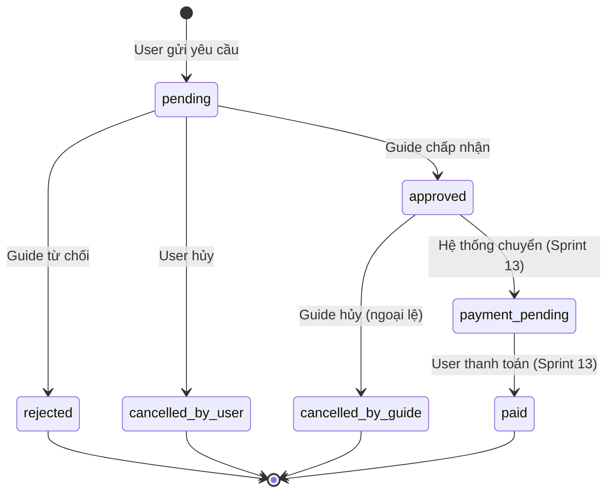
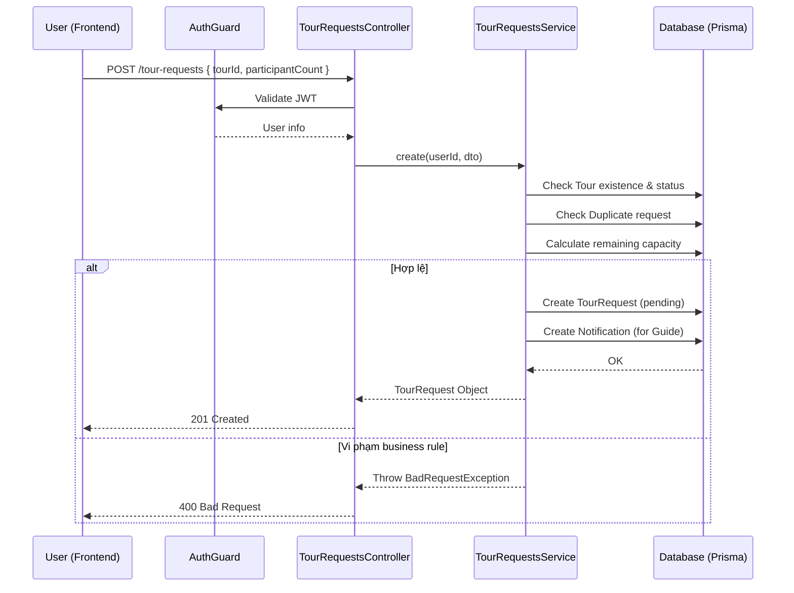

# SPRINT 06 – Triển khai yêu cầu tham gia tour

## 1. Mục tiêu sprint

Sprint 06 là sprint hoàn thiện **luồng nghiệp vụ trung tâm đầu tiên** của toàn bộ đồ án: **khách du lịch xem chi tiết tour → gửi yêu cầu tham gia tour → hướng dẫn viên tiếp nhận và xử lý yêu cầu**. Sau Sprint 03 đã có khu vực public cho tour, Sprint 04 đã có hồ sơ hướng dẫn viên, và Sprint 05 đã cho hướng dẫn viên tạo được tour thật, Sprint 06 phải làm cho các phần đó **liên kết thành một flow vận hành hoàn chỉnh**.

Đây là sprint có giá trị demo rất cao vì nó thể hiện rõ bản chất của đề tài: hệ thống không chỉ dừng ở việc hiển thị tour, mà còn hỗ trợ **kết nối thực sự giữa người muốn tham gia tour và người tổ chức tour** thông qua cơ chế request có trạng thái, có kiểm tra quyền, có phản hồi xử lý và có thông báo.

### Mục tiêu chính

- Hiện thực hoàn chỉnh nhóm chức năng:
  - **F11:** Quản lý yêu cầu tham gia tour
- Hoàn thành **luồng lõi đầu tiên có tính khép kín** của hệ thống:
  - người dùng xem tour;
  - gửi yêu cầu tham gia;
  - theo dõi trạng thái yêu cầu của mình;
  - hướng dẫn viên xem toàn bộ yêu cầu liên quan tới tour của mình;
  - hướng dẫn viên duyệt hoặc từ chối yêu cầu;
  - hệ thống cập nhật trạng thái và tạo thông báo.
- Chuẩn hóa **state machine của `tour_requests`** để frontend, backend, database và UML bám cùng một logic.
- Tạo nền cho các sprint sau như:
  - đánh giá tour / hướng dẫn viên;
  - thanh toán tour;
  - thông báo thời gian thực;
  - quản trị nội dung và báo cáo vận hành.

### Ý nghĩa của sprint này

Sprint 06 là mốc chứng minh rằng hệ thống đã đi qua được một chuỗi nghiệp vụ thật, không còn là các module rời rạc. Nếu Sprint 05 chứng minh guide có thể tạo tour, thì Sprint 06 chứng minh **tour đó có thể được người dùng tương tác và xử lý theo đúng vòng đời nghiệp vụ**.

---

## 2. Lưu ý trước khi triển khai

## 2.1. Phải chốt state machine của `tour_requests` ngay từ đầu

Sprint 06 là sprint rất nhạy cảm về trạng thái. Nếu không chốt rõ `tour_requests.status` từ đầu thì:

- frontend sẽ không biết nút nào được hiển thị ở từng trạng thái;
- backend sẽ dễ cho phép chuyển trạng thái sai;
- dữ liệu demo sẽ bị lẫn lộn;
- UML sẽ không phản ánh đúng nghiệp vụ.

Vì vậy, trước khi code phải thống nhất rõ:

- trạng thái khởi tạo là gì;
- ai có quyền chuyển trạng thái;
- điều kiện nào cho phép duyệt;
- điều kiện nào cho phép từ chối;
- điều kiện nào cho phép hủy;
- trạng thái nào chỉ để dành cho sprint thanh toán sau này.

## 2.2. Sprint này phụ thuộc trực tiếp vào Sprint 03, 04 và 05

Sprint 06 chỉ có thể chạy trơn tru nếu các sprint trước đã ổn định:

- Sprint 03 phải có `M06 Chi tiết tour` và dữ liệu public tour hoạt động đúng;
- Sprint 04 phải có guide profile để xác định chủ tour;
- Sprint 05 phải có tour thật, ảnh tour, itinerary và ownership rõ ràng;
- Sprint 02 phải có auth và role guard ổn định.

Nếu đầu vào từ các sprint trước chưa chắc, Sprint 06 sẽ rất dễ phát sinh lỗi dây chuyền.

## 2.3. Không được làm hỏng trải nghiệm public của `M06 Chi tiết tour`

Form gửi yêu cầu tham gia là phần mở rộng trên màn hình chi tiết tour, nhưng **không được làm M06 trở nên rối và nặng**. Mục tiêu của màn hình này vẫn là giúp người dùng đọc và hiểu tour trước. Khối request phải:

- gọn;
- rõ điều kiện;
- hiển thị trạng thái dễ hiểu;
- chỉ mở rộng khi người dùng đã đăng nhập và có quyền thao tác.

## 2.4. Kiểm tra quyền và ownership phải chặt hơn các sprint trước

Ở Sprint 06, sai quyền không chỉ gây lỗi hiển thị mà còn làm sai nghiệp vụ:

- người dùng không được gửi request vào tour không hợp lệ;
- người dùng không được duyệt request của người khác;
- hướng dẫn viên chỉ được xử lý request thuộc tour do mình quản lý;
- user không được sửa hoặc hủy yêu cầu sau khi đã qua trạng thái không còn hợp lệ.

Vì vậy, tầng backend phải coi ownership và state validation là kiểm tra bắt buộc, không chỉ là kiểm tra giao diện.

## 2.5. “Xong sprint” không phải chỉ là gửi request thành công

Sprint 06 chỉ được xem là hoàn thành khi đạt đủ:

- có API tạo request và xử lý request chạy được;
- có màn hình user theo dõi request đã gửi;
- có màn hình guide quản lý request;
- có dữ liệu demo đa trạng thái;
- có flow kiểm thử tối thiểu;
- có UML cập nhật theo đúng luồng gửi yêu cầu và duyệt / từ chối yêu cầu.

---

## 3. Các vấn đề cần xác định trong sprint này

## 3.1. State machine của `tour_requests`

Cần xác định rõ hệ trạng thái dùng trong hệ thống. Theo schema final, bảng `tour_requests` cho phép các trạng thái:

- `pending`
- `approved`
- `rejected`
- `cancelled_by_user`
- `cancelled_by_guide`
- `payment_pending`
- `paid`

Tuy nhiên, không nhất thiết Sprint 06 phải hiện thực sâu toàn bộ vòng đời thanh toán. Cần chốt rõ:

- trạng thái nào là **lõi bắt buộc** của Sprint 06;
- trạng thái nào chỉ cần **giữ tương thích schema** cho sprint sau.

## 3.2. Điều kiện để người dùng được gửi yêu cầu

Cần chốt rõ những ràng buộc khi tạo request:

- tour phải tồn tại;
- tour không bị xóa mềm;
- tour phải ở trạng thái có thể nhận người tham gia;
- tour phải đủ chỗ;
- user không phải là chủ tour;
- user chưa có một request đang còn hiệu lực cho chính tour đó;
- số lượng người đi cùng (`participant_count`) phải hợp lệ.

## 3.3. Cách tính số chỗ còn lại của tour

Cần xác định chỗ trống được tính theo:

- số request đã gửi;
- hay chỉ tính các request đã được duyệt;
- có trừ theo `participant_count` hay chỉ theo số request;
- khi user hủy hoặc guide từ chối thì có trả lại chỗ hay không.

Đây là chỗ rất dễ sai nếu frontend và backend không dùng cùng một nguyên tắc.

## 3.4. Quy tắc hủy yêu cầu

Cần chốt user được hủy trong trường hợp nào:

- chỉ khi request còn `pending`;
- hay cho phép hủy cả khi `approved` nhưng chưa thanh toán;
- có cho guide chủ động hủy request trong tình huống đặc biệt hay không;
- khi hủy có bắt buộc nhập lý do hay không.

## 3.5. Cách duyệt yêu cầu của hướng dẫn viên

Cần quyết định rõ hướng dẫn viên khi xử lý request:

- duyệt trực tiếp thành `approved`;
- hay chuyển sang `payment_pending`;
- có bắt buộc nhập `response_note` khi từ chối hay không;
- có giới hạn duyệt khi số chỗ còn lại không đủ hay không.

## 3.6. Cách tạo thông báo

Sprint này có liên quan đến `notifications`, nên cần xác định:

- tạo thông báo cho guide khi user gửi request;
- tạo thông báo cho user khi guide duyệt / từ chối;
- có tạo thông báo khi user tự hủy hay không;
- notification dùng loại nào, entity nào và payload nào để sau này dễ mở rộng real-time.

## 3.7. Phạm vi của thanh toán trong Sprint 06

Schema đã chuẩn bị `payment_pending` và `paid`, nhưng thanh toán là một phân hệ riêng ở sprint sau. Vì vậy phải chốt:

- Sprint 06 chỉ làm **flow request lõi**;
- thanh toán chưa triển khai đầy đủ;
- trạng thái `payment_pending` và `paid` chỉ được **giữ sẵn trong thiết kế** hoặc seed để không phá schema về sau.

---

## 4. Hạng mục cần chốt

Trong Sprint 06, các hạng mục cần chốt trước khi code gồm:

- state machine chính thức của `tour_requests`;
- điều kiện hợp lệ để gửi yêu cầu tham gia tour;
- nguyên tắc tính sức chứa còn lại của tour;
- quy tắc hủy yêu cầu của user;
- quy tắc duyệt / từ chối yêu cầu của guide;
- cách lưu `response_note`, `processed_at`, `processed_by_user_id`;
- chiến lược tạo notification ở mức cơ bản;
- phạm vi của trạng thái liên quan đến thanh toán trong sprint này;
- danh sách màn hình phải hoàn tất;
- checklist “xong Sprint 06”.

---

## 5. Phương án được chọn

## 5.1. State machine được chọn cho Sprint 06

Trong Sprint 06, hệ thống sử dụng đầy đủ tập trạng thái của schema để bảo đảm tương thích dài hạn:

- `pending`
- `approved`
- `rejected`
- `cancelled_by_user`
- `cancelled_by_guide`
- `payment_pending`
- `paid`

Tuy nhiên, **phần nghiệp vụ bắt buộc hiện thực thật trong Sprint 06** chỉ tập trung vào các chuyển trạng thái sau:

- `pending` → `approved`
- `pending` → `rejected`
- `pending` → `cancelled_by_user`

Ngoài ra:

- `cancelled_by_guide` được giữ như một hướng mở rộng có thể dùng trong trường hợp guide chủ động đóng request vì lý do nghiệp vụ;
- `payment_pending` và `paid` được giữ đúng schema, có thể seed dữ liệu mô phỏng, nhưng **không bắt buộc làm sâu trong UI/flow của Sprint 06**.

Cách chọn này giúp sprint bám đúng nguyên tắc:

- **lõi trước, mở rộng sau**;
- không phá thiết kế CSDL đã chốt;
- vẫn giữ được khả năng nối sang sprint thanh toán sau này.

## 5.2. Điều kiện gửi request được chọn

Người dùng được gửi yêu cầu tham gia tour khi thỏa các điều kiện sau:

- đã đăng nhập;
- có role người dùng hợp lệ;
- tour tồn tại;
- tour không bị xóa mềm;
- tour có `business_status = published`;
- tour có `visibility_status = visible`;
- guide của tour vẫn ở trạng thái profile hợp lệ để tiếp nhận tour;
- tổng số chỗ đã được duyệt cộng với `participant_count` mới không vượt `max_participants`;
- người gửi chưa có request đang còn hiệu lực cho cùng tour.

Nếu vi phạm bất kỳ điều kiện nào, backend trả lỗi nghiệp vụ rõ ràng để frontend hiển thị thông báo đúng ngữ cảnh.

## 5.3. Cách tính sức chứa được chọn

Sức chứa còn lại của tour được tính theo tổng `participant_count` của các request đang ở trạng thái **đã chiếm chỗ thực sự**, tối thiểu gồm:

- `approved`
- có thể mở rộng thêm `payment_pending` nếu về sau thanh toán được tích hợp ngay sau bước duyệt

Trong phạm vi Sprint 06:

- luồng chính lấy tổng người từ request `approved`;
- request `pending`, `rejected`, `cancelled_by_user`, `cancelled_by_guide` không chiếm chỗ;
- nếu đã seed `payment_pending` để test trước, backend phải xem rõ trạng thái này có chiếm chỗ hay không theo một rule thống nhất trong service.

Phương án khuyến nghị cho sprint này:

- **`approved` chiếm chỗ**
- **`payment_pending` được giữ tương thích nhưng chưa đưa thành logic chính bắt buộc**

## 5.4. Quy tắc hủy yêu cầu được chọn

Trong Sprint 06, user được phép hủy request khi request vẫn đang ở trạng thái:

- `pending`

Nếu muốn an toàn hơn trong giai đoạn đầu, không nên cho phép hủy khi request đã `approved`, vì điều đó sẽ kéo theo các câu hỏi về hoàn chỗ, hoàn thanh toán và lịch sử tham gia.

Khi user hủy:

- cập nhật `status = cancelled_by_user`;
- ghi `cancelled_at`;
- cập nhật `updated_at`;
- có thể tạo notification cho guide nếu muốn tăng tính minh bạch của flow.

## 5.5. Quy tắc xử lý request của guide được chọn

Guide chỉ được xử lý request khi:

- guide đã đăng nhập;
- có role `GUIDE`;
- tour của request thuộc guide đó;
- request đang ở trạng thái `pending`.

Guide có hai thao tác chính:

- duyệt → `approved`
- từ chối → `rejected`

Khi xử lý:

- ghi `processed_at`;
- ghi `processed_by_user_id`;
- cho phép lưu `response_note` để giải thích kết quả, đặc biệt hữu ích khi từ chối.

## 5.6. Cơ chế notification được chọn

Trong Sprint 06, notification được triển khai ở mức cơ bản nhưng đủ dùng:

- khi user gửi request:
  - tạo notification cho guide;
- khi guide duyệt / từ chối:
  - tạo notification cho user.

Bản ghi notification nên chứa:

- `notification_type = 'tour_request'`
- `entity_type = 'tour_requests'` hoặc giá trị tương đương thống nhất trong backend
- `entity_id = id của request`
- `payload` chứa các thông tin nhẹ như:
  - `tourId`
  - `tourTitle`
  - `status`
  - `actorUserId`

## 5.7. Phạm vi thanh toán được chọn

Sprint 06 **không triển khai sâu thanh toán**. Mục tiêu vẫn là hoàn tất flow request lõi. Vì vậy:

- UI không cần dựng flow thanh toán thật;
- API request không bắt buộc gắn payment flow;
- `payment_pending` và `paid` chỉ cần giữ trong schema / dữ liệu seed / tài liệu mô tả để không phải refactor ở sprint sau.

## 5.8. Quy tắc hiển thị nút thao tác được chọn

Trên giao diện:

- ở `M06 Chi tiết tour`:
  - user chưa đăng nhập: hiển thị CTA đăng nhập để gửi yêu cầu;
  - user đã đăng nhập và đủ điều kiện: hiển thị form gửi yêu cầu;
  - user đã có request còn hiệu lực: không cho gửi trùng;
  - guide là chủ tour: không hiển thị nút gửi yêu cầu.
- ở `M21 Yêu cầu tham gia tour của tôi`:
  - chỉ cho hủy khi trạng thái `pending`;
  - các trạng thái khác hiển thị read-only.
- ở `M37 Quản lý yêu cầu tham gia tour`:
  - chỉ hiển thị nút duyệt / từ chối với request `pending`;
  - request đã xử lý chỉ hiển thị trạng thái và thông tin xử lý.

---

## 6. Ghi chú triển khai

Kết thúc Sprint 06, hệ thống phải đạt được một flow đủ mạnh để demo:

1. người dùng truy cập chi tiết tour;
2. gửi yêu cầu tham gia thành công;
3. mở “Yêu cầu tham gia tour của tôi” để xem request vừa gửi;
4. hướng dẫn viên đăng nhập vào khu vực quản lý request;
5. duyệt hoặc từ chối một request;
6. người dùng quay lại và thấy trạng thái được cập nhật;
7. hệ thống có notification cơ bản tương ứng.

Ngoài ra, Sprint 06 cần giữ tinh thần:

- không mở rộng quá sớm sang thanh toán thật;
- không làm UI quá nặng;
- không phá dữ liệu tour public đã có;
- ưu tiên tính đúng nghiệp vụ hơn là làm nhiều tính năng phụ.

---

## 7. Chức năng trọng tâm

Sprint 06 tập trung vào một nhóm chức năng duy nhất:

- **F11 – Quản lý yêu cầu tham gia tour**

Trong phạm vi sprint này, F11 được tách thành ba cụm thao tác chính:

1. **Người dùng gửi yêu cầu tham gia tour**
   - gửi từ `M06 Chi tiết tour`;
   - nhập số lượng người tham gia;
   - nhập ghi chú nếu cần;
   - hệ thống kiểm tra điều kiện nghiệp vụ trước khi lưu.

2. **Người dùng theo dõi và hủy yêu cầu của mình**
   - xem danh sách request đã gửi tại `M21`;
   - xem trạng thái hiện tại của từng request;
   - hủy request còn đang chờ xử lý.

3. **Hướng dẫn viên quản lý yêu cầu liên quan tới tour của mình**
   - xem danh sách request theo tour hoặc theo trạng thái tại `M37`;
   - duyệt hoặc từ chối;
   - nhập phản hồi ngắn;
   - hệ thống cập nhật trạng thái và gửi thông báo.

---

## 8. Màn hình triển khai

## 8.1. Mục tiêu của phần màn hình

Phần giao diện của Sprint 06 phải làm được hai việc đồng thời:

- biến `M06` từ màn hình xem tour thành màn hình có thể **bắt đầu giao dịch nghiệp vụ**;
- tạo hai khu vực quản lý riêng để user và guide theo dõi cùng một request từ hai góc nhìn khác nhau.

## 8.2. Các màn hình cần triển khai trong Sprint 06

### M06 – Chi tiết tour (mở rộng phần gửi yêu cầu tham gia)

Đây là điểm bắt đầu của flow request. Trong Sprint 06, `M06` cần bổ sung thêm:

- khối CTA gửi yêu cầu tham gia;
- form nhỏ gồm:
  - `participantCount`
  - `note`
- trạng thái điều kiện tham gia:
  - còn chỗ / hết chỗ;
  - đã đăng nhập / chưa đăng nhập;
  - đã gửi request trước đó hay chưa;
- thông báo thành công / thất bại sau khi gửi;
- điều hướng hoặc liên kết nhanh tới `M21 Yêu cầu tham gia tour của tôi`.

Khối này phải được đặt ở vị trí hợp lý để không phá luồng đọc nội dung tour.

### M21 – Yêu cầu tham gia tour của tôi

Đây là màn hình phía user dùng để theo dõi toàn bộ request đã gửi. Màn hình nên có:

- danh sách request dạng table hoặc card;
- các cột/trường hiển thị chính:
  - tên tour;
  - ngày gửi;
  - số lượng người;
  - trạng thái;
  - ghi chú gửi đi;
  - ghi chú phản hồi từ guide;
  - thời điểm xử lý;
- bộ lọc theo trạng thái;
- nút hủy request nếu request còn `pending`;
- empty state rõ ràng nếu user chưa gửi request nào.

### M37 – Quản lý yêu cầu tham gia tour

Đây là màn hình phía guide để xử lý request liên quan tới tour mình quản lý. Màn hình cần có:

- danh sách request;
- bộ lọc theo:
  - tour;
  - trạng thái;
  - thời gian gửi;
- vùng hiển thị thông tin người gửi;
- hiển thị `participant_count`, `note`, trạng thái hiện tại;
- vùng nhập `response_note`;
- nút:
  - duyệt;
  - từ chối;
- trạng thái xử lý xong phải được phản ánh ngay trên UI.

## 8.3. Thành phần UI dùng chung cần tận dụng

Sprint 06 nên tận dụng lại các component đã có từ Sprint 01–05:

- table / data grid;
- badge trạng thái;
- modal xác nhận;
- textarea input;
- empty state;
- loading state;
- toast notification;
- filter bar;
- pagination nếu cần.

Không nên dựng một UI framework mới chỉ cho request flow này.

## 8.4. Kết quả mong đợi của phần màn hình

Kết thúc Sprint 06:

- `M06` có thể gửi request thật;
- `M21` theo dõi được request của user theo trạng thái;
- `M37` giúp guide xử lý request dễ hiểu và đúng quyền;
- các màn hình phản ánh nhất quán cùng một trạng thái dữ liệu.

---

## 9. Bảng CSDL chính

## 9.1. `tour_requests`

### Vai trò

Đây là bảng lõi của Sprint 06, dùng để lưu toàn bộ yêu cầu tham gia tour do user gửi.

### Trường quan trọng

- `id`
- `tour_id`
- `user_id`
- `participant_count`
- `note`
- `response_note`
- `status`
- `requested_at`
- `processed_at`
- `processed_by_user_id`
- `cancelled_at`
- `created_at`
- `updated_at`

### Vai trò trong Sprint 06

- tạo mới request;
- theo dõi trạng thái xử lý;
- lưu ghi chú từ user và phản hồi từ guide;
- ghi nhận thời điểm xử lý / hủy;
- làm căn cứ cho các sprint sau như payment, review và báo cáo.

## 9.2. `tours`

### Vai trò

Là bảng nguồn để xác định request đang gửi vào tour nào và tour đó có hợp lệ hay không.

### Trường quan trọng

- `id`
- `guide_profile_id`
- `title`
- `max_participants`
- `business_status`
- `visibility_status`
- `published_at`
- `is_deleted`
- `deleted_at`

### Vai trò trong Sprint 06

- kiểm tra tour có được phép nhận request hay không;
- xác định sức chứa tối đa;
- xác định ownership của guide thông qua `guide_profile_id`;
- hiển thị thông tin tour trên màn hình user và guide.

## 9.3. `users`

### Vai trò

Lưu hồ sơ nghiệp vụ của user và guide.

### Trường quan trọng

- `id`
- `email`
- `full_name`
- `avatar_url`
- `status`

### Vai trò trong Sprint 06

- xác định người gửi request;
- xác định guide xử lý request;
- hiển thị thông tin cơ bản trên UI;
- kiểm tra tài khoản có đang bị khóa / hạn chế hay không nếu cần.

## 9.4. `notifications`

### Vai trò

Lưu thông báo cho user hoặc guide khi request có thay đổi đáng chú ý.

### Trường quan trọng

- `id`
- `user_id`
- `notification_type`
- `title`
- `content`
- `entity_type`
- `entity_id`
- `payload`
- `is_read`
- `created_at`
- `read_at`

### Vai trò trong Sprint 06

- gửi thông báo cho guide khi có request mới;
- gửi thông báo cho user khi request được duyệt / từ chối;
- chuẩn bị nền cho sprint notification hoặc realtime sau này.

## 9.5. Bảng hỗ trợ cần lưu ý thêm

Dù không phải bảng trọng tâm chính thức của Sprint 06, backend vẫn sẽ phải join hoặc kiểm tra thêm từ:

- `guide_profiles`
- `user_roles`
- `roles`

Lý do:

- `guide_profiles` dùng để xác định tour thuộc guide nào;
- `user_roles` và `roles` hỗ trợ xác định quyền guide / user ở tầng guard.

## 9.6. Ghi chú triển khai dữ liệu

Trong Sprint 06, dữ liệu demo tối thiểu nên có:

- 2–3 guide đã có tour published;
- nhiều user khác nhau;
- các request ở nhiều trạng thái:
  - pending
  - approved
  - rejected
  - cancelled_by_user
- có thể seed thêm 1–2 bản ghi `payment_pending` để giữ tương thích báo cáo / demo schema.

---

## 10. API cần thiết

## 10.1. `POST /tour-requests`

### Mục đích

Tạo mới yêu cầu tham gia tour từ `M06 Chi tiết tour`.

### Request gợi ý

```json
{
  "tourId": "uuid",
  "participantCount": 2,
  "note": "Tôi muốn tham gia cùng 1 người bạn."
}
```

### Kết quả mong đợi

- tạo request mới với `status = pending`;
- trả về request vừa tạo;
- tạo notification cho guide;
- trả lỗi rõ ràng nếu:
  - tour không hợp lệ;
  - hết chỗ;
  - tour không còn mở;
  - user đã gửi request trước đó.

## 10.2. `GET /me/tour-requests`

### Mục đích

Lấy danh sách request của user hiện tại để hiển thị ở `M21`.

### Query gợi ý

- `status`
- `page`
- `limit`
- `sort`

### Kết quả mong đợi

Trả về danh sách request kèm thông tin tour cơ bản:

- tên tour;
- ngày bắt đầu;
- guide;
- trạng thái;
- ghi chú xử lý;
- thời gian gửi và thời gian xử lý.

## 10.3. `PATCH /tour-requests/:id/cancel`

### Mục đích

Cho user hủy request của chính mình khi request còn hợp lệ để hủy.

### Request gợi ý

```json
{
  "reason": "Tôi thay đổi kế hoạch cá nhân."
}
```

### Kết quả mong đợi

- cập nhật `status = cancelled_by_user`;
- ghi `cancelled_at`;
- không cho hủy nếu request đã không còn ở trạng thái cho phép hủy.

## 10.4. `GET /guide/tour-requests`

### Mục đích

Lấy danh sách request thuộc các tour do guide hiện tại quản lý.

### Query gợi ý

- `tourId`
- `status`
- `page`
- `limit`
- `keyword`

### Kết quả mong đợi

- trả về danh sách request theo ngữ cảnh guide;
- có thể lọc theo tour và trạng thái;
- có thông tin người gửi, tour liên quan, số lượng người, ghi chú và trạng thái hiện tại.

## 10.5. `PATCH /guide/tour-requests/:id/approve`

### Mục đích

Cho guide duyệt một request đang chờ xử lý.

### Request gợi ý

```json
{
  "responseNote": "Đã xác nhận tham gia. Hẹn gặp bạn đúng giờ."
}
```

### Kết quả mong đợi

- cập nhật `status = approved`;
- ghi `processed_at`;
- ghi `processed_by_user_id`;
- lưu `response_note` nếu có;
- tạo notification cho user;
- từ chối thao tác nếu:
  - guide không phải chủ tour;
  - request không còn `pending`;
  - tour không còn đủ chỗ.

## 10.6. `PATCH /guide/tour-requests/:id/reject`

### Mục đích

Cho guide từ chối một request đang chờ xử lý.

### Request gợi ý

```json
{
  "responseNote": "Tour đã đủ thành viên phù hợp."
}
```

### Kết quả mong đợi

- cập nhật `status = rejected`;
- ghi `processed_at`;
- ghi `processed_by_user_id`;
- lưu `response_note`;
- tạo notification cho user.

## 10.7. API hỗ trợ nên cân nhắc thêm

Không bắt buộc phải công bố rộng ngay ở Sprint 06, nhưng có thể cân nhắc:

- `GET /guide/tours/:id/requests-summary`
- `GET /tour-requests/:id`
- `POST /notifications/read-all` hoặc `PATCH /notifications/:id/read`

Các API này chỉ nên làm khi phần lõi đã ổn.

## 10.8. Yêu cầu kỹ thuật chung cho API

Toàn bộ API trong Sprint 06 cần bảo đảm:

- dùng auth guard;
- dùng role guard ở endpoint guide;
- validate DTO chặt;
- kiểm tra ownership trong service;
- trả lỗi nghiệp vụ rõ ràng;
- chuẩn hóa response format;
- log các thao tác đổi trạng thái.

---

## 11. Công việc frontend

## 11.1. Mở rộng `M06 Chi tiết tour` với form gửi yêu cầu

Frontend cần bổ sung một khối gửi yêu cầu tham gia tour, gồm:

- input số lượng người;
- textarea ghi chú;
- nút gửi yêu cầu;
- thông báo lỗi / thành công.

Khối này phải chỉ hiển thị đúng ngữ cảnh:

- guest: yêu cầu đăng nhập;
- user hợp lệ: cho gửi;
- guide là chủ tour: không hiển thị nút gửi.

## 11.2. Dựng `M21 Yêu cầu tham gia tour của tôi`

Cần xây dựng màn hình quản lý theo góc nhìn user:

- danh sách request đã gửi;
- bộ lọc trạng thái;
- badge trạng thái màu sắc rõ ràng;
- nút hủy cho request đang chờ xử lý;
- hiển thị thông tin phản hồi của guide nếu có.

## 11.3. Dựng `M37 Quản lý yêu cầu tham gia tour`

Đây là màn hình làm việc chính của guide trong Sprint 06. Cần có:

- bảng request;
- filter theo tour / trạng thái;
- modal hoặc panel chi tiết request;
- textarea nhập phản hồi;
- nút duyệt / từ chối.

## 11.4. Chuẩn hóa badge trạng thái

Nên xây một bộ hiển thị trạng thái dùng chung cho:

- `pending`
- `approved`
- `rejected`
- `cancelled_by_user`
- `cancelled_by_guide`
- `payment_pending`
- `paid`

Dù chưa dùng hết ở Sprint 06, việc dựng sẵn từ đầu sẽ giúp các sprint sau đỡ sửa UI.

## 11.5. Tạo UX chống gửi trùng và chống thao tác sai

Frontend cần:

- disable nút gửi khi request đang submit;
- disable nút approve / reject khi đang xử lý;
- confirm trước khi hủy request;
- refresh hoặc optimistic update đúng cách sau khi đổi trạng thái.

## 11.6. Hiển thị lỗi nghiệp vụ dễ hiểu

Các lỗi như:

- tour đã đóng;
- tour hết chỗ;
- đã gửi request trước đó;
- không đủ quyền xử lý;
- request không còn chờ xử lý

phải được map ra thông báo dễ hiểu, không hiển thị raw message kỹ thuật.

## 11.7. Kết nối notification cơ bản

Nếu có khu vực notification hoặc toast dùng chung, frontend nên hiển thị:

- gửi request thành công;
- duyệt thành công;
- từ chối thành công;
- hủy thành công.

## 11.8. Test flow phía frontend

Cần test ít nhất các trường hợp:

- gửi request hợp lệ;
- gửi request trùng;
- gửi request vào tour hết chỗ;
- user hủy request pending;
- guide duyệt request;
- guide từ chối request;
- guide xử lý request không thuộc tour của mình.

## 11.9. Kết quả mong đợi phía frontend

Kết thúc Sprint 06:

- user thao tác request được từ màn hình tour;
- user theo dõi được request đã gửi;
- guide xử lý được request trên một màn hình riêng;
- UI phản ánh trạng thái request rõ ràng và nhất quán.

---

## 12. Công việc backend

## 12.1. Hoàn thiện module `tour-requests`

Cần tách module đủ rõ:

- controller
- service
- dto
- mapper / presenter nếu cần
- policy / permission helper

## 12.2. Xử lý create request

Khi tạo request, backend phải:

- xác thực user;
- lấy tour;
- kiểm tra tour hợp lệ;
- kiểm tra duplicate request;
- kiểm tra sức chứa;
- tạo request mới;
- tạo notification cho guide.

## 12.3. Xử lý list request của user

Endpoint `GET /me/tour-requests` phải:

- chỉ lấy request của chính user hiện tại;
- hỗ trợ filter trạng thái;
- join thông tin tour cần thiết;
- không trả dữ liệu thừa.

## 12.4. Xử lý cancel request

Backend phải:

- kiểm tra request có thuộc user hiện tại không;
- kiểm tra state hiện tại có cho phép hủy không;
- cập nhật `status`, `cancelled_at`, `updated_at`;
- ngăn hủy nhiều lần.

## 12.5. Xử lý list request của guide

Backend phải:

- xác định guide hiện tại;
- join request với tour và user;
- chỉ trả các request thuộc tour của guide đó;
- hỗ trợ filter trạng thái và tour.

## 12.6. Xử lý approve / reject request

Khi guide xử lý request, backend phải:

- kiểm tra request tồn tại;
- kiểm tra ownership tour;
- kiểm tra request còn `pending`;
- kiểm tra sức chứa nếu duyệt;
- cập nhật trạng thái;
- ghi `processed_at`, `processed_by_user_id`, `response_note`;
- tạo notification cho user.

## 12.7. Chuẩn hóa rule về sức chứa

Service phải dùng một hàm thống nhất để tính số chỗ đã chiếm và số chỗ còn lại. Không nên để logic này lặp ở nhiều endpoint khác nhau.

## 12.8. Logging và xử lý lỗi

Các thao tác quan trọng cần được log ở mức đủ dùng:

- tạo request;
- hủy request;
- approve;
- reject.

Lỗi cần chia rõ:

- lỗi validate input;
- lỗi permission;
- lỗi state;
- lỗi business rule;
- lỗi hệ thống.

## 12.9. Chuẩn bị nền cho sprint thanh toán và review

Dù chưa làm sâu thanh toán, backend nên giữ kiến trúc đủ mở để sau này có thể:

- chuyển `approved` sang `payment_pending`;
- nối `tour_requests` với `payment_transactions`;
- nối `tour_requests` với `tour_reviews` và `guide_reviews`.

## 12.10. Kết quả mong đợi phía backend

Kết thúc Sprint 06:

- toàn bộ API request hoạt động ổn định;
- rule nghiệp vụ không bị lệch giữa user và guide;
- trạng thái được kiểm soát đúng;
- dữ liệu sẵn sàng cho sprint sau mà không cần refactor lớn.

---

## 13. Công việc database

## 13.1. Chuẩn hóa dữ liệu `tour_requests`

Cần bảo đảm bảng `tour_requests` dùng thống nhất các trạng thái trong schema:

- `pending`
- `approved`
- `rejected`
- `cancelled_by_user`
- `cancelled_by_guide`
- `payment_pending`
- `paid`

## 13.2. Thêm index cần thiết

Nên bổ sung / xác nhận index theo:

- `tour_id`
- `user_id`
- `status`

Nếu cần tối ưu hơn cho guide screen, có thể cân nhắc index ghép theo:

- `(tour_id, status)`
- `(user_id, status)`

## 13.3. Seed dữ liệu request đa trạng thái

Cần seed:

- request đang chờ;
- request đã được duyệt;
- request bị từ chối;
- request bị user hủy;
- có thể thêm request `payment_pending` để phục vụ demo cấu trúc dữ liệu.

## 13.4. Seed notification cơ bản

Nên có dữ liệu notification mẫu cho:

- guide nhận request mới;
- user nhận kết quả duyệt;
- user nhận kết quả từ chối.

## 13.5. Kiểm tra toàn vẹn dữ liệu

Cần rà lại:

- `tour_id` có tồn tại không;
- `user_id` có hợp lệ không;
- `processed_by_user_id` có hợp lệ không;
- các request không trỏ tới tour bị xóa / không hợp lệ trong seed demo.

## 13.6. Kiểm tra tính nhất quán với tour

Dữ liệu seed phải bám đúng:

- `tours.max_participants`
- `tours.business_status`
- `tours.visibility_status`

Không seed request vào tour đang ở trạng thái không nên nhận request nếu không có mục đích test ngoại lệ.

## 13.7. Kiểm tra RLS / quyền truy cập dữ liệu

Nếu dự án đang dùng Supabase RLS, cần rà lại để bảo đảm:

- user chỉ đọc / sửa request của mình;
- guide chỉ đọc / xử lý request thuộc tour của mình;
- notification chỉ đọc theo owner hoặc backoffice.

## 13.8. Kết quả mong đợi phía database

Kết thúc Sprint 06:

- dữ liệu request có thể test đủ các flow chính;
- index đủ để truy vấn màn hình user và guide không bị chậm;
- schema không phải chỉnh lớn khi sang sprint thanh toán hoặc review.

---

## 14.1. Mô hình trạng thái (State Machine) của Tour Request

Yêu cầu tham gia tour tuân theo vòng đời trạng thái nghiêm ngặt để đảm bảo tính toàn vẹn dữ liệu:



## 14.2. Activity Diagram – User gửi yêu cầu tham gia tour

```mermaid
activityDiagram
    start
    :User truy cập Chi tiết tour (M06);
    if (User đã đăng nhập?) then (có)
        :Hiển thị form đặt chỗ;
        :User nhập số lượng khách & ghi chú;
        :User nhấn "Gửi yêu cầu";
        :Hệ thống kiểm tra sức chứa & trùng lặp;
        if (Hợp lệ?) then (có)
            :Lưu request (status=pending);
            :Tạo notification cho Guide;
            :Hiển thị thông báo thành công;
        else (không)
            :Hiển thị lỗi nghiệp vụ;
        endif
    else (không)
        :Hiển thị nút "Đăng nhập để đặt chỗ";
    endif
    stop
```

## 14.3. Activity Diagram – Guide xử lý yêu cầu

```mermaid
activityDiagram
    start
    :Guide vào Dashboard -> Quản lý yêu cầu (M37);
    :Chọn yêu cầu trạng thái "Chờ duyệt";
    :Xem chi tiết & nhập phản hồi;
    if (Quyết định?) then (Chấp nhận)
        :Hệ thống kiểm tra sức chứa lại;
        :Cập nhật status = approved;
    else (Từ chối)
        :Cập nhật status = rejected;
    endif
    :Tạo notification cho User;
    :Cập nhật UI;
    stop
```

## 14.4. Sequence Diagram – POST /tour-requests



## 14.5. Mục tiêu của phần tài liệu/UML

Phần UML của Sprint 06 phải đủ rõ để khi bảo vệ có thể giải thích:

- ai gửi request;
- ai xử lý;
- dữ liệu nào thay đổi;
- điều kiện nào gây lỗi;
- vì sao flow này là luồng lõi có giá trị demo cao nhất của hệ thống ở giai đoạn đầu.

---

## 15. Đầu ra

## 15.1. Đầu ra chức năng

- User gửi được yêu cầu tham gia tour từ `M06`.
- User xem được danh sách request của mình tại `M21`.
- User hủy được request còn `pending`.
- Guide xem được toàn bộ request thuộc tour của mình tại `M37`.
- Guide duyệt hoặc từ chối request thành công.

## 15.2. Đầu ra giao diện

- `M06` có form gửi yêu cầu rõ ràng.
- `M21` hiển thị trạng thái request mạch lạc.
- `M37` có bộ lọc và thao tác xử lý request đúng ngữ cảnh guide.
- Badge trạng thái và thông báo UI nhất quán.

## 15.3. Đầu ra API

- `POST /tour-requests`
- `GET /me/tour-requests`
- `PATCH /tour-requests/:id/cancel`
- `GET /guide/tour-requests`
- `PATCH /guide/tour-requests/:id/approve`
- `PATCH /guide/tour-requests/:id/reject`

## 15.4. Đầu ra dữ liệu

- `tour_requests` được chuẩn hóa trạng thái;
- có dữ liệu demo đa trạng thái;
- `notifications` sinh đúng bản ghi cơ bản;
- dữ liệu đủ để demo từ góc nhìn user và guide.

## 15.5. Đầu ra tài liệu

- cập nhật mô tả nghiệp vụ request tour;
- cập nhật Activity Diagram gửi request;
- cập nhật Activity Diagram duyệt / từ chối request;
- cập nhật Sequence Diagram tương ứng;
- chốt state machine của `tour_requests`.

## 15.6. Tiêu chí sẵn sàng sang Sprint 07

Sprint 06 được xem là hoàn tất khi:

- flow xem tour → gửi yêu cầu → guide xử lý chạy được từ đầu đến cuối;
- API và UI đều hoạt động với dữ liệu thật;
- quyền user / guide không bị lệch;
- trạng thái request không bị sai logic;
- dự án sẵn sàng chuyển sang trục giá trị thứ hai là **bài tìm bạn đồng hành**.

---

## 16. Kết luận sprint

Sprint 06 là sprint đánh dấu việc hệ thống bắt đầu vận hành như một nền tảng kết nối thực thụ. Đây không còn là giai đoạn chỉ “xem được dữ liệu”, mà là giai đoạn người dùng và hướng dẫn viên **bắt đầu tương tác với nhau thông qua một vòng đời nghiệp vụ có trạng thái, có quyền xử lý và có phản hồi**.

Nếu Sprint 06 được làm chắc, đồ án sẽ có ngay một luồng demo rất mạnh:

- dễ trình bày;
- dễ kiểm thử;
- dễ mở rộng sang review, payment và notification;
- thể hiện rõ nhất tính thực tiễn của đề tài.

Vì vậy, ưu tiên lớn nhất của sprint này không phải làm nhiều màn hình phụ, mà là làm cho **flow request tour chạy đúng, rõ và ổn định**.
