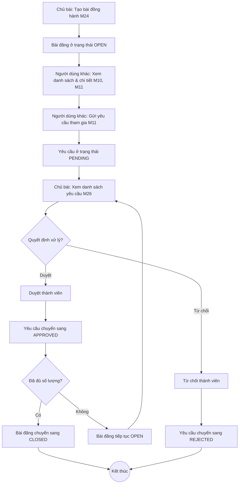
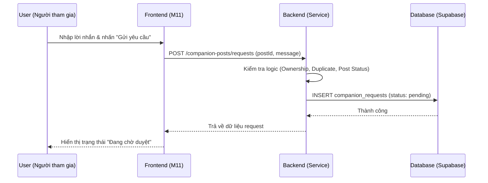
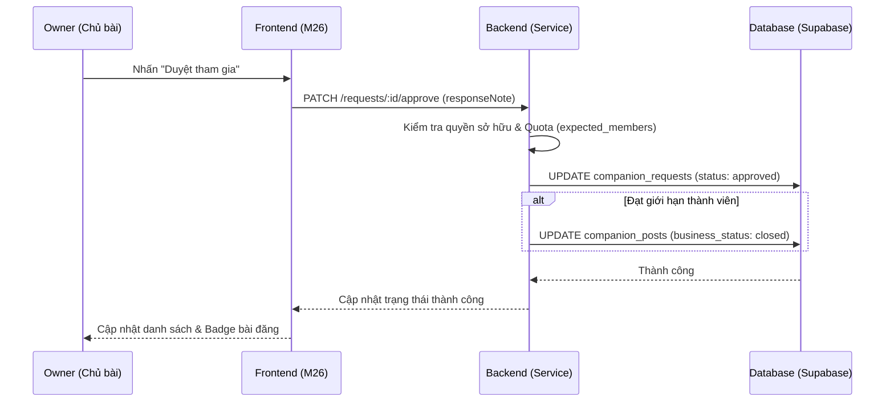
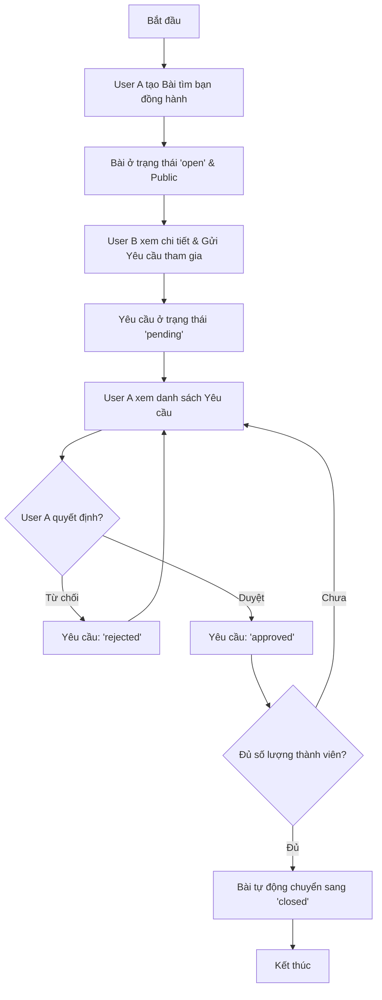
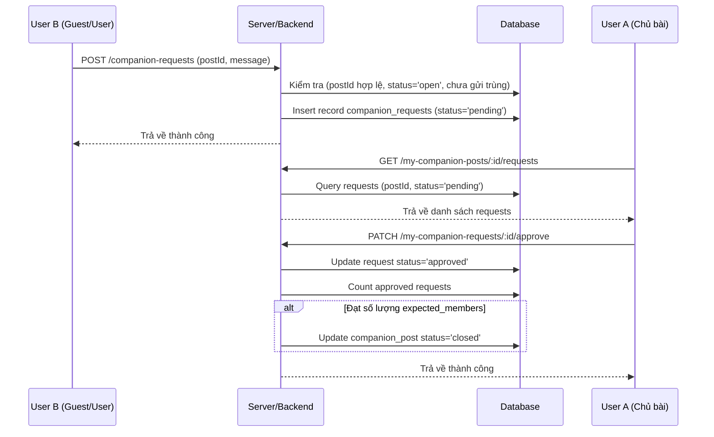

# SPRINT 07 – Triển khai bài tìm bạn đồng hành và yêu cầu tham gia bài đồng hành

## 1. Mục tiêu sprint

Sprint 07 là sprint hiện thực **trục giá trị thứ hai** của toàn bộ đề tài: **kết nối người dùng với nhau thông qua bài tìm bạn đồng hành**. Nếu Sprint 06 đã hoàn thành luồng kết nối giữa khách du lịch và hướng dẫn viên thông qua tour, thì Sprint 07 phải giúp hệ thống đi thêm một bước rất quan trọng: cho phép người dùng chủ động tạo bài đăng tìm người đi cùng, tiếp nhận yêu cầu tham gia, và quản lý danh sách thành viên theo đúng logic nghiệp vụ riêng của companion post.

Đây là sprint có ý nghĩa chiến lược vì nó tạo ra **bản sắc riêng** cho đồ án. Hệ thống từ đây không còn chỉ là một website tour thông thường, mà trở thành một nền tảng kết nối đa chiều:
- kết nối **khách du lịch – hướng dẫn viên** thông qua tour;
- kết nối **người dùng – người dùng** thông qua bài tìm bạn đồng hành.

### Mục tiêu chính
- Hiện thực hoàn chỉnh nhóm chức năng:
  - **F16:** Quản lý bài tìm bạn đồng hành
  - **F17:** Quản lý yêu cầu tham gia bài đồng hành
- Hoàn thành **luồng lõi thứ hai có tính khép kín** của hệ thống:
  - người dùng tạo bài tìm bạn đồng hành;
  - người khác xem danh sách bài và mở chi tiết bài;
  - người dùng gửi yêu cầu tham gia;
  - chủ bài xem danh sách yêu cầu;
  - chủ bài duyệt hoặc từ chối thành viên;
  - hệ thống đồng bộ trạng thái bài và trạng thái yêu cầu.
- Chuẩn hóa **state machine** cho:
  - `companion_posts.business_status`
  - `companion_requests.status`
- Dựng xong cụm màn hình Public Area và User Area liên quan tới companion post ở mức dùng thật, không chỉ dừng ở bản demo giao diện.
- Chuẩn bị nền dữ liệu và kiến trúc để các sprint sau có thể mở rộng sang:
  - chat nhóm bài đồng hành;
  - báo cáo vi phạm bài đồng hành;
  - notification;
  - quản trị và kiểm duyệt nội dung đồng hành.

### Ý nghĩa của sprint này
Sprint 07 là nơi hệ thống bắt đầu thể hiện rõ **sự khác biệt về ý tưởng đề tài**. Nếu làm chắc sprint này, bạn sẽ có thêm một luồng demo rất mạnh khi bảo vệ:
- User A tạo bài tìm bạn đồng hành;
- User B vào xem chi tiết bài;
- User B gửi yêu cầu tham gia;
- User A duyệt thành viên;
- hệ thống thay đổi trạng thái theo đúng quy tắc.

Đây là một trong bốn luồng demo bắt buộc đã được nhấn mạnh trong các tài liệu chốt, nên sprint này không được làm nửa vời.

---

## 2. Lưu ý trước khi triển khai

## 2.1. Phải tách rất rõ companion post với tour
Tài liệu đã chốt rất rõ: **tour** là hoạt động do guide tổ chức; còn **bài tìm bạn đồng hành** là bài do **user tạo để tìm người đi cùng**. Hai nhóm này phải khác nhau về:
- vai trò tạo dữ liệu;
- dữ liệu chính;
- quyền thao tác;
- trạng thái nghiệp vụ;
- màn hình quản lý;
- logic duyệt người tham gia.

Không được dùng lại tư duy của `tour_requests` để áp thẳng sang `companion_requests` mà không điều chỉnh, vì:
- chủ thể tạo bài khác;
- quy mô bài nhỏ hơn tour;
- không có guide_profile;
- không gắn logic thanh toán ở sprint này;
- logic “đủ thành viên thì đóng bài” phải được xử lý nhẹ và linh hoạt hơn.

## 2.2. Đây là sprint nghiệp vụ của User Area, không phải Guide Area
Sprint 07 chủ yếu xoay quanh:
- Public Area:
  - M10 Danh sách bài tìm bạn đồng hành
  - M11 Chi tiết bài tìm bạn đồng hành
- User Area:
  - M23 Danh sách bài đồng hành của tôi
  - M24 Tạo/cập nhật bài tìm bạn đồng hành
  - M25 Yêu cầu tham gia bài đồng hành đã gửi
  - M26 Quản lý yêu cầu tham gia bài đồng hành

Guide không phải actor trung tâm trong sprint này. Vì vậy:
- không kéo guide dashboard vào flow companion;
- không pha trộn companion post với tour của guide;
- không gắn nghiệp vụ xác minh guide vào companion post.

## 2.3. Phải chốt trạng thái bài và trạng thái request trước khi code
Sprint 07 rất nhạy về trạng thái. Nếu không chốt ngay từ đầu:
- frontend sẽ không biết khi nào hiển thị nút “Gửi yêu cầu”, “Hủy yêu cầu”, “Duyệt”, “Từ chối”;
- backend sẽ dễ cho phép chuyển trạng thái sai;
- database seed ra dữ liệu lẫn lộn;
- Activity Diagram và Sequence Diagram sẽ không nhất quán.

Các trạng thái tối thiểu phải thống nhất:
- bài đồng hành: `open`, `closed`, `cancelled`
- request tham gia: `pending`, `approved`, `rejected`, `cancelled`

## 2.4. Phải chốt sớm quy tắc số lượng thành viên
Một trong các điểm dễ phát sinh sửa logic nhất của Sprint 07 là câu hỏi:
- `expected_members` là số người mong muốn hay số người tối đa được duyệt?
- khi đủ người thì bài có tự đóng hay chủ bài tự đóng?
- một người đã bị từ chối có được gửi lại yêu cầu không?
- chủ bài có được duyệt quá số lượng không?

Tài liệu chốt cho phép chọn hướng hợp lý, dễ triển khai cho đồ án:
- `expected_members` là số thành viên mong muốn / tối đa duyệt;
- chủ bài là người quyết định duyệt thành viên;
- có thể áp dụng quy tắc **tự đóng khi đủ số lượng** để giảm rủi ro logic;
- nếu chưa đủ số lượng thì bài vẫn ở trạng thái mở.

## 2.5. Không kéo chat nhóm vào sprint này
Một số tài liệu mapping cho biết màn hình quản lý yêu cầu bài đồng hành có liên quan đến `conversations`, nhưng phần **chat nhóm bài đồng hành** được để cho Sprint 12. Vì vậy trong Sprint 07:
- không cần làm giao diện chat nhóm;
- không cần tạo conversation thật;
- chỉ cần giữ thiết kế đủ sạch để sau này có thể nối chat vào sau khi request được duyệt.

## 2.6. “Xong sprint” không phải chỉ là tạo bài được
Một Sprint 07 đạt yêu cầu phải có đủ:
- tạo bài được;
- sửa và xóa mềm bài được;
- bài xuất hiện đúng ở khu vực public khi hợp lệ;
- người khác gửi request được;
- chủ bài xem request được;
- chủ bài duyệt / từ chối được;
- người gửi request xem trạng thái của mình được;
- dữ liệu demo đủ đẹp để minh họa toàn flow;
- UML được cập nhật bám đúng logic thật.

---

## 3. Các vấn đề cần xác định trong sprint này

## 3.1. Tập trường bắt buộc của `companion_posts`
Theo tài liệu chốt, companion post phải có đủ các trường nền:
- tiêu đề;
- điểm đến;
- thời gian bắt đầu;
- thời gian kết thúc;
- số lượng thành viên mong muốn;
- chi phí dự kiến;
- mô tả;
- yêu cầu đối với người tham gia.

Cần xác định rõ:
- trường nào là bắt buộc tuyệt đối;
- trường nào cho phép null;
- trường nào hiển thị ở danh sách;
- trường nào hiển thị ở chi tiết;
- trường nào chỉ dùng cho backend validation.

## 3.2. State machine của `companion_posts`
Bài đồng hành cần tối thiểu các trạng thái:
- `open`
- `closed`
- `cancelled`

Cần chốt thêm:
- bài mới tạo ở trạng thái nào;
- khi đủ thành viên thì tự đóng hay chủ bài đóng tay;
- chủ bài có được mở lại bài đã đóng hay không;
- bài bị hủy có được khôi phục trong sprint này hay không.

## 3.3. State machine của `companion_requests`
Request tham gia cần tối thiểu các trạng thái:
- `pending`
- `approved`
- `rejected`
- `cancelled`

Cần chốt thêm:
- ai được tạo request;
- ai được hủy request;
- ai được duyệt hoặc từ chối;
- một request đã rejected có được chuyển lại pending không;
- một request đã approved có được chủ bài thu hồi không trong sprint này hay không.

## 3.4. Quy tắc gửi request
Cần xác định:
- người tạo bài có được tự gửi request vào bài của chính mình hay không;
- một user có được gửi nhiều request cho cùng một bài hay không;
- nếu đã từng `cancelled` hoặc `rejected` thì có gửi lại được không;
- bài đã `closed` hoặc `cancelled` có cho gửi request không.

## 3.5. Quy tắc số lượng thành viên
Cần chốt:
- `expected_members` tính theo số người được duyệt hay tổng số người quan tâm;
- khi duyệt một request thì có cần kiểm tra số lượng approved hiện có hay không;
- khi vượt số lượng mong muốn thì xử lý thế nào;
- khi đã đủ số lượng thì:
  - tự động chuyển `business_status = closed`
  - hay chỉ chặn gửi request mới.

## 3.6. Quy tắc hiển thị bài công khai
Cần xác định một bài được hiển thị tại `M10` và `M11` khi nào. Tối thiểu phải xét:
- `business_status`;
- `visibility_status`;
- `is_deleted`;
- tính hợp lệ của ngày;
- user có phải chủ bài hay không.

## 3.7. Phạm vi xóa bài trong sprint này
Cần chốt rằng “xóa bài” ở Sprint 07 nên theo hướng:
- **xóa mềm**;
- không xóa cứng khỏi database;
- ẩn khỏi public list;
- chủ bài không còn thao tác duyệt request trên bài đã xóa.

## 3.8. Phạm vi notification / report / chat
Dù companion post có liên quan tới:
- `notifications`
- `reports`
- `conversations`

nhưng Sprint 07 không nên mở rộng quá sâu. Cần chốt:
- notification chỉ ở mức tùy chọn hoặc tạo log đơn giản;
- report dành cho Sprint 08;
- chat nhóm dành cho Sprint 12.

---

## 4. Hạng mục cần chốt

- Phạm vi nghiệp vụ của bài tìm bạn đồng hành.
- Phân biệt rạch ròi giữa companion post và tour.
- Bộ trường bắt buộc của `companion_posts`.
- State machine của `companion_posts`.
- State machine của `companion_requests`.
- Quy tắc số lượng thành viên và cơ chế tự đóng bài.
- Quy tắc gửi request, hủy request, duyệt request, từ chối request.
- Điều kiện hiển thị bài công khai.
- Điều kiện xóa mềm bài.
- Phạm vi của notification, report và chat trong Sprint 07.
- Tập dữ liệu demo phục vụ luồng bảo vệ.

---

## 5. Phương án được chọn

## 5.1. Bộ trường bắt buộc được chọn cho `companion_posts`
Theo hướng chốt khả thi cho đồ án, bài đồng hành bắt buộc có:
- `title`
- `destination`
- `start_date`
- `end_date`
- `expected_members`
- `estimated_cost`
- `description`

Trường:
- `requirements` được khuyến nghị có, nhưng có thể cho phép rỗng nếu người dùng không đặt điều kiện cụ thể.

### Quy tắc validation gợi ý
- `title`: 10–200 ký tự
- `destination`: bắt buộc, không để rỗng
- `start_date <= end_date`
- `start_date` không nên nhỏ hơn ngày hiện tại đối với bài mới
- `expected_members > 0`
- `estimated_cost >= 0`

## 5.2. State machine được chọn cho `companion_posts`
Trạng thái nghiệp vụ của bài:
- `open`: bài đang mở, cho phép gửi request
- `closed`: bài đã đủ người hoặc chủ bài chủ động đóng
- `cancelled`: bài bị hủy, không còn hiệu lực

Trạng thái hiển thị:
- `visible`: hiển thị công khai
- `hidden`: không hiển thị công khai
- `flagged`: dành cho admin/moderation ở sprint sau

### Quy tắc chuyển trạng thái
- tạo bài mới -> `open`
- `open` -> `closed`:
  - khi chủ bài đóng tay; hoặc
  - khi số request `approved` đạt `expected_members`
- `open` -> `cancelled`: chủ bài hủy bài
- `closed` không mở lại trong Sprint 07 để giảm phức tạp
- `cancelled` không khôi phục trong Sprint 07

## 5.3. State machine được chọn cho `companion_requests`
Trạng thái request:
- `pending`
- `approved`
- `rejected`
- `cancelled`

### Quy tắc chuyển trạng thái
- tạo request mới -> `pending`
- `pending` -> `approved`: chủ bài duyệt
- `pending` -> `rejected`: chủ bài từ chối
- `pending` -> `cancelled`: người gửi tự hủy
- các trạng thái cuối (`approved`, `rejected`, `cancelled`) không chuyển ngược trong Sprint 07

## 5.4. Quy tắc gửi request được chọn
Người dùng được gửi yêu cầu tham gia khi thỏa tất cả điều kiện:
- đã đăng nhập;
- không phải là chủ bài;
- bài đang ở trạng thái `open`;
- bài có `visibility_status = visible`;
- bài chưa bị xóa mềm;
- chưa có request `pending` hoặc `approved` cho cùng bài.

### Quy tắc gửi lại request
- nếu request trước là `rejected` hoặc `cancelled`, **không cho gửi lại ngay trong Sprint 07** để đơn giản hóa logic.
- Nếu muốn mở rộng sau, có thể thêm luồng “gửi lại yêu cầu” ở sprint hoàn thiện.

## 5.5. Quy tắc duyệt thành viên được chọn
Chủ bài là người duy nhất được:
- xem danh sách request trên bài của mình;
- duyệt request;
- từ chối request.

Khi duyệt:
- backend phải đếm số request đang `approved`;
- nếu số lượng đã đạt `expected_members` thì không cho duyệt thêm;
- sau khi duyệt thành công và số lượng vừa đủ, bài chuyển sang `closed`.

## 5.6. Quy tắc số lượng thành viên được chọn
- `expected_members` được hiểu là **số thành viên mong muốn / số lượng tối đa có thể duyệt**.
- Không cần tạo bảng membership riêng trong Sprint 07.
- Danh sách thành viên được suy ra từ các request có `status = approved`.

Đây là cách làm phù hợp với phạm vi sinh viên vì:
- giảm số bảng phải thêm;
- dễ truy vấn;
- dễ trình bày trong báo cáo;
- đủ mạnh để demo flow thực tế.

## 5.7. Điều kiện hiển thị bài công khai được chọn
Bài xuất hiện ở `M10` và cho phép xem ở `M11` khi:
- `business_status = open`
- `visibility_status = visible`
- `is_deleted = false`

Đối với chủ bài:
- vẫn có thể xem bài của mình trong khu vực quản lý kể cả khi `closed`;
- bài `cancelled` chỉ hiển thị trong “bài của tôi”, không hiển thị public.

## 5.8. Phạm vi xóa bài được chọn
- Dùng **xóa mềm** qua `is_deleted` và `deleted_at`.
- Không xóa cứng.
- Bài đã xóa mềm:
  - không hiển thị public;
  - không cho gửi request mới;
  - không cho tiếp tục duyệt request;
  - vẫn giữ dữ liệu để phục vụ audit / admin sau này.

## 5.9. Phạm vi notification / report / chat được chọn
- **Notification:** chưa bắt buộc làm sâu ở Sprint 07.
- **Report companion post:** để Sprint 08 xử lý chung trong admin/report flow.
- **Chat nhóm companion:** để Sprint 12.

Điều này giúp Sprint 07 giữ đúng tinh thần:
- làm chắc luồng lõi;
- không mở rộng quá sớm;
- bảo đảm đúng roadmap đã chốt.

---

## 6. Ghi chú triển khai

- Đây là một trong bốn luồng demo bắt buộc nên **phải seed dữ liệu đẹp từ sớm**.
- Nên chuẩn bị ít nhất:
  - 6–8 tài khoản user;
  - 6–8 bài đồng hành;
  - request ở đủ trạng thái `pending`, `approved`, `rejected`, `cancelled`.
- Cần có các tình huống demo riêng:
  - bài đang mở và còn chỗ;
  - bài đã đủ người và tự đóng;
  - bài bị chủ bài hủy;
  - user gửi request thành công;
  - user không gửi được vì là chủ bài;
  - user không gửi được vì bài đã đóng;
  - chủ bài duyệt thành công;
  - chủ bài không duyệt được vì đã đủ người.
- Nên cập nhật UML song song với code, tránh để dồn tới cuối.

---

## 7. Chức năng trọng tâm

- **F16 – Quản lý bài tìm bạn đồng hành**
- **F17 – Quản lý yêu cầu tham gia bài đồng hành**

### Phạm vi thực hiện trong Sprint 07
- Public list companion posts
- Companion post detail
- Create / update / soft delete companion post
- Send companion request
- Cancel companion request
- List requests sent by current user
- List requests on my post
- Approve / reject request by post owner

### Những gì chưa làm sâu trong sprint này
- chat nhóm bài đồng hành;
- report / moderation chuyên sâu;
- notification realtime;
- thống kê nâng cao;
- gợi ý companion thông minh.

---

## 8. Màn hình triển khai

## 8.1. Mục tiêu của phần màn hình
Phần màn hình của Sprint 07 phải phục vụ đồng thời hai lớp sử dụng:
- **người xem public**: xem danh sách bài, xem chi tiết bài;
- **người dùng đã đăng nhập**:
  - tạo và quản lý bài của mình;
  - gửi request vào bài của người khác;
  - theo dõi request đã gửi;
  - duyệt / từ chối request trên bài của mình.

## 8.2. Các màn hình cần triển khai trong Sprint 07

### M10 – Danh sách bài tìm bạn đồng hành
**Vai trò:**
- Public Area

**Mục đích:**
- hiển thị các bài đồng hành đang mở;
- giúp người dùng duyệt nhanh và chọn bài phù hợp.

**Nội dung hiển thị chính:**
- tiêu đề bài;
- điểm đến;
- ngày đi / ngày về;
- chi phí dự kiến;
- số thành viên mong muốn;
- trạng thái bài;
- nút xem chi tiết;
- bộ lọc cơ bản.

**Yêu cầu chính:**
- chỉ hiển thị bài `open`, `visible`, chưa xóa mềm;
- hỗ trợ lọc tối thiểu theo:
  - điểm đến;
  - thời gian;
  - trạng thái;
- phân trang hoặc infinite list ở mức cơ bản.

### M11 – Chi tiết bài tìm bạn đồng hành
**Vai trò:**
- Public Area / User Area

**Mục đích:**
- hiển thị đầy đủ thông tin của bài;
- hỗ trợ user gửi yêu cầu tham gia.

**Nội dung hiển thị chính:**
- tiêu đề;
- điểm đến;
- thời gian đi / về;
- chi phí dự kiến;
- số lượng mong muốn;
- mô tả;
- yêu cầu tham gia;
- thông tin người tạo bài ở mức cơ bản;
- nút gửi yêu cầu;
- badge trạng thái bài.

**Yêu cầu chính:**
- nếu chưa đăng nhập: cho xem nhưng nút gửi request chuyển hướng sang đăng nhập;
- nếu là chủ bài: ẩn nút gửi request;
- nếu bài đã đóng / hủy: khóa nút gửi request;
- nếu người dùng đã có request: hiển thị đúng trạng thái hiện tại.

### M23 – Danh sách bài đồng hành của tôi
**Vai trò:**
- User Area

**Mục đích:**
- giúp người dùng quản lý toàn bộ bài do mình tạo.

**Nội dung hiển thị chính:**
- danh sách bài của tôi;
- trạng thái bài;
- số request đang chờ;
- số request đã duyệt;
- thao tác sửa / xóa mềm / xem danh sách request.

**Yêu cầu chính:**
- lọc theo trạng thái;
- hiển thị thống kê nhẹ theo từng bài;
- điều hướng sang M24 và M26.

### M24 – Tạo/cập nhật bài tìm bạn đồng hành
**Vai trò:**
- User Area

**Mục đích:**
- cho phép người dùng tạo mới hoặc cập nhật bài.

**Nội dung hiển thị chính:**
- form nhập:
  - tiêu đề
  - điểm đến
  - ngày đi
  - ngày về
  - chi phí dự kiến
  - số thành viên mong muốn
  - mô tả
  - yêu cầu
- nút lưu;
- validate lỗi;
- thông báo thành công.

**Yêu cầu chính:**
- một form dùng chung cho create và edit;
- validate chặt các trường ngày và số lượng;
- edit chỉ cho chủ bài;
- không cho sửa bài đã cancelled trong Sprint 07.

### M25 – Yêu cầu tham gia bài đồng hành đã gửi
**Vai trò:**
- User Area

**Mục đích:**
- giúp người dùng theo dõi các request mình đã gửi tới bài của người khác.

**Nội dung hiển thị chính:**
- tiêu đề bài;
- điểm đến;
- thời gian;
- trạng thái request;
- lời nhắn đã gửi;
- thời điểm gửi;
- nút hủy request nếu đang `pending`.

**Yêu cầu chính:**
- chỉ hiển thị request của user hiện tại;
- hỗ trợ lọc theo trạng thái;
- cập nhật badge rõ ràng.

### M26 – Quản lý yêu cầu tham gia bài đồng hành
**Vai trò:**
- User Area (chủ bài)

**Mục đích:**
- cho phép chủ bài xem và xử lý các request trên bài của mình.

**Nội dung hiển thị chính:**
- thông tin bài;
- danh sách request;
- user gửi request;
- lời nhắn;
- trạng thái;
- nút duyệt;
- nút từ chối.

**Yêu cầu chính:**
- chỉ chủ bài mới xem được;
- khi bài đã đủ người, các nút duyệt phải bị khóa;
- hiển thị rõ số lượng approved / expected_members;
- chuẩn bị UX sạch để sau này nối chat nhóm nếu cần.

## 8.3. Thành phần UI dùng chung cần tận dụng
- card danh sách
- status badge
- filter bar
- confirm modal
- empty state
- loading state
- toast / alert
- protected route
- pagination hoặc load more

## 8.4. Kết quả mong đợi của phần màn hình
Sau Sprint 07, người dùng có thể:
- vào danh sách bài công khai;
- mở chi tiết bài;
- tạo bài mới;
- sửa bài của mình;
- xóa mềm bài;
- gửi request tham gia;
- theo dõi request đã gửi;
- duyệt / từ chối thành viên trên bài của mình.

---

## 9. Bảng CSDL chính

## 9.1. `companion_posts`
### Vai trò
Lưu bài tìm bạn đồng hành do người dùng tạo.

### Trường quan trọng
- `post_id`
- `user_id`
- `title`
- `destination`
- `start_date`
- `end_date`
- `estimated_cost`
- `expected_members`
- `description`
- `requirements`
- `business_status`
- `visibility_status`
- `is_deleted`
- `deleted_at`
- `created_at`
- `updated_at`

### Vai trò trong Sprint 07
Đây là bảng trung tâm của sprint, phục vụ:
- danh sách bài công khai;
- chi tiết bài;
- danh sách bài của tôi;
- tạo / sửa / xóa mềm bài;
- kiểm soát trạng thái mở / đóng / hủy.

## 9.2. `companion_requests`
### Vai trò
Lưu yêu cầu tham gia của user vào một companion post.

### Trường quan trọng
- `request_id`
- `post_id`
- `user_id`
- `message`
- `status`
- `requested_at`
- `processed_at`
- `processed_by_user_id`

### Vai trò trong Sprint 07
Đây là bảng trung tâm thứ hai của sprint, phục vụ:
- gửi request tham gia;
- xem request đã gửi;
- xem request trên bài của tôi;
- duyệt / từ chối request;
- suy ra số thành viên đã được duyệt.

## 9.3. `users`
### Vai trò
Lưu hồ sơ nghiệp vụ của người dùng trong hệ thống.

### Trường quan trọng
- `id`
- `email`
- `full_name`
- `avatar_url`
- `status`

### Vai trò trong Sprint 07
Dùng để:
- xác định chủ bài;
- hiển thị thông tin người gửi request;
- kiểm tra tài khoản có hợp lệ để thao tác hay không.

## 9.4. Bảng hỗ trợ cần lưu ý thêm
- `reports`: dùng cho sprint report / moderation sau
- `conversations`: dùng cho chat nhóm sau
- `notifications`: dùng cho thông báo sau
- `user_activity_logs`: có thể log hoạt động ở mức nhẹ nếu muốn

## 9.5. Ghi chú triển khai dữ liệu
- Không cần thêm bảng membership riêng trong Sprint 07.
- Thành viên được duyệt = các dòng `companion_requests.status = approved`.
- Nên thêm unique logic ở tầng backend hoặc database để hạn chế duplicate request theo `(post_id, user_id)` trong phạm vi trạng thái đang hiệu lực.

---

## 10. API cần thiết

## 10.1. `GET /companion-posts`
### Mục đích
Lấy danh sách bài đồng hành công khai.

### Query gợi ý
- `destination`
- `startDateFrom`
- `startDateTo`
- `status`
- `page`
- `limit`

### Kết quả mong đợi
- chỉ trả bài `open`, `visible`, chưa xóa mềm;
- hỗ trợ filter tối thiểu;
- trả summary đủ để render card danh sách.

## 10.2. `GET /companion-posts/:id`
### Mục đích
Lấy chi tiết một bài đồng hành.

### Kết quả mong đợi
- thông tin đầy đủ của bài;
- thông tin cơ bản của chủ bài;
- trạng thái hiện tại;
- nếu user đã đăng nhập, có thể kèm trạng thái request của chính user với bài này.

## 10.3. `POST /companion-posts`
### Mục đích
Tạo bài đồng hành mới.

### Request gợi ý
```json
{
  "title": "Tìm bạn đi Đà Lạt cuối tuần",
  "destination": "Đà Lạt",
  "startDate": "2026-05-10",
  "endDate": "2026-05-12",
  "estimatedCost": 2500000,
  "expectedMembers": 3,
  "description": "Ưu tiên đi nhẹ nhàng, thích chụp ảnh và cafe.",
  "requirements": "Vui vẻ, đúng giờ"
}
```

### Kết quả mong đợi
- tạo bài với `business_status = open`
- `visibility_status = visible`
- trả về bản ghi vừa tạo

## 10.4. `PATCH /companion-posts/:id`
### Mục đích
Cập nhật bài đồng hành của chính mình.

### Request gợi ý
Cho phép cập nhật các trường nội dung, không cho đổi owner.

### Kết quả mong đợi
- chỉ chủ bài được sửa;
- validate lại dữ liệu ngày và số lượng;
- không cho sửa bài đã `cancelled`.

## 10.5. `DELETE /companion-posts/:id`
### Mục đích
Xóa mềm bài đồng hành của chính mình.

### Kết quả mong đợi
- set `is_deleted = true`
- set `deleted_at`
- ẩn khỏi public area

## 10.6. `POST /companion-requests`
### Mục đích
Gửi yêu cầu tham gia bài đồng hành.

### Request gợi ý
```json
{
  "postId": 101,
  "message": "Mình muốn tham gia, lịch trình phù hợp và có thể đi đúng ngày."
}
```

### Kết quả mong đợi
- chỉ tạo khi bài đang mở;
- không cho chủ bài tự gửi;
- không cho gửi trùng request đang hiệu lực;
- tạo request với `status = pending`.

## 10.7. `GET /me/companion-requests`
### Mục đích
Lấy danh sách request bài đồng hành do user hiện tại đã gửi.

### Query gợi ý
- `status`
- `page`
- `limit`

### Kết quả mong đợi
- trả kèm thông tin cơ bản của bài;
- hỗ trợ badge trạng thái.

## 10.8. `GET /my-companion-posts/:id/requests`
### Mục đích
Lấy danh sách request trên một bài do chính tôi làm chủ.

### Kết quả mong đợi
- chỉ chủ bài truy cập được;
- trả danh sách request + thông tin user gửi;
- hỗ trợ lọc theo `status`.

## 10.9. `PATCH /companion-requests/:id/cancel`
### Mục đích
Người gửi request tự hủy request của mình.

### Kết quả mong đợi
- chỉ cho hủy khi `status = pending`;
- cập nhật `status = cancelled`.

## 10.10. `PATCH /my-companion-requests/:id/approve`
### Mục đích
Chủ bài duyệt request tham gia.

### Kết quả mong đợi
- chỉ chủ bài được duyệt;
- chỉ duyệt request `pending`;
- kiểm tra số lượng approved hiện tại;
- nếu vừa đủ `expected_members`, tự đóng bài.

## 10.11. `PATCH /my-companion-requests/:id/reject`
### Mục đích
Chủ bài từ chối request tham gia.

### Kết quả mong đợi
- chỉ chủ bài được từ chối;
- chỉ từ chối request `pending`;
- cập nhật `processed_at`, `processed_by_user_id`.

## 10.12. API hỗ trợ nên cân nhắc thêm
- `GET /me/companion-posts`
- `GET /companion-posts/:id/my-request`
- `PATCH /companion-posts/:id/close`
- `PATCH /companion-posts/:id/cancel`

Các API này không bắt buộc theo tài liệu gốc, nhưng nếu thêm sẽ giúp frontend sạch hơn.

## 10.13. Yêu cầu kỹ thuật chung cho API
- Kiểm tra auth cho mọi API của User Area.
- Kiểm tra ownership cho API sửa bài và quản lý request.
- Chuẩn hóa response format giống các sprint trước.
- Trả lỗi nghiệp vụ rõ ràng:
  - bài đã đóng;
  - bài đã hủy;
  - không phải chủ bài;
  - request trùng;
  - đã đủ thành viên.

---

## 11. Công việc frontend

## 11.1. Dựng `M10 Danh sách bài tìm bạn đồng hành`
- render card bài đồng hành công khai;
- filter cơ bản;
- badge trạng thái;
- pagination hoặc load more.

## 11.2. Dựng `M11 Chi tiết bài tìm bạn đồng hành`
- hiển thị đầy đủ dữ liệu bài;
- form gửi request;
- trạng thái đăng nhập / chưa đăng nhập;
- trạng thái đã gửi request / bài đã đóng.

## 11.3. Dựng `M23 Danh sách bài đồng hành của tôi`
- danh sách bài theo user hiện tại;
- nút sửa / xóa mềm / xem request;
- hiển thị số request theo từng bài.

## 11.4. Dựng `M24 Tạo/cập nhật bài tìm bạn đồng hành`
- form dùng chung create / edit;
- validate phía client;
- xử lý lỗi ngày tháng và số lượng.

## 11.5. Dựng `M25 Yêu cầu tham gia bài đồng hành đã gửi`
- danh sách request của tôi;
- lọc theo trạng thái;
- hủy request pending.

## 11.6. Dựng `M26 Quản lý yêu cầu tham gia bài đồng hành`
- danh sách request theo bài;
- duyệt / từ chối;
- hiển thị approved count / expected_members;
- khóa thao tác nếu bài đã đủ người.

## 11.7. Chuẩn hóa component badge trạng thái
Cần có badge riêng cho:
- bài: `open`, `closed`, `cancelled`
- request: `pending`, `approved`, `rejected`, `cancelled`

## 11.8. Tạo UX chống thao tác sai
- disable nút submit khi đang gửi;
- confirm modal trước khi xóa bài;
- confirm trước khi duyệt / từ chối nếu muốn;
- refresh đúng danh sách sau thao tác.

## 11.9. Hiển thị lỗi nghiệp vụ dễ hiểu
Ví dụ:
- “Bạn không thể gửi yêu cầu vào bài của chính mình.”
- “Bài đồng hành đã đóng nên không thể gửi yêu cầu mới.”
- “Bài này đã đủ thành viên.”
- “Bạn đã có yêu cầu tham gia trước đó.”

## 11.10. Test flow phía frontend
Ít nhất phải test:
- guest xem danh sách và chi tiết bài;
- user tạo bài;
- user sửa bài;
- user xóa mềm bài;
- user gửi request;
- user hủy request;
- chủ bài duyệt request;
- chủ bài từ chối request.

## 11.11. Kết quả mong đợi phía frontend
Frontend phải cho cảm giác hệ thống đã có một module companion hoàn chỉnh, không bị rời rạc hoặc “nửa demo nửa thật”.

---

## 12. Công việc backend

## 12.1. Hoàn thiện module `companions`
Theo mapping backend/frontend, companion nên đi trong module riêng:
- controller
- service
- repository/query layer nếu có

## 12.2. Xử lý CRUD bài đồng hành
- create post
- get public list
- get detail
- update own post
- soft delete own post

## 12.3. Xử lý create request
- validate bài tồn tại;
- validate bài đang mở;
- validate user không phải chủ bài;
- validate không gửi trùng;
- tạo request `pending`.

## 12.4. Xử lý list request của user hiện tại
- query request theo `user_id`;
- join thông tin bài;
- hỗ trợ filter theo status.

## 12.5. Xử lý list request trên bài của chủ bài
- kiểm tra ownership trước;
- join user gửi request;
- sắp xếp theo thời gian gửi.

## 12.6. Xử lý approve / reject request
- chỉ cho phép trên request `pending`;
- chỉ chủ bài được thao tác;
- khi approve phải kiểm tra quota;
- khi đủ quota thì đóng bài.

## 12.7. Chuẩn hóa rule về số lượng thành viên
- approved count = count request có `status = approved`
- nếu approved count >= expected_members:
  - không cho approve thêm;
  - không cho tạo request mới;
  - đóng bài về `closed`.

## 12.8. Xử lý cancel request
- chỉ người gửi request được hủy;
- chỉ được hủy khi request đang `pending`.

## 12.9. Logging và xử lý lỗi
- log các thao tác create / update / delete / approve / reject / cancel;
- trả lỗi nghiệp vụ rõ ràng;
- bảo đảm không lộ dữ liệu bài của người khác trong API quản lý riêng.

## 12.10. Chuẩn bị nền cho sprint sau
- report companion cho Sprint 08
- chat nhóm companion cho Sprint 12
- notification cho sprint hoàn thiện

## 12.11. Kết quả mong đợi phía backend
Backend phải đủ chắc để frontend chỉ cần gọi API là đi hết được toàn bộ flow demo companion.

---

## 13. Công việc database

## 13.1. Chuẩn hóa dữ liệu `companion_posts`
- kiểm tra `end_date >= start_date`
- kiểm tra `expected_members > 0`
- kiểm tra `estimated_cost >= 0`
- chuẩn hóa `business_status`
- chuẩn hóa `visibility_status`

## 13.2. Chuẩn hóa dữ liệu `companion_requests`
- chuẩn hóa `status`
- lưu `processed_at`
- lưu `processed_by_user_id`

## 13.3. Thêm index cần thiết
Ưu tiên index cho:
- `companion_posts(destination)`
- `companion_posts(start_date)`
- `companion_posts(user_id)`
- `companion_posts(business_status, visibility_status)`
- `companion_requests(post_id)`
- `companion_requests(user_id)`
- `companion_requests(status)`

## 13.4. Cân nhắc ràng buộc chống request trùng
Tùy cách triển khai, có thể:
- xử lý ở backend; hoặc
- thêm unique logic phù hợp.

Đối với đồ án sinh viên, xử lý ở backend thường dễ linh hoạt hơn.

## 13.5. Seed dữ liệu đa trạng thái
Cần có:
- bài `open`
- bài `closed`
- bài `cancelled`
- request `pending`
- request `approved`
- request `rejected`
- request `cancelled`

## 13.6. Seed dữ liệu demo đẹp phục vụ bảo vệ
Ít nhất nên có:
- 6–8 bài đồng hành;
- nhiều điểm đến khác nhau;
- bài đã đủ người;
- bài còn chỗ;
- request chờ duyệt;
- request đã duyệt;
- request đã từ chối.

## 13.7. Kiểm tra toàn vẹn dữ liệu
- post owner hợp lệ
- request user hợp lệ
- processed_by_user_id hợp lệ
- bài xóa mềm không bị lộ trong public query

## 13.8. Kiểm tra RLS / quyền truy cập dữ liệu
- public query chỉ đọc dữ liệu công khai;
- user chỉ sửa bài của mình;
- user chỉ xem request mình gửi;
- chủ bài chỉ xem request trên bài của mình.

## 13.9. Kết quả mong đợi phía database
Database phải đủ sạch để:
- truy vấn public không lẫn bài ẩn / xóa mềm;
- truy vấn cá nhân đúng ownership;
- seed demo ra đúng các tình huống thuyết trình.

---

## 14. Tài liệu/UML

## 14.1. Tài liệu cần hoàn thiện
- mô tả chức năng F16, F17
- mô tả vai trò User trong companion flow
- mô tả bảng `companion_posts`, `companion_requests`
- cập nhật mapping màn hình – dữ liệu – API

## 14.2. Activity Diagram (Sơ đồ hoạt động tổng quát)



## 14.3. Sequence Diagram (Sơ đồ tuần tự)

### Luồng Gửi yêu cầu tham gia


### Luồng Duyệt yêu cầu & Tự động đóng bài


## 14.4. Mục tiêu của phần tài liệu/UML
- bảo đảm tài liệu đi cùng code thật;
- giúp báo cáo không bị chung chung;
- hỗ trợ giải thích rõ sự khác nhau giữa tour request và companion request.

---

## 15. Đầu ra

## 15.1. Đầu ra chức năng
- user tạo bài đồng hành được;
- user sửa bài của mình được;
- user xóa mềm bài của mình được;
- public xem danh sách bài được;
- public xem chi tiết bài được;
- user gửi request tham gia được;
- user hủy request pending được;
- chủ bài duyệt / từ chối request được.

## 15.2. Đầu ra giao diện
- hoàn thiện M10, M11, M23, M24, M25, M26 ở mức dùng thật;
- badge trạng thái rõ ràng;
- luồng điều hướng sạch giữa public và user area.

## 15.3. Đầu ra API
- bộ API companion chạy ổn định;
- kiểm tra auth và ownership đúng;
- trả lỗi nghiệp vụ dễ hiểu.

## 15.4. Đầu ra dữ liệu
- `companion_posts` và `companion_requests` hoạt động đúng logic;
- dữ liệu demo đủ các trạng thái;
- query public và query cá nhân không lẫn nhau.

## 15.5. Đầu ra tài liệu
- Activity Diagram companion hoàn chỉnh;
- mô tả CSDL companion đồng bộ với code;
- tài liệu sprint và báo cáo có thể dùng trực tiếp.

## 15.6. Tiêu chí sẵn sàng sang Sprint 08
Chỉ nên sang Sprint 08 khi:
- flow “đăng bài → gửi request → chủ bài duyệt thành viên” chạy ổn định;
- dữ liệu demo companion đã đủ đẹp;
- các trạng thái không bị lệch giữa frontend, backend, database;
- tài liệu UML của Sprint 07 đã cập nhật xong.

---

## 16. Kết luận sprint

Sprint 07 là sprint giúp đồ án thoát khỏi hình ảnh của một website tour đơn thuần để trở thành một **nền tảng kết nối du lịch có chiều sâu hơn**. Khi sprint này hoàn thành tốt, hệ thống sẽ có thêm một luồng demo mạnh, rõ ràng và rất phù hợp để bảo vệ trước hội đồng: **người dùng tự tạo bài tìm bạn đồng hành, tiếp nhận thành viên và quản lý tương tác theo trạng thái nghiệp vụ cụ thể**.

Đây là mốc quan trọng trước khi bước sang Sprint 08, nơi hệ thống bắt đầu hoàn thiện phần quản trị lõi, báo cáo vi phạm và kiểm duyệt nội dung.

---

## 17. Phụ lục: Sơ đồ UML & Quy tắc nghiệp vụ bổ sung

### 17.1. Activity Diagram: Luồng tìm bạn đồng hành (Companion Flow)


### 17.2. Sequence Diagram: Gửi và Duyệt yêu cầu đồng hành


### 17.3. Rule: Quy tắc xử lý Yêu cầu (Companion Request)
1. **Chủ bài**: Không được gửi yêu cầu tham gia vào bài đăng của chính mình.
2. **Người tham gia**: 
    - Chỉ được gửi tối đa 01 yêu cầu đang có hiệu lực (`pending` hoặc `approved`) cho mỗi bài đăng.
    - Có quyền hủy yêu cầu (`cancelled`) khi nó vẫn ở trạng thái `pending`.
3. **Cơ chế duyệt**:
    - Khi một yêu cầu được Duyệt, hệ thống cộng dồn số lượng thành viên hiện tại.
    - Khi số lượng thành viên đạt mức `expected_members`, hệ thống tự động khóa bài đăng (`closed`) để ngừng nhận thêm yêu cầu mới.
