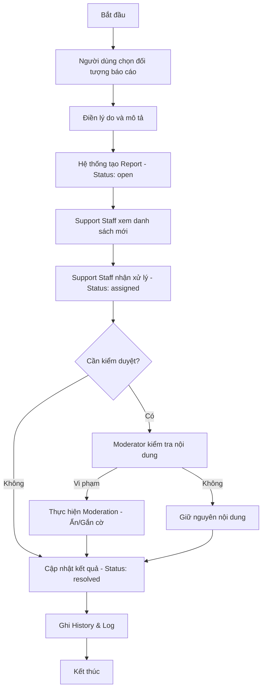
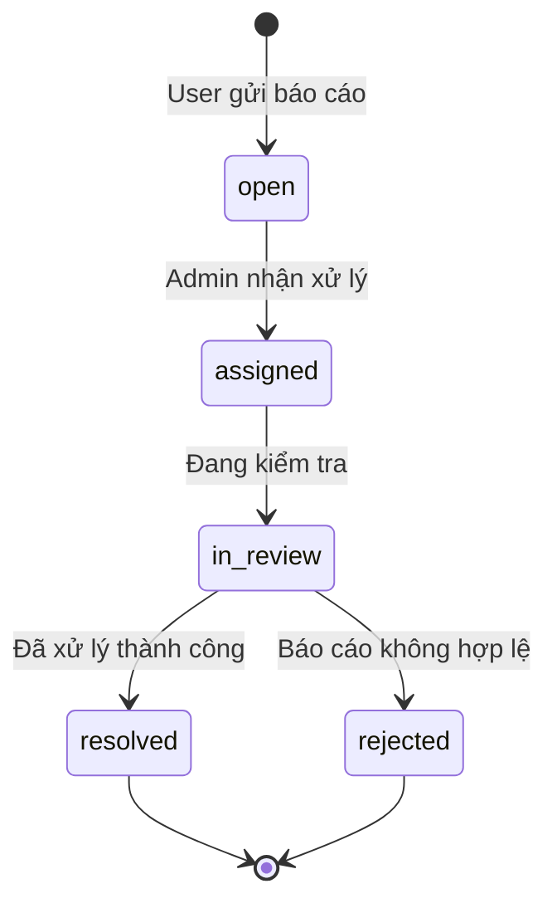
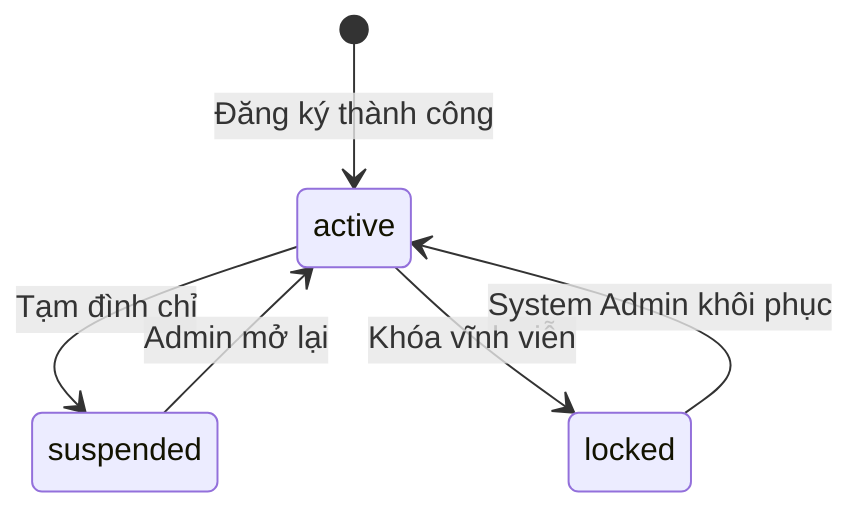

# SPRINT 08 – Hoàn thiện Admin lõi, report flow, kiểm duyệt và phân quyền quản trị

## 1. Mục tiêu sprint

Sprint 08 là sprint hoàn thiện **trục quản trị lõi** của toàn bộ hệ thống. Nếu Sprint 06 đã hoàn thành luồng kết nối **khách du lịch – hướng dẫn viên** thông qua tour, và Sprint 07 đã hoàn thành luồng kết nối **người dùng – người dùng** thông qua bài tìm bạn đồng hành, thì Sprint 08 phải giúp hệ thống có thêm một lớp vận hành bắt buộc: **quản trị tài khoản, phân quyền, kiểm duyệt nội dung, xử lý báo cáo vi phạm và phê duyệt xác minh hồ sơ hướng dẫn viên**.

Đây là sprint quyết định độ “đầy đặn” của đồ án dưới góc nhìn hệ thống thông tin hoàn chỉnh. Nếu không có sprint này, sản phẩm sẽ giống một website demo chức năng phía người dùng nhưng thiếu cơ chế kiểm soát, thiếu chiều sâu quản trị và thiếu phần phản hồi khi phát sinh vi phạm. Vì vậy, Sprint 08 không chỉ làm đẹp Admin Area, mà phải biến khu vực quản trị thành **một trục nghiệp vụ có thể demo được**.

### Mục tiêu chính
- Hoàn thành nhóm chức năng:
  - **F06:** Gửi báo cáo vi phạm
  - **F25:** Quản trị dữ liệu tổng thể
  - **F26:** Phê duyệt hồ sơ chuyên môn hướng dẫn viên
  - **F27:** Quản lý nội dung vi phạm
  - **F29:** Giao diện quản trị trực quan
- Hoàn thành **luồng lõi thứ tư** của hệ thống:
  - người dùng gửi báo cáo vi phạm;
  - hệ thống tiếp nhận báo cáo;
  - nhân sự quản trị tiếp nhận, phân loại, gán xử lý;
  - quản trị viên cập nhật trạng thái xử lý;
  - quản trị viên thực hiện hành động moderation phù hợp;
  - hệ thống ghi log và lưu lịch sử xử lý.
- Thiết lập rõ mô hình **đa vai trò trong Admin Area**:
  - `SYSTEM_ADMIN`
  - `CONTENT_MODERATOR`
  - `SUPPORT_STAFF`
- Chuẩn hóa các cơ chế quản trị cốt lõi:
  - khóa / mở khóa tài khoản;
  - gán / thu hồi vai trò;
  - duyệt / từ chối xác minh hướng dẫn viên;
  - ẩn / hiện / gắn cờ nội dung;
  - theo dõi log hoạt động quản trị.
- Dựng được bộ màn hình Admin đủ để demo ở mức nghiệp vụ thật, không chỉ là dashboard tĩnh.
- Chuẩn bị nền dữ liệu và cấu trúc để Sprint 09 có thể đi vào giai đoạn ổn định MVP mà không phải sửa ngược lại mô hình quyền và moderation.

### Ý nghĩa của sprint này
Sprint 08 là nơi hệ thống chuyển từ “có chức năng” sang “có khả năng vận hành”. Sau sprint này, bạn có thể demo được một chuỗi tình huống thuyết phục:
- User gửi báo cáo vi phạm từ một tour hoặc bài đồng hành;
- Support Staff tiếp nhận báo cáo;
- Content Moderator kiểm tra nội dung và chuyển trạng thái hiển thị;
- System Admin xem log, khóa tài khoản hoặc chỉnh lại vai trò nếu cần;
- hệ thống lưu lịch sử xử lý đầy đủ.

Đây là một trong những sprint làm tăng mạnh giá trị trình bày khi bảo vệ đồ án, vì nó thể hiện tư duy hệ thống chứ không chỉ là tư duy giao diện.

---

## 2. Lưu ý trước khi triển khai

## 2.1. Sprint này là Admin lõi, không phải full backoffice
Mục tiêu của Sprint 08 là **hoàn thiện quản trị lõi có giá trị demo cao**, không phải triển khai toàn bộ quản trị mở rộng. Vì vậy:
- tập trung vào **user management, role assignment, guide verification, content moderation, report handling, audit log**;
- chưa cần làm sâu:
  - thống kê nâng cao;
  - biểu đồ phức tạp;
  - export file;
  - workflow nhiều cấp quá nặng;
  - moderation chi tiết cho mọi loại review nếu chưa đủ thời gian.

Admin Area trong sprint này phải **đủ dùng, đúng nghiệp vụ và dễ bảo vệ**, thay vì cố mở rộng quá nhiều.

## 2.2. Phải tách rõ 3 vai trò quản trị
Trong Admin Area, không nên gom tất cả quyền vào một role duy nhất rồi làm cho nhanh. Tài liệu đã định hướng khá rõ ba lớp vai trò:
- **System Admin**: quyền cao nhất, quản lý tài khoản, phân quyền, xem log, can thiệp toàn hệ thống;
- **Content Moderator**: tập trung vào kiểm duyệt nội dung công khai;
- **Support Staff / Complaint Staff**: tập trung vào tiếp nhận và xử lý báo cáo, khiếu nại, phản ánh.

Nếu không tách sớm:
- backend guard sẽ rối;
- frontend menu sẽ khó tổ chức;
- tài liệu UML mất tính thuyết phục;
- phần demo quản trị sẽ kém chiều sâu.

## 2.3. Moderation không đồng nghĩa với xóa cứng dữ liệu
Tài liệu đã nhấn mạnh rằng kiểm duyệt **không nhất thiết phải xóa dữ liệu**, mà nên ưu tiên:
- ẩn nội dung;
- gắn cờ nội dung;
- chuyển trạng thái hiển thị;
- khóa tài khoản trong trường hợp cần thiết.

Vì vậy, Sprint 08 phải đi theo hướng:
- **soft moderation** trước;
- **hard delete** không phải trọng tâm;
- action quản trị phải dễ giải thích trong báo cáo.

Đây là hướng hợp lý hơn cho đồ án vì vừa an toàn dữ liệu, vừa phù hợp cơ chế audit.

## 2.4. Report flow phải khép kín từ User Area sang Admin Area
Sprint 08 không thể chỉ làm M45 ở phía admin mà bỏ qua M20 ở phía user. Luồng báo cáo chỉ có ý nghĩa khi khép kín:
1. user gửi báo cáo;
2. hệ thống tạo `reports`;
3. hệ thống tạo `report_processing_history` ban đầu;
4. nhân sự quản trị tiếp nhận;
5. cập nhật trạng thái;
6. ghi chú xử lý;
7. nếu cần thì thực hiện moderation trên đối tượng bị báo cáo.

Nếu chỉ có “màn hình xử lý báo cáo” mà không có đầu vào từ người dùng, sprint sẽ bị đứt luồng.

## 2.5. Phải chốt state machine trước khi code
Sprint 08 đụng tới nhiều trạng thái:
- `users.status`
- `reports.status`
- `guide_profiles.verification_status`
- `guide_verification_requests.status`
- `guide_verification_documents.status`
- `tours.visibility_status`
- `companion_posts.visibility_status`
- `guide_profiles.visibility_status`

Đây là sprint rất dễ lệch giữa frontend, backend và database. Vì vậy:
- phải chốt trạng thái hợp lệ;
- phải chốt ai được quyền đổi trạng thái nào;
- phải chốt thao tác nào bắt buộc ghi log;
- phải chốt trạng thái nào chỉ được đổi thông qua admin.

## 2.6. Dashboard admin trong sprint này chỉ cần “thống kê vận hành cơ bản”
Tài liệu đã xác định dashboard admin ở mức truy vấn tổng hợp đơn giản:
- số user;
- số tour;
- số bài đồng hành;
- số báo cáo;
- số hồ sơ guide chờ duyệt.

Không cần làm BI hay analytics nâng cao trong sprint này. Chỉ cần:
- hiển thị đúng;
- điều hướng nhanh;
- thể hiện được tính trực quan và hữu ích.

## 2.7. “Xong sprint” không phải chỉ là vào được Admin Area
Sprint 08 chỉ được xem là hoàn thành khi đáp ứng đủ:
- có role và guard rõ ràng;
- có dữ liệu admin seed sẵn;
- có màn hình admin nối API;
- có report flow chạy được;
- có audit log hoặc role-change log được ghi;
- có dữ liệu mẫu cho các ca xử lý khác nhau;
- có UML cập nhật theo đúng luồng.

---

## 3. Các vấn đề cần xác định trong sprint này

## 3.1. Cơ chế phân vai trò quản trị
Cần chốt:
- dùng `roles` + `user_roles` làm nguồn sự thật chính thức;
- một user có thể có nhiều role hay không;
- role nào là “primary role” khi điều hướng vào Admin Area;
- quyền nào kiểm tra ở frontend, quyền nào kiểm tra ở backend;
- thay đổi vai trò có bắt buộc ghi lịch sử hay không.

## 3.2. State machine của `users.status`
Cần chốt tập trạng thái tài khoản:
- `active`
- `suspended`
- `locked`

Đồng thời phải xác định:
- `suspended` khác `locked` như thế nào;
- role nào được đổi trạng thái;
- hệ quả của từng trạng thái khi user đăng nhập hoặc thao tác.

## 3.3. State machine của `reports.status`
Cần chốt quy trình xử lý báo cáo:
- `open`
- `assigned`
- `in_review`
- `resolved`
- `rejected`

Ngoài ra cần xác định:
- khi nào một report được xem là “tiếp nhận”;
- khi nào có người phụ trách;
- khi nào bắt buộc cập nhật `processed_by_user_id`;
- khi nào phải ghi lịch sử xử lý.

## 3.4. Quy tắc chọn đối tượng bị báo cáo
Cần xác định rõ `target_type` có thể là:
- `tour`
- `companion_post`
- `user`
- `guide_profile`
- `tour_review`
- `guide_review`

Trong Sprint 08, cần chọn phạm vi trọng tâm để giảm độ phức tạp nhưng vẫn đúng schema.

## 3.5. Logic xử lý xác minh hướng dẫn viên
Cần chốt:
- admin duyệt trên `guide_verification_requests` hay trực tiếp sửa `guide_profiles.verification_status`;
- khi approve thì document có đổi trạng thái không;
- khi reject có bắt buộc `result_note` không;
- sau khi approve thì hồ sơ guide có tự động visible hay không.

## 3.6. Logic moderation tour / companion / guide profile
Cần xác định:
- sprint này ưu tiên moderation bằng `visibility_status` hay `business_status`;
- khi bị báo cáo thì hệ thống ẩn ngay hay chỉ gắn cờ;
- role nào được thao tác với tour, companion post, guide profile;
- có cần action “restore / unhide” hay chưa.

## 3.7. Phạm vi dashboard quản trị
Cần chốt dashboard chỉ hiển thị:
- các số liệu tổng quan;
- shortcut tới các module;
- danh sách chờ xử lý cơ bản.

Không nên biến dashboard thành nơi hiển thị toàn bộ nghiệp vụ chi tiết.

## 3.8. Phạm vi audit trong sprint này
Cần xác định:
- action nào bắt buộc ghi `admin_activity_logs`;
- thay đổi role có ghi thêm `user_role_change_logs`;
- report history khác gì admin activity log;
- có cần lưu `old_data` / `new_data` ở mọi action hay chỉ các action quan trọng.

## 3.9. Phạm vi màn hình trong Sprint 08
Theo tài liệu, Sprint 08 tập trung vào:
- M20
- M38
- M39
- M40
- M41
- M42
- M43
- M45
- M47

Cần chốt rõ:
- M44 kiểm duyệt review chưa phải trọng tâm;
- M46 thống kê và báo cáo hệ thống chưa làm sâu;
- Sprint 08 chỉ làm **Admin lõi**, không tràn sang nhóm hoàn thiện nâng cao.

---

## 4. Hạng mục cần chốt

Sprint 08 cần chốt các hạng mục sau trước khi triển khai sâu:

1. **Mô hình quyền quản trị**
   - `SYSTEM_ADMIN`
   - `CONTENT_MODERATOR`
   - `SUPPORT_STAFF`

2. **Quy tắc truy cập Admin Area**
   - route guard;
   - menu theo vai trò;
   - quyền truy cập từng màn hình;
   - quyền thao tác từng action.

3. **Quy tắc khóa / mở khóa tài khoản**
   - ai được thực hiện;
   - trạng thái nào hợp lệ;
   - hiển thị gì với tài khoản bị khóa.

4. **Quy tắc gán / thu hồi vai trò**
   - ai được gán role;
   - có cấm tự hạ quyền chính mình hay không;
   - có log lịch sử thay đổi vai trò hay không.

5. **Quy tắc gửi và xử lý báo cáo**
   - target hợp lệ;
   - trạng thái xử lý;
   - yêu cầu bắt buộc khi resolve / reject;
   - ghi lịch sử xử lý.

6. **Quy tắc phê duyệt xác minh guide**
   - trạng thái request;
   - trạng thái document;
   - đồng bộ sang `guide_profiles.verification_status`.

7. **Quy tắc moderation nội dung**
   - tour;
   - companion post;
   - guide profile;
   - ưu tiên hide / flag thay vì delete.

8. **Quy tắc ghi log**
   - `admin_activity_logs`;
   - `user_role_change_logs`;
   - `report_processing_history`.

9. **Bộ dữ liệu demo admin**
   - tài khoản admin;
   - moderator;
   - support staff;
   - dữ liệu vi phạm mẫu;
   - guide chờ duyệt;
   - tài khoản bị khóa;
   - report ở nhiều trạng thái khác nhau.

---

## 5. Phương án được chọn

## 5.1. Mô hình phân quyền được chọn
Phương án được chọn là:
- dùng **`roles` + `user_roles`** làm nguồn dữ liệu phân quyền chính thức;
- backend kiểm tra quyền bằng **guard theo role**;
- frontend hiển thị menu và action theo role hiện có;
- mọi thay đổi phân quyền phải ghi vào **`user_role_change_logs`**.

### Quy tắc áp dụng
- `SYSTEM_ADMIN`: toàn quyền trong Admin Area;
- `CONTENT_MODERATOR`: tập trung moderation nội dung, xem dashboard, xem report liên quan nội dung;
- `SUPPORT_STAFF`: tập trung xử lý report, cập nhật tiến độ, phối hợp moderation khi cần;
- user có thể có nhiều role, nhưng menu hiển thị theo tập quyền thực tế.

## 5.2. Mô hình quản lý trạng thái tài khoản được chọn
Phương án được chọn:
- dùng trực tiếp `public.users.status` với ba giá trị:
  - `active`
  - `suspended`
  - `locked`

### Quy tắc chuyển trạng thái
- `active -> suspended`: dùng khi cần hạn chế truy cập tạm thời;
- `active -> locked`: dùng khi vi phạm nghiêm trọng hoặc cần chặn đăng nhập;
- `suspended -> active`: mở lại sau xử lý;
- `locked -> active`: chỉ System Admin mới nên thực hiện;
- không cho role thấp hơn tự đổi trạng thái tài khoản quản trị cấp cao.

## 5.3. State machine được chọn cho `reports`
Phương án được chọn:
- `open`
- `assigned`
- `in_review`
- `resolved`
- `rejected`

### Quy tắc chuyển trạng thái
- khi user gửi report, hệ thống tạo report ở `open`;
- khi Support Staff hoặc admin nhận xử lý, report chuyển sang `assigned`;
- khi đang kiểm tra hoặc phối hợp moderation, chuyển sang `in_review`;
- khi đã có kết luận và hành động phù hợp, chuyển sang `resolved`;
- nếu report không hợp lệ hoặc không đủ căn cứ, chuyển sang `rejected`.

### Quy tắc dữ liệu đi kèm
- `assigned_to_user_id` phải có khi trạng thái là `assigned` hoặc `in_review`;
- `processed_by_user_id`, `processed_at`, `resolution_note` nên có khi `resolved` hoặc `rejected`;
- mọi thay đổi trạng thái phải ghi vào `report_processing_history`.

## 5.4. Quy tắc đối tượng bị báo cáo được chọn
Schema hỗ trợ nhiều `target_type`, nhưng trong Sprint 08 nên ưu tiên các nhóm có giá trị demo cao nhất:
- `tour`
- `companion_post`
- `user`
- `guide_profile`

### Những gì chưa làm sâu
- `tour_review`
- `guide_review`

Hai nhóm review vẫn giữ đúng schema nhưng chưa cần làm flow moderation quá sâu trong sprint này.

## 5.5. Quy tắc phê duyệt xác minh hướng dẫn viên được chọn
Phương án được chọn:
- luồng nghiệp vụ đi qua **`guide_verification_requests`**;
- tài liệu xác minh đi qua **`guide_verification_documents`**;
- kết quả duyệt đồng bộ ngược sang **`guide_profiles.verification_status`**.

### Quy tắc xử lý
- request mới tạo ở `pending`;
- admin duyệt -> request `approved`, guide profile `approved`;
- admin từ chối -> request `rejected`, guide profile `rejected`;
- khi cần, document có thể đổi sang `accepted` / `rejected` để thể hiện chi tiết;
- `result_note` nên bắt buộc khi từ chối.

## 5.6. Quy tắc moderation được chọn
Phương án được chọn:
- ưu tiên moderation bằng **`visibility_status`**:
  - `visible`
  - `hidden`
  - `flagged`
- chỉ can thiệp `business_status` khi thực sự liên quan nghiệp vụ nội dung.

### Ứng dụng theo từng loại dữ liệu
- `guide_profiles.visibility_status`
- `tours.visibility_status`
- `companion_posts.visibility_status`

### Nguyên tắc xử lý
- nội dung đáng ngờ: `flagged`;
- nội dung xác định vi phạm: `hidden`;
- nội dung phục hồi sau xử lý: `visible`.

## 5.7. Phạm vi dashboard được chọn
Dashboard admin chỉ làm ở mức:
- số lượng user;
- số lượng tour;
- số lượng bài đồng hành;
- số lượng report đang mở;
- số hồ sơ guide chờ duyệt;
- lối tắt tới M39, M41, M42, M43, M45, M47.

Không làm biểu đồ nặng, không làm analytics nâng cao trong sprint này.

## 5.8. Phạm vi audit được chọn
Phương án được chọn:
- thao tác admin quan trọng ghi vào `admin_activity_logs`;
- thay đổi role ghi thêm `user_role_change_logs`;
- xử lý report ghi vào `report_processing_history`.

### Action nên bắt buộc ghi log
- khóa / mở khóa tài khoản;
- gán / thu hồi role;
- duyệt / từ chối xác minh guide;
- hide / unhide / flag content;
- assign / resolve report.

## 5.9. Phạm vi màn hình được chọn
Sprint 08 triển khai:
- **M20** Gửi báo cáo vi phạm
- **M38** Dashboard quản trị trực quan
- **M39** Quản lý người dùng và nhân sự quản trị
- **M40** Phân quyền quản trị
- **M41** Quản lý hồ sơ hướng dẫn viên và xác minh
- **M42** Quản trị tour toàn hệ thống
- **M43** Quản trị bài đồng hành toàn hệ thống
- **M45** Tiếp nhận / phân loại / cập nhật xử lý báo cáo
- **M47** Nhật ký hoạt động quản trị

### Những gì chưa làm sâu trong sprint này
- **M44** Kiểm duyệt đánh giá và nội dung phản hồi
- **M46** Thống kê và báo cáo hệ thống nâng cao

---

## 6. Ghi chú triển khai

- Sprint 08 phải tái sử dụng tối đa nền kỹ thuật đã dựng ở Sprint 01–07:
  - auth;
  - role guard;
  - layout theo area;
  - bảng dữ liệu;
  - badge trạng thái;
  - modal xác nhận;
  - chuẩn response API.
- Không nên tách một dashboard admin quá cầu kỳ. Quan trọng nhất là:
  - có dữ liệu thật;
  - có điều hướng nhanh;
  - có trạng thái rõ ràng;
  - có thao tác đúng quyền.
- Nên xây theo hướng mỗi màn hình admin là một module rõ:
  - users
  - roles
  - guides-verification
  - tours moderation
  - companion moderation
  - reports
  - audit logs
- Luồng report và luồng moderation phải liên kết được với nhau, nhưng không cần ép tất cả xử lý trong cùng một API.
- Kết thúc sprint này phải có một bộ **tài khoản demo đa vai trò** để phục vụ test và bảo vệ.

---

## 7. Chức năng trọng tâm

Sprint 08 tập trung vào 5 nhóm chức năng sau:

- **F06 – Gửi báo cáo vi phạm**
- **F25 – Quản trị dữ liệu tổng thể**
- **F26 – Phê duyệt hồ sơ chuyên môn hướng dẫn viên**
- **F27 – Quản lý nội dung vi phạm**
- **F29 – Giao diện quản trị trực quan**

### Phạm vi thực hiện trong Sprint 08
- user gửi report từ các đối tượng hợp lệ;
- admin xem dashboard tổng quan;
- System Admin quản lý user và role;
- admin duyệt / từ chối xác minh hướng dẫn viên;
- Content Moderator quản lý hiển thị tour và bài đồng hành;
- Support Staff tiếp nhận và xử lý report;
- hệ thống ghi audit và history phù hợp.

### Những gì chưa làm sâu trong sprint này
- thống kê nâng cao;
- review moderation toàn diện;
- export file;
- workflow nhiều bước quá nặng;
- hệ thống phân công xử lý phức tạp kiểu SLA.

---

## 8. Màn hình triển khai

## 8.1. Mục tiêu của phần màn hình
Phần màn hình trong Sprint 08 phải thể hiện được:
- có đầu vào từ user;
- có khu vực xử lý ở admin;
- có phân quyền truy cập;
- có bảng danh sách, bộ lọc, badge trạng thái, action rõ ràng;
- có log và lịch sử xử lý đủ để giải thích nghiệp vụ.

## 8.2. Các màn hình cần triển khai trong Sprint 08

### M20 – Gửi báo cáo vi phạm
**Vai trò:** User đã đăng nhập.

**Mục tiêu màn hình**
- cho phép người dùng phản ánh đối tượng không phù hợp;
- tạo điểm vào chính thức cho report flow.

**Nội dung chính**
- loại đối tượng bị báo cáo;
- thông tin đối tượng liên quan;
- lý do báo cáo;
- mô tả chi tiết;
- nút gửi;
- thông báo tiếp nhận.

**Ghi chú triển khai**
- có thể mở dưới dạng modal từ chi tiết tour / chi tiết bài đồng hành / hồ sơ guide;
- nên khóa nút gửi khi thiếu reason hoặc target không hợp lệ;
- sau khi gửi thành công, cho phép user xem `GET /me/reports`.

### M38 – Dashboard quản trị trực quan
**Vai trò:** `SYSTEM_ADMIN`, `CONTENT_MODERATOR`, `SUPPORT_STAFF` theo quyền.

**Mục tiêu màn hình**
- là điểm vào của Admin Area;
- cung cấp số liệu vận hành cơ bản;
- điều hướng nhanh tới các khu vực xử lý.

**Nội dung chính**
- số lượng user;
- số lượng tour;
- số lượng bài đồng hành;
- số report mở;
- số guide verification chờ duyệt;
- shortcut tới user management, reports, verification, moderation, audit logs.

**Ghi chú triển khai**
- không cần biểu đồ nặng;
- mỗi card nên click được để đi tới module tương ứng.

### M39 – Quản lý người dùng và nhân sự quản trị
**Vai trò:** `SYSTEM_ADMIN`.

**Mục tiêu màn hình**
- quản lý tài khoản user và tài khoản quản trị;
- khóa / mở khóa tài khoản;
- xem vai trò và trạng thái hiện tại.

**Nội dung chính**
- danh sách tài khoản;
- bộ lọc vai trò;
- bộ lọc trạng thái;
- chi tiết hồ sơ cơ bản;
- action khóa / mở khóa;
- liên kết sang phân quyền.

**Ghi chú triển khai**
- nên có cảnh báo khi thao tác với tài khoản quản trị;
- nên ngăn tự khóa tài khoản đang đăng nhập nếu gây mất quyền.

### M40 – Phân quyền quản trị
**Vai trò:** `SYSTEM_ADMIN`.

**Mục tiêu màn hình**
- gán, thu hồi hoặc điều chỉnh role quản trị;
- hiển thị lịch sử thay đổi quyền.

**Nội dung chính**
- danh sách tài khoản;
- role hiện tại;
- danh sách role khả dụng;
- action assign / revoke;
- lịch sử thay đổi quyền;
- ghi chú thay đổi nếu cần.

**Ghi chú triển khai**
- mọi thay đổi phải ghi `user_role_change_logs`;
- có thể mở dạng trang + drawer chi tiết cho từng user.

### M41 – Quản lý hồ sơ hướng dẫn viên và xác minh
**Vai trò:** `SYSTEM_ADMIN`, người được giao duyệt; `CONTENT_MODERATOR` phối hợp kiểm duyệt nội dung hồ sơ.

**Mục tiêu màn hình**
- xem hồ sơ guide;
- xem tài liệu xác minh;
- duyệt hoặc từ chối xác minh;
- điều chỉnh hiển thị hồ sơ nếu cần.

**Nội dung chính**
- danh sách guide profile;
- trạng thái verification;
- tài liệu xác minh;
- ghi chú xử lý;
- nút approve / reject;
- nút hide / unhide profile.

**Ghi chú triển khai**
- nên tách rõ hai nhóm action:
  - action xác minh nghề nghiệp;
  - action moderation hiển thị hồ sơ.

### M42 – Quản trị tour toàn hệ thống
**Vai trò:** `SYSTEM_ADMIN`, `CONTENT_MODERATOR`.

**Mục tiêu màn hình**
- kiểm soát dữ liệu tour trên toàn hệ thống;
- hỗ trợ ẩn / hiện / gắn cờ nội dung tour;
- hỗ trợ truy vết guide sở hữu.

**Nội dung chính**
- danh sách tour;
- guide sở hữu;
- trạng thái nghiệp vụ;
- trạng thái hiển thị;
- số lượng người tham gia;
- action view detail / hide / unhide / flag.

**Ghi chú triển khai**
- ưu tiên moderation trên `visibility_status`;
- không làm sửa tour trực tiếp từ admin nếu chưa cần.

### M43 – Quản trị bài đồng hành toàn hệ thống
**Vai trò:** `SYSTEM_ADMIN`, `CONTENT_MODERATOR`.

**Mục tiêu màn hình**
- kiểm soát bài tìm bạn đồng hành trên toàn hệ thống;
- xử lý bài bị báo cáo hoặc có dấu hiệu vi phạm.

**Nội dung chính**
- danh sách bài;
- chủ bài;
- điểm đến;
- thời gian;
- trạng thái hiển thị;
- action view detail / hide / unhide / flag.

**Ghi chú triển khai**
- cách thao tác nên tương tự M42 để giữ UX nhất quán.

### M45 – Tiếp nhận / phân loại / cập nhật xử lý báo cáo
**Vai trò:** `SUPPORT_STAFF`, `SYSTEM_ADMIN`, `CONTENT_MODERATOR` phối hợp khi liên quan nội dung.

**Mục tiêu màn hình**
- là trung tâm xử lý report;
- gán người xử lý;
- cập nhật tiến độ;
- xem lịch sử xử lý;
- phối hợp moderation.

**Nội dung chính**
- danh sách report;
- target bị báo cáo;
- người báo cáo;
- lý do;
- trạng thái;
- người phụ trách;
- ghi chú;
- lịch sử xử lý;
- action assign / review / resolve / reject.

**Ghi chú triển khai**
- nên có filter theo `status`, `target_type`, `assigned_to`, thời gian;
- nên có panel chi tiết hiển thị thông tin target để admin không phải nhảy màn hình quá nhiều.

### M47 – Nhật ký hoạt động quản trị
**Vai trò:** `SYSTEM_ADMIN`.

**Mục tiêu màn hình**
- theo dõi thao tác quản trị;
- phục vụ minh bạch và truy vết.

**Nội dung chính**
- actor;
- role thực hiện;
- module;
- entity;
- action;
- thời gian;
- reason;
- metadata cơ bản;
- bộ lọc theo người thực hiện hoặc loại action.

**Ghi chú triển khai**
- hiển thị log gần nhất trước;
- nên có filter theo khoảng thời gian và module.

## 8.3. Thành phần UI dùng chung cần tận dụng
- layout admin;
- sidebar theo role;
- table chuẩn có filter và pagination;
- badge trạng thái;
- modal xác nhận hành động nhạy cảm;
- drawer xem chi tiết;
- tabs cho profile / verification / history;
- card tổng hợp dashboard;
- empty state;
- loading state;
- toast thành công / thất bại.

## 8.4. Kết quả mong đợi của phần màn hình
- user gửi report được từ màn hình phù hợp;
- admin vào dashboard thấy số liệu cơ bản;
- System Admin quản lý user và role được;
- admin xử lý report được;
- moderator ẩn / gắn cờ tour hoặc bài đồng hành được;
- System Admin xem audit log được.

---

## 9. Bảng CSDL chính

## 9.1. `reports`
### Vai trò
Lưu báo cáo vi phạm do user gửi lên hệ thống.

### Trường quan trọng
- `id`
- `reporter_user_id`
- `target_type`
- `tour_id`
- `companion_post_id`
- `reported_user_id`
- `guide_profile_id`
- `reason`
- `description`
- `status`
- `assigned_to_user_id`
- `processed_by_user_id`
- `processed_at`
- `resolution_note`
- `created_at`
- `updated_at`

### Vai trò trong Sprint 08
Đây là bảng trung tâm của report flow. M20 ghi dữ liệu vào đây, M45 đọc và cập nhật dữ liệu từ đây.

## 9.2. `report_processing_history`
### Vai trò
Lưu lịch sử xử lý của từng report.

### Trường quan trọng
- `report_id`
- `action_by_user_id`
- `action_type`
- `old_status`
- `new_status`
- `note`
- `created_at`

### Vai trò trong Sprint 08
Dùng để truy vết các bước:
- created
- assigned
- status_changed
- note_added
- resolved
- rejected
- hidden_target
- restored_target

## 9.3. `users`
### Vai trò
Lưu hồ sơ nghiệp vụ của người dùng và trạng thái tài khoản.

### Trường quan trọng
- `id`
- `email`
- `full_name`
- `phone`
- `avatar_url`
- `status`
- `created_at`
- `updated_at`
- `last_seen_at`

### Vai trò trong Sprint 08
Dùng cho:
- M39 quản lý user;
- M45 xác định reporter / assignee / processor;
- xác định actor trong audit log.

## 9.4. `roles`
### Vai trò
Danh mục vai trò hệ thống.

### Trường quan trọng
- `role_code`
- `description`

### Vai trò trong Sprint 08
Dùng để dựng M40 và seed vai trò:
- `USER`
- `GUIDE`
- `SYSTEM_ADMIN`
- `CONTENT_MODERATOR`
- `SUPPORT_STAFF`

## 9.5. `user_roles`
### Vai trò
Liên kết user với role.

### Trường quan trọng
- `user_id`
- `role_code`
- `assigned_by`
- `assigned_at`

### Vai trò trong Sprint 08
Dùng để kiểm tra quyền truy cập Admin Area và quyền thao tác cụ thể.

## 9.6. `guide_verification_requests`
### Vai trò
Lưu yêu cầu xác minh của hướng dẫn viên.

### Trường quan trọng
- `guide_profile_id`
- `submitted_at`
- `status`
- `submission_note`
- `processed_by_user_id`
- `processed_at`
- `result_note`

### Vai trò trong Sprint 08
Là nguồn dữ liệu chính của M41 cho luồng duyệt / từ chối xác minh.

## 9.7. `guide_verification_documents`
### Vai trò
Lưu tài liệu xác minh đi kèm với request xác minh.

### Trường quan trọng
- `verification_request_id`
- `document_type`
- `file_url`
- `uploaded_at`
- `status`
- `note`

### Vai trò trong Sprint 08
Cho phép admin xem tài liệu và quyết định xác minh.

## 9.8. `guide_profiles`
### Vai trò
Lưu hồ sơ nghề nghiệp của hướng dẫn viên.

### Trường quan trọng
- `user_id`
- `bio`
- `years_of_experience`
- `working_area`
- `verification_status`
- `visibility_status`
- `is_accepting_tours`

### Vai trò trong Sprint 08
Dùng cho moderation hồ sơ guide và đồng bộ trạng thái sau khi xử lý verification.

## 9.9. `admin_activity_logs`
### Vai trò
Lưu log thao tác quản trị.

### Trường quan trọng
- `actor_user_id`
- `actor_role_code`
- `module_name`
- `entity_type`
- `entity_pk`
- `action_type`
- `reason`
- `old_data`
- `new_data`
- `metadata`
- `created_at`

### Vai trò trong Sprint 08
Là nền cho M47 và cho tính minh bạch của toàn bộ Admin Area.

## 9.10. `user_role_change_logs`
### Vai trò
Lưu lịch sử thay đổi quyền của user.

### Trường quan trọng
- `target_user_id`
- `changed_role_code`
- `action_type`
- `changed_by_user_id`
- `old_snapshot`
- `new_snapshot`
- `note`
- `created_at`

### Vai trò trong Sprint 08
Là căn cứ truy vết cho M40 khi gán hoặc thu hồi vai trò.

## 9.11. Bảng hỗ trợ cần lưu ý thêm
Dù không phải bảng trung tâm của sprint, M42 và M43 vẫn cần đọc / cập nhật:
- `tours`
- `companion_posts`

Trong đó trọng tâm là:
- `business_status`
- `visibility_status`
- `is_deleted`

## 9.12. Ghi chú triển khai dữ liệu
- cần seed đủ dữ liệu report ở nhiều trạng thái;
- cần seed ít nhất 1 guide đang `pending verification`;
- cần seed ít nhất 1 tour bị `flagged`;
- cần seed ít nhất 1 companion post bị `hidden`;
- cần seed ít nhất 1 user `suspended` và 1 user `locked`.

---

## 10. API cần thiết

## 10.1. `POST /reports`
### Mục đích
Tạo báo cáo vi phạm từ phía user.

### Request gợi ý
```json
{
  "targetType": "tour",
  "tourId": "uuid",
  "reason": "Thông tin tour không phù hợp",
  "description": "Nội dung mô tả và dữ liệu thực tế không khớp."
}
```

### Kết quả mong đợi
- tạo bản ghi `reports` ở trạng thái `open`;
- tạo history ban đầu trong `report_processing_history`;
- trả về thông báo tiếp nhận thành công.

## 10.2. `GET /me/reports`
### Mục đích
Cho user xem danh sách report do chính mình gửi.

### Query gợi ý
- `status`
- `page`
- `limit`

### Kết quả mong đợi
- user theo dõi được tình trạng báo cáo;
- tránh phải gửi lại trùng lặp vì không biết report cũ đang ở đâu.

## 10.3. `GET /admin/dashboard`
### Mục đích
Lấy dữ liệu tổng hợp cho M38.

### Kết quả mong đợi
Trả về các chỉ số tổng quan:
- totalUsers
- totalTours
- totalCompanionPosts
- openReports
- pendingGuideVerifications

## 10.4. `GET /admin/users`
### Mục đích
Lấy danh sách user cho M39.

### Query gợi ý
- `keyword`
- `role`
- `status`
- `page`
- `limit`

### Kết quả mong đợi
Có thể lọc theo:
- role;
- status;
- user thường / nhân sự quản trị.

## 10.5. `PATCH /admin/users/:id/status`
### Mục đích
Khóa / mở khóa / tạm đình chỉ tài khoản.

### Request gợi ý
```json
{
  "status": "locked",
  "reason": "Vi phạm nhiều lần sau khi đã nhắc nhở."
}
```

### Kết quả mong đợi
- cập nhật `users.status`;
- ghi `admin_activity_logs`;
- chặn tài khoản thao tác theo đúng rule.

## 10.6. `GET /admin/roles`
### Mục đích
Lấy danh sách role để hiển thị ở M40.

### Kết quả mong đợi
Frontend có nguồn dữ liệu chuẩn để assign / revoke role.

## 10.7. `POST /admin/users/:id/roles`
### Mục đích
Gán vai trò cho user.

### Request gợi ý
```json
{
  "roleCode": "SUPPORT_STAFF",
  "note": "Bổ sung nhân sự xử lý report."
}
```

### Kết quả mong đợi
- thêm bản ghi vào `user_roles`;
- ghi `user_role_change_logs`;
- ghi `admin_activity_logs`.

## 10.8. `DELETE /admin/users/:id/roles/:role`
### Mục đích
Thu hồi vai trò của user.

### Kết quả mong đợi
- xóa bản ghi ở `user_roles`;
- ghi log thay đổi quyền;
- không cho thu hồi theo cách phá vỡ toàn bộ quyền truy cập hệ thống nếu chưa có rule dự phòng.

## 10.9. `GET /admin/role-change-logs`
### Mục đích
Lấy lịch sử thay đổi role.

### Kết quả mong đợi
Phục vụ truy vết tại M40 hoặc màn chi tiết quyền.

## 10.10. `GET /admin/guides`
### Mục đích
Lấy danh sách hồ sơ hướng dẫn viên cho M41.

### Query gợi ý
- `verificationStatus`
- `visibilityStatus`
- `keyword`
- `page`
- `limit`

### Kết quả mong đợi
Có thể lọc nhanh các hồ sơ đang chờ duyệt.

## 10.11. `GET /admin/guide-verification`
### Mục đích
Lấy danh sách request xác minh và tài liệu đi kèm.

### Kết quả mong đợi
Phục vụ tab verification riêng trong M41.

## 10.12. `PATCH /admin/guide-verification/:id`
### Mục đích
Duyệt hoặc từ chối request xác minh.

### Request gợi ý
```json
{
  "status": "approved",
  "resultNote": "Hồ sơ hợp lệ, giấy tờ đầy đủ."
}
```

### Kết quả mong đợi
- cập nhật `guide_verification_requests.status`;
- cập nhật `guide_profiles.verification_status`;
- ghi `admin_activity_logs`.

## 10.13. `PATCH /admin/guides/:id/moderation`
### Mục đích
Ẩn / hiện / gắn cờ hồ sơ guide.

### Request gợi ý
```json
{
  "visibilityStatus": "hidden",
  "reason": "Hồ sơ hiển thị thông tin chưa phù hợp."
}
```

### Kết quả mong đợi
- cập nhật `guide_profiles.visibility_status`;
- ghi log moderation.

## 10.14. `GET /admin/tours`
### Mục đích
Lấy danh sách tour toàn hệ thống cho M42.

### Query gợi ý
- `businessStatus`
- `visibilityStatus`
- `province`
- `guideId`
- `page`
- `limit`

### Kết quả mong đợi
Phục vụ moderation tour ở mức toàn hệ thống.

## 10.15. `PATCH /admin/tours/:id/moderation`
### Mục đích
Ẩn / hiện / gắn cờ tour.

### Request gợi ý
```json
{
  "visibilityStatus": "flagged",
  "reason": "Tour bị nhiều người dùng phản ánh."
}
```

### Kết quả mong đợi
- cập nhật `tours.visibility_status`;
- ghi log moderation;
- nếu có report liên quan, có thể cập nhật history tương ứng.

## 10.16. `GET /admin/companion-posts`
### Mục đích
Lấy danh sách bài đồng hành toàn hệ thống cho M43.

### Query gợi ý
- `businessStatus`
- `visibilityStatus`
- `destination`
- `page`
- `limit`

### Kết quả mong đợi
Phục vụ moderation bài đồng hành.

## 10.17. `PATCH /admin/companion-posts/:id/moderation`
### Mục đích
Ẩn / hiện / gắn cờ bài đồng hành.

### Request gợi ý
```json
{
  "visibilityStatus": "hidden",
  "reason": "Bài đăng có nội dung không phù hợp."
}
```

### Kết quả mong đợi
- cập nhật `companion_posts.visibility_status`;
- ghi log moderation.

## 10.18. `GET /admin/reports`
### Mục đích
Lấy danh sách report cho M45.

### Query gợi ý
- `status`
- `targetType`
- `assignedTo`
- `keyword`
- `page`
- `limit`

### Kết quả mong đợi
Có thể lọc nhanh report đang mở, đã gán, đang review, đã giải quyết.

## 10.19. `PATCH /admin/reports/:id`
### Mục đích
Cập nhật trạng thái và nội dung xử lý report.

### Request gợi ý
```json
{
  "status": "resolved",
  "assignedToUserId": "uuid",
  "resolutionNote": "Đã ẩn nội dung vi phạm và thông báo cho người dùng."
}
```

### Kết quả mong đợi
- cập nhật `reports`;
- thêm bản ghi `report_processing_history`;
- nếu cần thì đồng bộ moderation target.

## 10.20. `GET /admin/reports/:id/history`
### Mục đích
Xem toàn bộ lịch sử xử lý của một report.

### Kết quả mong đợi
Admin có thể giải thích rõ report đã đi qua những bước nào.

## 10.21. `GET /admin/activity-logs`
### Mục đích
Lấy dữ liệu cho M47.

### Query gợi ý
- `module`
- `actionType`
- `actorUserId`
- `dateFrom`
- `dateTo`
- `page`
- `limit`

### Kết quả mong đợi
Hỗ trợ truy vết thao tác quản trị.

## 10.22. API hỗ trợ nên cân nhắc thêm
- `GET /admin/statistics` nếu muốn tách khỏi dashboard;
- `GET /admin/users/:id/role-history`;
- `POST /rpc/write_admin_activity_log` nếu backend cần gọi RPC hoặc hàm DB riêng.

## 10.23. Yêu cầu kỹ thuật chung cho API
- trả lỗi rõ ràng theo role / permission;
- thống nhất response shape giữa admin modules;
- có pagination cho danh sách lớn;
- có filter tối thiểu cho report, user, guide, tour, companion;
- mọi action nhạy cảm phải có reason hoặc note nếu phù hợp.

---

## 11. Công việc frontend

## 11.1. Dựng `M20 Gửi báo cáo vi phạm`
- tạo form báo cáo dùng lại được ở nhiều màn hình;
- hiển thị đúng target đang báo cáo;
- validate trường bắt buộc;
- sau khi gửi thành công, reset form và thông báo tiếp nhận.

## 11.2. Dựng `M38 Dashboard quản trị`
- card tổng hợp số liệu;
- quick action links;
- skeleton loading;
- empty state nếu chưa có dữ liệu.

## 11.3. Dựng `M39 Quản lý người dùng và nhân sự quản trị`
- bảng danh sách user;
- lọc theo role / status;
- badge trạng thái tài khoản;
- modal đổi trạng thái;
- liên kết sang phân quyền.

## 11.4. Dựng `M40 Phân quyền quản trị`
- form assign role;
- bảng role hiện có;
- hiển thị lịch sử thay đổi quyền;
- xác nhận trước khi revoke role.

## 11.5. Dựng `M41 Quản lý hồ sơ hướng dẫn viên và xác minh`
- bảng guide profile;
- panel chi tiết hồ sơ;
- tab verification documents;
- nút approve / reject;
- badge verification status và visibility status.

## 11.6. Dựng `M42 Quản trị tour toàn hệ thống`
- bảng tour toàn hệ thống;
- bộ lọc trạng thái;
- action hide / unhide / flag;
- liên kết xem chi tiết.

## 11.7. Dựng `M43 Quản trị bài đồng hành toàn hệ thống`
- bảng companion posts;
- bộ lọc destination / status;
- action moderation;
- hiển thị chủ bài và thời gian.

## 11.8. Dựng `M45 Tiếp nhận và xử lý báo cáo`
- bảng report có filter;
- badge trạng thái report;
- drawer chi tiết report;
- tab history;
- action assign / in_review / resolve / reject.

## 11.9. Dựng `M47 Nhật ký hoạt động quản trị`
- bảng log;
- filter actor / module / action type;
- hiển thị thời gian và lý do;
- xem chi tiết old/new data ở mức rút gọn.

## 11.10. Chuẩn hóa menu và điều hướng theo role
- `SYSTEM_ADMIN`: thấy đầy đủ;
- `CONTENT_MODERATOR`: ẩn các màn quản lý role / log không được phép;
- `SUPPORT_STAFF`: tập trung dashboard + reports.

## 11.11. Chuẩn hóa component badge trạng thái
Cần thống nhất badge cho:
- user status;
- report status;
- verification status;
- visibility status.

## 11.12. Tạo UX chống thao tác sai
- modal confirm cho lock account, revoke role, reject verification, hide content;
- disable nút khi không đủ quyền;
- tooltip giải thích lý do action bị khóa.

## 11.13. Hiển thị lỗi nghiệp vụ dễ hiểu
Ví dụ:
- không đủ quyền;
- không thể thu hồi role cuối cùng của tài khoản quản trị chính;
- report đã được xử lý trước đó;
- guide verification request không còn ở trạng thái pending.

## 11.14. Test flow phía frontend
Cần test ít nhất:
1. user gửi report thành công;
2. support staff nhận report và cập nhật trạng thái;
3. moderator ẩn tour hoặc bài đồng hành;
4. system admin khóa user;
5. system admin gán role;
6. system admin duyệt guide verification;
7. system admin xem log.

## 11.15. Kết quả mong đợi phía frontend
- giao diện admin rõ ràng;
- menu đúng theo vai trò;
- thao tác mượt, ít nhầm;
- thể hiện rõ chiều sâu quản trị khi demo.

---

## 12. Công việc backend

## 12.1. Hoàn thiện module `reports-notifications` cho report flow
- endpoint tạo report;
- endpoint list report của user;
- validate target hợp lệ;
- tạo history ban đầu.

## 12.2. Hoàn thiện module `admin`
- dashboard service;
- users service;
- roles service;
- reports service;
- moderation service;
- audit log service.

## 12.3. Xử lý quản lý trạng thái tài khoản
- update `users.status`;
- chặn thao tác khi tài khoản bị khóa;
- kiểm tra không cho role thấp tác động lên role cao.

## 12.4. Xử lý role assignment
- assign / revoke role;
- kiểm tra role hợp lệ;
- chống duplicate role;
- ghi `user_role_change_logs`;
- ghi `admin_activity_logs`.

## 12.5. Xử lý guide verification approval
- list request pending;
- approve / reject request;
- đồng bộ sang guide profile;
- lưu `processed_by_user_id`, `processed_at`, `result_note`.

## 12.6. Xử lý moderation guide profile
- update `guide_profiles.visibility_status`;
- ghi log hide / unhide / flag.

## 12.7. Xử lý moderation tour
- list tour toàn hệ thống;
- cập nhật `tours.visibility_status`;
- ghi audit log.

## 12.8. Xử lý moderation companion post
- list companion posts toàn hệ thống;
- cập nhật `companion_posts.visibility_status`;
- ghi audit log.

## 12.9. Xử lý report lifecycle
- open -> assigned;
- assigned -> in_review;
- in_review -> resolved / rejected;
- ghi `report_processing_history` ở mọi bước;
- lưu `assigned_to_user_id`, `processed_by_user_id`, `resolution_note`.

## 12.10. Xử lý audit log
- tạo helper / interceptor / service ghi `admin_activity_logs`;
- chuẩn hóa `module_name`, `entity_type`, `action_type`;
- lưu `old_data`, `new_data` khi cần.

## 12.11. Xử lý role-based guard nhiều cấp
- `SYSTEM_ADMIN`
- `CONTENT_MODERATOR`
- `SUPPORT_STAFF`

Cần tách rõ:
- ai được xem;
- ai được cập nhật;
- ai được gán role;
- ai được khóa tài khoản.

## 12.12. Kiểm tra ownership và thứ bậc vai trò
Backend nên chống các trường hợp:
- support staff khóa system admin;
- content moderator gán role quản trị;
- user thường tự gọi admin endpoint.

## 12.13. Chuẩn hóa response và lỗi cho admin modules
- cùng format trả về;
- cùng format lỗi validation;
- dễ debug khi test Postman.

## 12.14. Kết nối moderation với report flow ở mức hợp lý
Không bắt buộc mọi report phải tự động ẩn nội dung, nhưng nên có khả năng:
- admin xử lý report;
- sau đó thực hiện action moderation tương ứng;
- history thể hiện được việc đó.

## 12.15. Kết quả mong đợi phía backend
- API admin chạy ổn định;
- guard chặt chẽ;
- history và log ghi đúng;
- report flow khép kín.

---

## 13. Công việc database

## 13.1. Chuẩn hóa dữ liệu `reports`
- kiểm tra ràng buộc `target_type`;
- bảo đảm mỗi report chỉ tham chiếu đúng loại target;
- tối ưu `status`, `assigned_to_user_id`, `created_at`.

## 13.2. Chuẩn hóa dữ liệu `report_processing_history`
- action_type đồng bộ với flow thực tế;
- cho phép truy vết trạng thái cũ / mới;
- ghi chú rõ ràng cho thao tác quan trọng.

## 13.3. Chuẩn hóa dữ liệu phân quyền
- seed đầy đủ `roles`;
- kiểm tra unique trên `user_roles`;
- chuẩn hóa seed cho admin accounts.

## 13.4. Chuẩn hóa dữ liệu verification
- seed guide verification pending / approved / rejected;
- gắn tài liệu tương ứng;
- bảo đảm relation `guide_profile -> request -> documents`.

## 13.5. Chuẩn hóa dữ liệu moderation
- bảo đảm tour / companion / guide có các giá trị:
  - `visible`
  - `hidden`
  - `flagged`

## 13.6. Thêm index cần thiết
Ưu tiên index cho:
- `reports(status, assigned_to_user_id, created_at)`
- `guide_verification_requests(status, submitted_at)`
- `admin_activity_logs(actor_user_id, module_name, created_at)`
- `user_role_change_logs(target_user_id, created_at)`

## 13.7. Seed tài khoản quản trị
Tối thiểu:
- 1 `SYSTEM_ADMIN`
- 1 `CONTENT_MODERATOR`
- 1 `SUPPORT_STAFF`

## 13.8. Seed dữ liệu vi phạm mẫu
Tối thiểu cần có:
- 1 tour bị report;
- 1 companion post bị report;
- 1 guide profile chờ duyệt;
- 1 report đang `open`;
- 1 report `assigned`;
- 1 report `in_review`;
- 1 report `resolved`;
- 1 report `rejected`.

## 13.9. Seed dữ liệu log mẫu
- 1 log assign role;
- 1 log lock account;
- 1 log approve verification;
- 1 log hide companion post;
- 1 log resolve report.

## 13.10. Kiểm tra toàn vẹn dữ liệu
- role tồn tại trước khi gán;
- user phải tồn tại trước khi đổi status;
- report history phải tham chiếu report hợp lệ;
- verification documents phải thuộc request hợp lệ.

## 13.11. Kiểm tra RLS / quyền truy cập dữ liệu
- user thường không truy cập admin data;
- support staff chỉ truy cập phần được phép;
- admin endpoints vẫn nên qua backend để kiểm soát tốt hơn.

## 13.12. Kết quả mong đợi phía database
- dữ liệu demo đủ đẹp để test;
- index đủ cho truy vấn admin;
- không có dữ liệu trạng thái sai logic.

---

## 14. Tài liệu/UML

## 14.1. Tài liệu cần hoàn thiện
- mô tả quyền theo vai trò admin;
- mô tả report flow;
- mô tả moderation flow;
- mô tả guide verification flow;
- mô tả audit log và role-change log.

## 14.2. Activity Diagram cần cập nhật
- user gửi báo cáo vi phạm;
- admin tiếp nhận và xử lý báo cáo;
- system admin gán / thu hồi role;
- system admin khóa / mở khóa tài khoản;
- admin duyệt / từ chối xác minh guide.

## 14.3. Sequence Diagram nên bổ sung
- gửi báo cáo vi phạm;
- cập nhật trạng thái report;
- gán role quản trị;
- phê duyệt guide verification;
- khóa tài khoản user.

## 14.4. Class Diagram / nhóm lớp nên bổ sung
Có thể bổ sung nhóm lớp hoặc service class logic cho:
- User / Role / UserRole
- Report / ReportProcessingHistory
- GuideProfile / GuideVerificationRequest / GuideVerificationDocument
- AdminActivityLog / UserRoleChangeLog

## 14.5. Mục tiêu của phần tài liệu/UML
- cho thấy Admin Area không phải phần phụ;
- thể hiện rõ actor, quyền, trạng thái, đầu ra;
- đồng bộ với code và database;
- hỗ trợ tốt cho phần bảo vệ đồ án.

---

## 15. Đầu ra

## 15.1. Đầu ra chức năng
- user gửi report được;
- admin xử lý report được;
- system admin quản lý tài khoản và role được;
- admin duyệt guide verification được;
- moderator ẩn / gắn cờ tour, bài đồng hành, hồ sơ guide được.

## 15.2. Đầu ra giao diện
- có dashboard admin;
- có user management;
- có role management;
- có guide verification;
- có moderation tour / companion;
- có report handling;
- có activity log.

## 15.3. Đầu ra API
- bộ API admin lõi chạy được;
- role guard đúng;
- response thống nhất;
- có history và audit cho action quan trọng.

## 15.4. Đầu ra dữ liệu
- seed tài khoản quản trị;
- seed report đa trạng thái;
- seed guide verification pending;
- seed moderation case;
- seed log mẫu.

## 15.5. Đầu ra tài liệu
- Activity Diagram cập nhật;
- Sequence Diagram bổ sung;
- mô tả nghiệp vụ admin rõ ràng;
- phần báo cáo thể hiện được chiều sâu quản trị.

## 15.6. Tiêu chí sẵn sàng sang Sprint 09
Sprint 08 được xem là hoàn tất khi:
- Admin Area vào được theo role;
- report flow chạy trọn;
- role assignment có log;
- khóa tài khoản có log;
- guide verification có xử lý và đồng bộ trạng thái;
- moderation tour / companion / guide chạy được;
- có dữ liệu demo đủ để regression test;
- có tài liệu UML cập nhật.

---

## 16. Kết luận sprint

Sprint 08 là sprint khép lại nhóm **chức năng lõi ưu tiên 1** dưới góc nhìn vận hành và kiểm soát hệ thống. Sau sprint này, website du lịch không chỉ có khả năng:
- cho người dùng đăng ký, đăng nhập, tìm tour, gửi yêu cầu, tạo bài đồng hành;

mà còn có khả năng:
- tiếp nhận phản ánh;
- quản trị người dùng;
- kiểm duyệt nội dung;
- duyệt hồ sơ hướng dẫn viên;
- theo dõi thao tác quản trị.

Đây là bước rất quan trọng trước khi bước sang Sprint 09 – giai đoạn **ổn định MVP lõi**, nơi trọng tâm không còn là thêm chức năng mới, mà là rà soát, đồng bộ, polish và chuẩn bị cho demo chính của đồ án.

---

## 17. Phụ lục: Sơ đồ UML (Mermaid)

### 17.1. Activity Diagram: Luồng xử lý báo cáo vi phạm


### 17.2. Sequence Diagram: Phê duyệt xác minh Hướng dẫn viên
```mermaid
sequenceDiagram
    participant G as Guide (User)
    participant S as Supabase/DB
    participant A as Admin (System Admin)
    
    G->>S: Gửi yêu cầu xác minh + Tài liệu (pending)
    A->>S: Lấy danh sách yêu cầu chờ duyệt
    S-->>A: Trả về danh sách requests
    A->>A: Kiểm tra tài liệu
    alt Chấp nhận
        A->>S: Duyệt yêu cầu (approved)
        S->>S: Cập nhật guide_profiles.verification_status = approved
        S->>S: Ghi Admin Activity Log
    else Từ chối
        A->>S: Từ chối yêu cầu (rejected) + Lý do
        S->>S: Cập nhật guide_profiles.verification_status = rejected
        S->>S: Ghi Admin Activity Log
    endif
    S-->>G: Thông báo kết quả
```

### 17.3. State Machine: Trạng thái Báo cáo (reports.status)


### 17.4. State Machine: Trạng thái Tài khoản (users.status)

