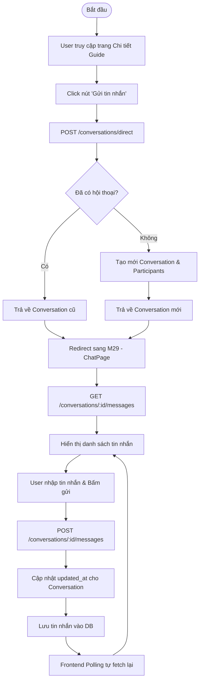

# SPRINT 12 – Mở rộng giao tiếp: chat trực tiếp và chat nhóm bài đồng hành

## 1. Mục tiêu sprint

Sprint 12 là sprint mở rộng theo đúng lộ trình 14 sprint, tập trung vào **nhóm chức năng giao tiếp** để làm hệ thống có chiều sâu tương tác hơn sau khi:

- Sprint 09 đã ổn định MVP lõi;
- Sprint 10 đã bổ sung favorite, review và verification;
- Sprint 11 đã làm sản phẩm “đầy” hơn với map, activity log, notification và statistics.

Nếu Sprint 11 giúp hệ thống hoàn thiện hơn về **theo dõi và hiển thị vận hành**, thì Sprint 12 giúp sản phẩm có thêm một lớp trải nghiệm quan trọng: **người dùng có thể trao đổi trực tiếp với hướng dẫn viên, và các thành viên của một bài đồng hành có thể trao đổi trong không gian chung**.

Theo kế hoạch đã chốt, Sprint 12 tập trung vào 2 chức năng chính:

- **F19 – Chat trực tiếp**
- **F20 – Chat nhóm bài đồng hành**

Các màn hình trọng tâm tương ứng là:

- **M29 – Chat trực tiếp user–guide**
- **M30 – Chat nhóm bài đồng hành**

### Mục tiêu chính

- Hoàn thiện **module chat cơ bản** có thể lưu hội thoại và tin nhắn, đủ để minh họa khả năng giao tiếp của nền tảng.
- Cho phép mở **chat trực tiếp giữa user và guide** trong ngữ cảnh phù hợp, chủ yếu từ chi tiết guide hoặc chi tiết tour.
- Cho phép mở **chat nhóm của bài đồng hành** để chủ bài và các thành viên đã được duyệt có không gian trao đổi chung.
- Hỗ trợ các thao tác cơ bản:
  - xem danh sách conversation;
  - xem participant;
  - lấy message theo hội thoại;
  - gửi message mới;
  - cập nhật trạng thái đã đọc ở mức cơ bản.
- Giữ đúng tinh thần đồ án:
  - **có lưu hội thoại**;
  - **có cấu trúc dữ liệu rõ ràng**;
  - **có UI đủ để demo**;
  - nhưng **không bắt buộc realtime/WebSocket**.
- Đồng bộ giữa **database – backend – frontend – tài liệu/UML** để Sprint 12 khép kín, sẵn sàng sang Sprint 13.

### Ý nghĩa của sprint này

Sprint 12 không phải sprint lõi bắt buộc như tour, guide, companion hay admin. Tuy nhiên, đây là sprint có **giá trị trình bày rất cao** vì nó làm hệ thống giống một nền tảng kết nối thực sự hơn.

Giá trị của sprint này nằm ở 3 điểm:

1. **Tăng tính kết nối thực tế**  
   Người dùng không chỉ xem tour hay gửi request, mà còn có thể trao đổi trực tiếp với guide hoặc trao đổi trong nhóm đồng hành.

2. **Tăng chiều sâu khi demo**  
   Khi bảo vệ, module chat luôn là phần dễ tạo ấn tượng vì thể hiện rõ khả năng tương tác giữa các actor.

3. **Tạo nền cho mở rộng sau này**  
   Sau Sprint 12, hệ thống đã có nền conversation/message. Về sau có thể mở rộng sang realtime, notification sâu hơn, gửi file, chatbot hoặc các trải nghiệm hỗ trợ khác.

Nói ngắn gọn, Sprint 12 là sprint giúp hệ thống có thêm **“lớp giao tiếp”**, nhưng vẫn phải giữ đúng mức **cơ bản, dễ demo, dễ báo cáo và khả thi cho đồ án sinh viên**.

---

## 2. Lưu ý trước khi triển khai

## 2.1. Đây là sprint mở rộng, không được kéo chậm phần lõi đã ổn định

Sprint 12 thuộc nhóm mở rộng có giá trị trình bày cao. Vì vậy, mục tiêu không phải là xây một hệ thống chat hoàn chỉnh như sản phẩm thương mại, mà là làm một module chat đủ rõ về:

- actor;
- conversation;
- participant;
- message;
- điều kiện truy cập;
- trạng thái đã đọc ở mức cơ bản.

Không nên để sprint này kéo dài vì các nội dung như realtime, socket gateway, media upload, đồng bộ đa tab hay unread counter phức tạp.

## 2.2. Không đẩy ngay sang WebSocket hoặc realtime đầy đủ

Nếu làm một mình hoặc nguồn lực hạn chế, Sprint 12 không nên đẩy ngay sang:

- WebSocket gateway;
- realtime push;
- presence online/offline;
- typing indicator;
- delivery status nhiều tầng;
- sync nhiều tab;
- đẩy notification popup tức thời.

Mức phù hợp nhất cho đồ án là:

- lưu hội thoại vào database;
- lấy danh sách conversation bằng REST;
- lấy message bằng REST;
- gửi message bằng REST;
- dùng **polling** hoặc **refresh định kỳ** để cập nhật màn hình.

## 2.3. Direct chat phải có ngữ cảnh tạo rõ ràng

Nếu không chốt ngữ cảnh tạo chat, direct chat rất dễ bị mở tràn lan và khó giải thích khi viết báo cáo.  
Ngay từ đầu phải thống nhất:

- direct chat được mở từ đâu;
- có cho tạo direct chat từ trang bất kỳ hay không;
- một cặp user–guide có được tạo nhiều conversation direct giống nhau hay không;
- có gắn conversation với `related_tour_id` hay chỉ lưu theo cặp participant.

Hướng hợp lý nhất cho đồ án là:
- direct chat chỉ nên phát sinh từ **chi tiết guide** hoặc **chi tiết tour**;
- nếu đã có conversation direct phù hợp thì mở lại conversation cũ thay vì tạo trùng quá nhiều.

## 2.4. Group chat chỉ nên gắn với bài đồng hành

Sprint 12 chỉ hỗ trợ hai loại chat:

- **direct**
- **group_companion**

Không nên mở thêm:
- group chat cho tour;
- group chat tự tạo tùy ý;
- room công khai;
- room theo tỉnh/thành;
- voice room hoặc video room.

Chat nhóm phải gắn với **một bài đồng hành cụ thể**, và participant chỉ gồm:
- chủ bài;
- các thành viên đã được duyệt tham gia bài đồng hành.

Điều này giúp chat nhóm bám chặt vào nghiệp vụ đã có từ Sprint 07, không biến Sprint 12 thành một sản phẩm nhắn tin độc lập.

## 2.5. Read-state phải đơn giản, nhất quán và đủ demo

Nếu làm read-state quá sâu, hệ thống sẽ phát sinh rất nhiều logic:

- unread count theo message;
- read receipt theo từng participant;
- seen status cho từng tin;
- đồng bộ nhiều thiết bị;
- message delivery.

Với đồ án, chỉ cần chọn một cách đơn giản và ổn định.  
Hướng phù hợp là lưu `last_read_at` ở `conversation_participants`, từ đó frontend/backend suy ra unread ở mức tổng quát.

## 2.6. Không mở rộng voice, video, gửi file phức tạp

Schema có thể cho phép mở rộng `message_type`, nhưng Sprint 12 không nên kéo sâu sang:

- gửi voice;
- gọi video;
- gửi file dung lượng lớn;
- chia sẻ vị trí realtime;
- image gallery;
- moderation message nhiều tầng.

Chỉ cần ưu tiên:
- text message;
- message hệ thống cơ bản nếu cần;
- file/image chỉ để mở rộng sau.

## 2.7. Dữ liệu demo quyết định chất lượng của module chat

Chat là nhóm chức năng rất khó demo nếu thiếu dữ liệu mẫu.  
Muốn Sprint 12 nhìn thuyết phục, phải chuẩn bị sẵn:

- ít nhất 1 direct conversation giữa user và guide;
- ít nhất 1 group conversation gắn với companion post;
- vài participant đã join vào group;
- nhiều message với mốc thời gian khác nhau;
- trạng thái đã đọc / chưa đọc khác nhau;
- 1–2 tình huống participant rời group hoặc bị ẩn tin nhắn nếu muốn minh họa.

---

## 3. Các vấn đề cần xác định trong sprint này

### 3.1. Direct chat được tạo trong ngữ cảnh nào

Cần chốt rõ:
- từ chi tiết tour có nút “Nhắn guide” hay không;
- từ hồ sơ hướng dẫn viên công khai có nút “Nhắn guide” hay không;
- có cho admin tham gia flow này không;
- direct chat có yêu cầu người dùng đã gửi request tour trước đó hay chỉ cần đăng nhập.

### 3.2. Group chat gắn với companion post nào

Cần xác định:
- group conversation được tạo ngay khi bài đồng hành được tạo, hay chỉ tạo khi có thành viên đầu tiên được duyệt;
- group conversation có 1–1 với companion post hay có thể nhiều hơn 1;
- title của conversation lấy theo tiêu đề bài đồng hành hay tự đặt.

### 3.3. Participant của từng loại conversation gồm những ai

Cần chốt:
- direct chat chỉ gồm 2 người hay có cho admin/support vào xem không;
- group chat gồm chủ bài + thành viên approved, có cho người bị reject vào xem không;
- khi thành viên bị hủy duyệt hoặc rời nhóm thì xử lý `left_at` thế nào.

### 3.4. Trạng thái đọc được lưu theo cách nào

Cần thống nhất:
- dùng `last_read_at` ở participant;
- có cập nhật mỗi khi mở conversation hay mỗi lần kéo tới cuối danh sách;
- unread count tính phía backend hay frontend.

### 3.5. Có cho soft delete message hay không

Schema đã có `is_deleted`, `deleted_at`, vì vậy cần chốt:
- Sprint 12 có hiện thực xóa mềm message hay chưa;
- nếu chưa làm UI xóa message thì backend có cần chuẩn bị sẵn không;
- khi message bị xóa thì frontend hiển thị thế nào.

### 3.6. Có chống trùng conversation direct hay không

Đây là điểm quan trọng vì nếu không chốt trước sẽ dễ phát sinh dữ liệu rác.  
Cần xác định:
- mỗi cặp user–guide chỉ có 1 direct conversation chính;
- hay cho phép nhiều conversation theo từng tour;
- nếu user nhắn cùng một guide từ hai tour khác nhau thì hệ thống mở conversation nào.

### 3.7. Phân quyền truy cập conversation được kiểm tra ở đâu

Cần chốt:
- check participant ở database hay service;
- endpoint lấy messages có luôn kiểm tra membership không;
- PATCH read-state có kiểm tra participant không;
- GET participants có giới hạn theo role không.

### 3.8. Có cần thay đổi schema không

Schema final đã có đủ:
- `conversations`
- `conversation_participants`
- `messages`

Nhưng vẫn cần rà soát:
- index nào còn thiếu;
- có cần unique rule bổ sung cho direct conversation hay không;
- có cần trigger cập nhật `updated_at` cho `conversations` khi có tin nhắn mới hay không.

### 3.9. UML nào cần cập nhật ngay trong sprint này

Tối thiểu phải xác định:
- Activity Diagram cho direct chat;
- Activity Diagram cho group companion chat;
- nếu còn thời gian, thêm Sequence Diagram cho luồng gửi message.

---

## 4. Hạng mục cần chốt

### 4.1. Hạng mục chiến lược chat

- Chỉ làm chat cơ bản, chưa bắt buộc realtime.
- Chỉ hỗ trợ 2 loại conversation: `direct` và `group_companion`.
- Dùng REST API + polling/refresh định kỳ.

### 4.2. Hạng mục ngữ cảnh tạo conversation

- Direct chat phát sinh từ ngữ cảnh guide/tour.
- Group chat gắn với bài đồng hành.
- Không cho tạo conversation tự do ngoài hai ngữ cảnh trên.

### 4.3. Hạng mục participant

- Direct chat: user và guide.
- Group chat: chủ bài + thành viên đã approved.
- Participant được kiểm tra chặt ở mọi endpoint đọc/ghi chat.

### 4.4. Hạng mục message

- Hỗ trợ gửi text message là chính.
- Có thể để mở `message_type = system` cho thông báo nội bộ đơn giản.
- Chưa bắt buộc UI cho image/file trong sprint này.

### 4.5. Hạng mục read-state

- Dùng `last_read_at` trong `conversation_participants`.
- Cho phép đánh dấu đã đọc ở mức conversation.
- Unread count nếu có thì tính ở mức cơ bản.

### 4.6. Hạng mục frontend

- Danh sách conversation.
- Khung chat direct.
- Khung chat group.
- Participant list cơ bản.
- Empty state, loading state, error state.

### 4.7. Hạng mục backend

- Tạo direct conversation.
- Tạo group conversation gắn companion post.
- Lấy danh sách conversation của current user.
- Lấy message theo conversation.
- Gửi message.
- Cập nhật read-state.
- Kiểm tra quyền truy cập conversation.

### 4.8. Hạng mục database

- Seed conversation và message mẫu.
- Bổ sung index cần thiết.
- Chuẩn hóa relation giữa group conversation và companion post.
- Chuẩn bị convention cập nhật `updated_at`.

### 4.9. Hạng mục tài liệu/UML

- Activity Diagram cho chat trực tiếp.
- Activity Diagram cho chat nhóm bài đồng hành.
- Mô tả use case và rule phân quyền chat.

---

## 5. Phương án được chọn

## 5.1. Chiến lược chat được chọn

Sprint 12 triển khai **chat ở mức cơ bản, có lưu hội thoại**, chưa bắt buộc realtime.  
Giải pháp phù hợp nhất là:

- backend REST API;
- frontend polling/refetch định kỳ;
- chưa dùng WebSocket trong sprint này.

Hướng này vừa phù hợp với tài liệu chốt, vừa bảo đảm tính khả thi cho đồ án.

## 5.2. Loại chat được chọn

Chỉ hỗ trợ:

- **direct chat user–guide**
- **group chat bài đồng hành**

Không hỗ trợ thêm:
- group chat tự do;
- group chat cho tour;
- voice/video;
- room công khai.

## 5.3. Điều kiện tạo conversation được chọn

- **Direct chat** chỉ nên tạo từ **chi tiết guide** hoặc **chi tiết tour**.
- **Group chat** chỉ gắn với **một companion post cụ thể**.
- Với group chat, chỉ **chủ bài** và **thành viên đã được duyệt** mới được vào conversation.
- Nếu direct conversation phù hợp đã tồn tại, hệ thống nên **mở lại conversation cũ** thay vì tạo trùng.

## 5.4. Quy tắc participant được chọn

- `conversation_participants` là nguồn sự thật để kiểm tra quyền truy cập.
- Direct chat có đúng 2 participant hoạt động.
- Group chat có thể nhiều participant, nhưng chỉ gồm những người hợp lệ theo nghiệp vụ companion.
- Khi một người rời conversation/group, ưu tiên cập nhật `left_at` thay vì xóa cứng record participant.

## 5.5. Cách lưu read-state được chọn

- Dùng `last_read_at` trong bảng `conversation_participants`.
- Khi người dùng mở conversation hoặc thực hiện action “đánh dấu đã đọc”, backend cập nhật `last_read_at`.
- Unread state được suy ra bằng cách so `last_read_at` với `sent_at` của tin nhắn mới nhất hoặc tin chưa đọc.

## 5.6. Mức độ message được chọn

- Ưu tiên `message_type = text`.
- Có thể cho phép `system` ở mức tối thiểu để minh họa các tin như:
  - thành viên mới tham gia;
  - chủ bài đã duyệt thành viên.
- `image` và `file` chỉ giữ như hướng mở rộng của schema, chưa bắt buộc triển khai UI/flow trong Sprint 12.

## 5.7. Mức độ realtime được chọn

- **Không bắt buộc realtime push**.
- Có thể dùng:
  - refetch khi mở conversation;
  - refetch theo khoảng thời gian;
  - refresh thủ công khi cần.
- Không làm typing indicator, online presence hay delivered/seen phức tạp.

## 5.8. Hướng xử lý dữ liệu demo được chọn

Chuẩn bị ít nhất:

- 1 direct conversation giữa 1 user và 1 guide;
- 1 direct conversation khác có nhiều message cũ/mới;
- 1 group conversation gắn với 1 companion post;
- 3–5 participant trong group;
- nhiều message với mốc thời gian khác nhau;
- ít nhất 1 participant có `last_read_at` cũ để thấy unread state.

## 5.9. Chia module backend

Phù hợp nhất là để chat nằm trong module:

- **`chat-ai`** nếu muốn bám sát mapping đã chốt;
hoặc
- tách riêng **`chat`** nếu muốn clean code hơn trong triển khai thực tế.

Trong phạm vi bộ tài liệu hiện tại, nên giữ theo hướng:

- controller/service/chat logic nằm trong **`chat-ai`**
- nhưng code nội bộ tách rõ:
  - `conversation.service`
  - `message.service`
  - `participant.service`

để sang Sprint 13 nối AI Chat thuận tiện hơn.

---

## 6. Ghi chú triển khai

### 6.1. Thứ tự triển khai nên làm

Nên triển khai theo thứ tự sau:

1. rà lại schema chat và seed dữ liệu mẫu;
2. làm API list conversations;
3. làm API lấy messages theo conversation;
4. làm API gửi message;
5. làm API tạo direct conversation;
6. làm API tạo group conversation từ companion post;
7. làm API read-state;
8. dựng UI M29 và M30;
9. cập nhật UML.

### 6.2. Không biến M29 thành “messenger” hoàn chỉnh

M29 chỉ cần đủ:

- danh sách conversation;
- chọn conversation;
- xem message history;
- gửi text message;
- thông tin đối tác trò chuyện.

Không cần:
- sticker;
- emoji picker phức tạp;
- pin chat;
- search chat toàn cục;
- media gallery;
- archive chat.

### 6.3. Không biến M30 thành group social network

M30 chỉ là không gian trao đổi cho một bài đồng hành cụ thể.  
Không nên thêm:

- quản trị nhóm nhiều tầng;
- phân vai thành viên;
- tạo nhiều room con;
- chia topic;
- invite link;
- approval vào chat tách rời approval vào bài đồng hành.

### 6.4. Conversation direct nên tránh tạo trùng

Về triển khai, nên có helper:

- tìm direct conversation hiện có giữa hai người;
- nếu đã tồn tại thì trả về conversation cũ;
- nếu chưa có mới tạo conversation mới.

Như vậy dữ liệu chat gọn hơn và UI dễ hiểu hơn.

### 6.5. Group chat nên tạo sau khi có dữ liệu companion ổn định

Không nên làm group chat trước rồi mới vá nghiệp vụ companion.  
Group chat chỉ đẹp khi Sprint 07 đã có:

- companion post;
- companion request;
- approved member;
- chủ bài rõ ràng.

Vì vậy, ở Sprint 12 phải dùng lại đúng dữ liệu nền từ Sprint 07.

### 6.6. Quy tắc “xong sprint”

Sprint 12 chỉ được coi là hoàn thành khi tối thiểu đáp ứng:

- có bảng chat đúng schema;
- có seed dữ liệu chat mẫu;
- có API list / detail / create / send / read chạy được;
- có M29 và M30 nối API;
- có test flow tối thiểu;
- có cập nhật tài liệu/UML liên quan.

### 6.7. Dữ liệu demo nên chuẩn bị

Nên seed các nhóm dữ liệu:

- user thường;
- guide;
- companion post đã mở;
- companion request đã approved;
- conversation direct đang hoạt động;
- conversation group có nhiều thành viên;
- message text nhiều mốc thời gian;
- vài message hệ thống nếu muốn minh họa.

---

## 7. Chức năng trọng tâm

### F19. Chat trực tiếp

Chức năng này hỗ trợ **người dùng đã đăng nhập** và **hướng dẫn viên** trao đổi trực tiếp về:

- tour;
- thời gian;
- yêu cầu cụ thể;
- thông tin cần làm rõ trước khi tham gia.

Giá trị của F19 là tăng khả năng kết nối trực tiếp giữa hai actor chính của nền tảng: **khách du lịch** và **hướng dẫn viên**.

### F20. Chat nhóm bài đồng hành

Chức năng này tạo một không gian trao đổi chung cho:

- chủ bài đồng hành;
- các thành viên đã được duyệt vào bài.

Giá trị của F20 là hỗ trợ phối hợp trước chuyến đi, trao đổi về thời gian, điểm hẹn, kế hoạch hoặc các lưu ý chung.

### Kết luận cho nhóm chức năng

Sprint 12 chỉ tập trung vào **2 chức năng giao tiếp cốt lõi nhất** của giai đoạn mở rộng.  
Mục tiêu không phải làm một nền tảng nhắn tin độc lập, mà là làm cho hệ thống du lịch có đủ “lớp giao tiếp” để:

- hợp logic nghiệp vụ;
- hợp phạm vi đồ án;
- đủ mạnh để demo và viết báo cáo.

---

## 8. Màn hình triển khai

## 8.1. Mục tiêu của phần màn hình

Phần màn hình trong Sprint 12 phải làm rõ được ba điều:

1. Người dùng/guide **nhìn thấy các conversation của mình**.
2. Người dùng/guide **đọc được nội dung trao đổi** trong một conversation cụ thể.
3. Người dùng/guide **gửi được message mới** và nhìn thấy trạng thái cơ bản của conversation.

## 8.2. M29 – Chat trực tiếp user–guide

M29 là màn hình hỗ trợ trao đổi trực tiếp giữa user và guide.

### Thành phần chính nên có

- danh sách cuộc trò chuyện ở cột trái;
- khung message ở vùng trung tâm;
- thông tin đối tác trò chuyện ở phần header;
- input gửi tin;
- timestamp cơ bản;
- empty state khi chưa chọn conversation;
- empty state khi chưa có conversation nào.

### Hành vi chính

- mở từ chi tiết guide hoặc chi tiết tour;
- nếu chưa có direct conversation thì tạo mới;
- nếu đã có conversation thì mở lại;
- lấy danh sách message theo conversation đang chọn;
- gửi message mới;
- cập nhật read-state khi mở conversation.

### Điều cần tránh

- không làm layout quá phức tạp như ứng dụng chat thương mại;
- không phụ thuộc vào realtime để màn hình hoạt động;
- không thêm quá nhiều cột/phần phụ gây rối.

## 8.3. M30 – Chat nhóm bài đồng hành

M30 là không gian trao đổi nhóm cho một companion post cụ thể.

### Thành phần chính nên có

- tên nhóm hoặc title theo bài đồng hành;
- danh sách thành viên;
- khung message nhóm;
- thông báo thành viên mới nếu cần;
- liên kết quay lại bài đồng hành;
- input gửi tin;
- empty state khi chưa có group conversation.

### Hành vi chính

- mở từ khu vực bài đồng hành của người dùng;
- chỉ chủ bài và thành viên approved mới vào được;
- lấy participant list;
- lấy message list;
- gửi message mới;
- cập nhật read-state.

### Điều cần tránh

- không tạo nhiều group con cho một bài;
- không thêm quyền quản trị nhóm phức tạp;
- không tách group chat thành module mạng xã hội.

## 8.4. Kết quả mong đợi của phần màn hình

Kết thúc Sprint 12, người dùng có thể:

- mở direct chat với guide trong ngữ cảnh phù hợp;
- xem các cuộc trò chuyện của mình;
- gửi và nhận message ở mức lưu trữ cơ bản;
- tham gia chat nhóm bài đồng hành nếu là thành viên hợp lệ.

---

## 9. Bảng CSDL chính

## 9.1. `conversations`

Đây là bảng trung tâm của module chat.

### Vai trò dữ liệu

- lưu metadata của conversation;
- xác định loại conversation;
- xác định người tạo;
- liên kết với tour hoặc companion post nếu cần.

### Thuộc tính đáng chú ý

- `id`
- `conversation_type`
- `title`
- `created_by_user_id`
- `related_tour_id`
- `related_companion_post_id`
- `created_at`
- `updated_at`

### Quy tắc quan trọng

- `conversation_type` chỉ nên là:
  - `direct`
  - `group_companion`
- nếu là `group_companion` thì phải có `related_companion_post_id`.
- direct chat có thể không cần `title`;
- group chat nên có `title` dễ hiểu theo bài đồng hành.

## 9.2. `conversation_participants`

Đây là bảng kiểm soát membership của conversation.

### Vai trò dữ liệu

- xác định ai thuộc conversation nào;
- lưu thời điểm join;
- lưu thời điểm rời;
- lưu trạng thái mute;
- lưu read-state tổng quát bằng `last_read_at`.

### Thuộc tính đáng chú ý

- `conversation_id`
- `user_id`
- `joined_at`
- `left_at`
- `is_muted`
- `last_read_at`

### Quy tắc quan trọng

- direct chat phải có đúng 2 participant hoạt động;
- group chat có nhiều participant;
- nếu participant rời nhóm, ưu tiên cập nhật `left_at` thay vì xóa record;
- mọi endpoint đọc/ghi chat phải check participant từ bảng này.

## 9.3. `messages`

Đây là bảng lưu nội dung trao đổi trong conversation.

### Vai trò dữ liệu

- lưu người gửi;
- lưu nội dung;
- lưu loại tin nhắn;
- lưu thời điểm gửi;
- hỗ trợ soft delete nếu cần.

### Thuộc tính đáng chú ý

- `id`
- `conversation_id`
- `sender_user_id`
- `content`
- `message_type`
- `attachment_url`
- `sent_at`
- `edited_at`
- `is_deleted`
- `deleted_at`

### Quy tắc quan trọng

- Sprint 12 ưu tiên `message_type = text`;
- `system` có thể dùng ở mức tối thiểu;
- `image`, `file` là hướng mở rộng, chưa bắt buộc UI;
- soft delete có thể chuẩn bị sẵn ở DB nhưng chưa bắt buộc hiện thực đầy đủ trong UI.

## 9.4. Bảng phụ thuộc cần dùng kèm

Ngoài 3 bảng chính, module chat vẫn cần dựa vào các bảng đã có của hệ thống:

- `users`  
  để hiển thị tên, avatar, trạng thái tài khoản của participant.

- `guide_profiles`  
  để direct chat với guide có ngữ cảnh rõ ràng từ hồ sơ/tour.

- `tours`  
  để direct chat có thể gắn với tour nếu cần.

- `companion_posts`  
  để group chat gắn với bài đồng hành.

- `companion_requests`  
  để xác định thành viên approved nào được vào group chat.

## 9.5. Ghi chú quan trọng về schema

Schema final hiện tại đã đủ tốt cho Sprint 12.  
Các việc cần làm thêm thiên về:

- index;
- convention tạo conversation;
- trigger cập nhật `updated_at`;
- seed dữ liệu.

Không nên phá vỡ schema lớn ở sprint này trừ khi phát hiện lỗi thật sự ảnh hưởng tới chat flow.

---

## 10. API cần thiết

## 10.1. `GET /conversations`

### Mục đích
Lấy danh sách conversation của người dùng hiện tại.

### Dữ liệu nên trả về
- `conversationId`
- `conversationType`
- `title`
- `lastMessagePreview`
- `lastMessageAt`
- `unreadCount` hoặc cờ unread cơ bản
- `participants` rút gọn
- `relatedCompanionPostId` / `relatedTourId` nếu có

### Ghi chú
Danh sách nên sắp theo conversation có hoạt động mới nhất.

## 10.2. `POST /conversations/direct`

### Mục đích
Tạo direct conversation giữa current user và guide.

### Input gợi ý
- `guideUserId`
- `relatedTourId` (nếu tạo từ tour)
- `initialMessage` (tùy chọn)

### Rule chính
- chỉ user đăng nhập hợp lệ mới được tạo;
- guide đích phải tồn tại;
- nếu conversation phù hợp đã có thì trả về conversation cũ;
- không tạo direct chat trùng vô hạn.

## 10.3. `POST /conversations/group-companion`

### Mục đích
Tạo group conversation cho một companion post.

### Input gợi ý
- `companionPostId`

### Rule chính
- chỉ tạo trong ngữ cảnh companion post hợp lệ;
- conversation gắn với `related_companion_post_id`;
- participant ban đầu ít nhất gồm chủ bài;
- các thành viên approved được thêm vào theo rule nghiệp vụ.

## 10.4. `GET /conversations/:id/messages`

### Mục đích
Lấy danh sách messages của một conversation.

### Rule chính
- chỉ participant mới được truy cập;
- phân trang hoặc load theo batch;
- ẩn tin đã xóa nếu áp dụng soft delete.

## 10.5. `POST /conversations/:id/messages`

### Mục đích
Gửi message mới vào conversation.

### Input gợi ý
- `content`
- `messageType` (mặc định `text`)

### Rule chính
- sender phải là participant hợp lệ;
- không cho gửi message rỗng;
- cập nhật `updated_at` của conversation;
- có thể cập nhật unread cho participant khác theo logic suy ra từ `last_read_at`.

## 10.6. `PATCH /conversations/:id/read`

### Mục đích
Đánh dấu conversation đã đọc.

### Hướng xử lý
- cập nhật `last_read_at` cho participant hiện tại;
- không cần read receipt chi tiết theo từng tin nhắn.

## 10.7. `GET /conversations/:id/participants`

### Mục đích
Lấy danh sách participant của conversation.

### Rule chính
- chỉ participant mới được xem;
- với direct chat chỉ trả về danh sách tối giản;
- với group chat có thể trả avatar, tên, vai trò trong group theo mức cơ bản.

## 10.8. Yêu cầu kỹ thuật chung cho API

- mọi endpoint đều phải kiểm tra auth;
- mọi endpoint conversation detail đều phải kiểm tra membership;
- response format phải đồng nhất với các sprint trước;
- xử lý tốt các case:
  - conversation không tồn tại;
  - user không phải participant;
  - participant đã rời group;
  - guide/user bị khóa tài khoản;
  - companion post không hợp lệ cho group chat.

---

## 11. Công việc frontend

## 11.1. Xây dựng danh sách conversation

- dựng sidebar hoặc panel danh sách conversation;
- hiển thị title hoặc đối tác trò chuyện;
- hiển thị preview tin cuối;
- hiển thị thời gian gần nhất;
- trạng thái unread cơ bản.

## 11.2. Xây dựng M29

- layout chat 2 cột hoặc 3 vùng;
- header hiển thị thông tin guide/user đối thoại;
- message bubble rõ ràng;
- input gửi tin;
- loading, empty, error state.

## 11.3. Xây dựng M30

- layout tương tự M29 nhưng thêm danh sách thành viên;
- title nhóm theo companion post;
- hiển thị system message nếu có;
- link quay lại chi tiết bài đồng hành.

## 11.4. Tích hợp từ các màn hình nguồn

- từ **chi tiết tour** hoặc **hồ sơ guide** có nút mở direct chat;
- từ **khu vực companion post** có điểm vào group chat;
- điều hướng phải rõ, tránh tạo cảm giác chat bị “đứng riêng” ngoài nghiệp vụ.

## 11.5. Chuẩn hóa UI message

- bubble cho message của mình / của người khác;
- timestamp dễ đọc;
- trạng thái gửi cơ bản;
- danh sách dài phải scroll ổn định;
- không cần animation phức tạp.

## 11.6. Polling hoặc refetch

- refetch khi mở conversation;
- refetch theo khoảng thời gian phù hợp;
- refetch sau khi gửi message;
- tránh spam request quá dày.

## 11.7. Xử lý trường hợp rỗng và lỗi

- chưa có conversation nào;
- chưa có message nào;
- không đủ quyền vào conversation;
- participant không còn hợp lệ;
- lỗi gửi tin.

## 11.8. Kết quả mong đợi phía frontend

Kết thúc Sprint 12, frontend phải có:

- M29 chạy được với API thật;
- M30 chạy được với API thật;
- điểm vào chat từ các màn hình nghiệp vụ liên quan;
- danh sách conversation;
- khung chat hiển thị và gửi tin ổn định.

---

## 12. Công việc backend

## 12.1. Tổ chức module

Giữ chat trong module `chat-ai` hoặc tách service con rõ ràng:

- conversation service
- message service
- participant service

## 12.2. Xử lý logic direct conversation

- validate guide/user hợp lệ;
- kiểm tra conversation direct đã có chưa;
- nếu có thì trả conversation cũ;
- nếu chưa có thì tạo mới;
- thêm participant tương ứng.

## 12.3. Xử lý logic group companion conversation

- validate companion post;
- validate quyền của chủ bài hoặc logic khởi tạo;
- tạo conversation gắn `related_companion_post_id`;
- thêm chủ bài và participant approved;
- tránh tạo nhiều group conversation trùng cho một bài.

## 12.4. Xử lý logic lấy conversation list

- chỉ lấy conversation mà current user là participant;
- join dữ liệu message mới nhất;
- join participant rút gọn;
- sort theo hoạt động gần nhất.

## 12.5. Xử lý logic gửi message

- validate membership;
- sanitize nội dung;
- tạo message;
- cập nhật timestamp conversation;
- trả message mới để frontend append vào UI.

## 12.6. Xử lý logic read-state

- cập nhật `last_read_at`;
- tính unread ở mức cơ bản nếu cần;
- không làm receipt quá chi tiết.

## 12.7. Phân quyền và ownership

- direct chat: chỉ đúng participant mới đọc/ghi;
- group chat: chỉ chủ bài và thành viên approved mới đọc/ghi;
- participant có `left_at` cần được kiểm soát rõ quyền xem tiếp hay không.

## 12.8. Logging và đồng bộ với hệ thống hiện có

Nếu đủ thời gian, có thể bổ sung:

- ghi `user_activity_logs` khi mở conversation đầu tiên hoặc gửi tin đầu tiên;
- sinh `notifications` khi có tin nhắn mới ở mức cơ bản.

Tuy nhiên, đây chỉ là phần phụ trợ, không được làm chậm luồng chat chính.

## 12.9. Kết quả mong đợi phía backend

Kết thúc Sprint 12, backend phải có:

- API conversation list;
- API tạo direct/group conversation;
- API lấy messages;
- API gửi message;
- API read-state;
- API participants;
- kiểm tra quyền truy cập conversation ổn định.

---

## 13. Công việc database

## 13.1. Giữ nguyên schema 38 bảng làm chuẩn

Sprint 12 nên bám schema final đã chốt, đặc biệt là 3 bảng:

- `conversations`
- `conversation_participants`
- `messages`

## 13.2. Bổ sung index cần thiết

Nên rà soát và bổ sung index cho:

- `conversation_participants(user_id)`
- `messages(conversation_id, sent_at desc)`
- `conversations(related_companion_post_id)`
- `conversations(updated_at desc)` nếu cần list nhanh

## 13.3. Helper cập nhật `updated_at` cho conversation

Khi có message mới, nên có cơ chế:
- cập nhật `conversations.updated_at`;
- giúp list conversation sắp xếp đúng theo hoạt động gần nhất.

## 13.4. Seed dữ liệu direct chat

Chuẩn bị:
- 1–2 guide;
- 2–3 user;
- vài conversation direct;
- message cũ/mới xen kẽ;
- participant có `last_read_at` khác nhau.

## 13.5. Seed dữ liệu group chat

Chuẩn bị:
- 1 companion post;
- chủ bài;
- vài thành viên approved;
- 1 group conversation;
- nhiều message nhóm;
- vài system message nếu muốn trình bày đẹp hơn.

## 13.6. Rà soát relation với companion

Phải kiểm tra:
- `related_companion_post_id` đúng FK;
- participant group khớp dữ liệu approved trong `companion_requests`;
- không để group chat tồn tại với companion post đã bị xóa mềm/hủy mà không có rule rõ ràng.

## 13.7. Kết quả mong đợi phía database

Kết thúc Sprint 12, database phải có:

- schema chat ổn định;
- index đủ dùng;
- dữ liệu demo phong phú;
- helper/trigger cập nhật dữ liệu conversation hợp lý;
- relation với companion rõ ràng.

---

## 14. Tài liệu/UML

## 14.1. Tài liệu cần hoàn thiện

- mô tả chức năng chat trực tiếp;
- mô tả chức năng chat nhóm bài đồng hành;
- rule actor và quyền truy cập;
- mapping màn hình – API – bảng dữ liệu.

## 14.2. UML cần chốt trong Sprint 12

## 14.2. UML cần chốt trong Sprint 12

Dưới đây là 2 Activity Diagram cốt lõi của chức năng Chat trong Sprint 12.

### Activity Diagram – Chat trực tiếp user–guide


### Activity Diagram – Chat nhóm bài đồng hành
```mermaid
flowchart TD
    Start([Bắt đầu]) --> UI[Truy cập trang Chi tiết Bài Đồng Hành]
    UI --> CheckAuth{Quyền truy cập hợp lệ?\n(Chủ bài / Member đã duyệt)}
    CheckAuth -- Không --> End([Chỉ hiển thị bài đồng hành])
    CheckAuth -- Có --> ClickOpen[Click nút 'Mở Nhóm Chat']
    
    ClickOpen --> APICreate[POST /conversations/group-companion]
    
    APICreate --> VerifyPerm{Backend kiểm tra quyền?}
    VerifyPerm -- Lỗi/Không quyền --> Error[Báo lỗi 403]
    
    VerifyPerm -- Hợp lệ --> CheckGroupExist{Nhóm chat đã tồn tại?}
    CheckGroupExist -- Có --> SyncMember[Đồng bộ Participants\ntừ approved requests]
    CheckGroupExist -- Không --> CreateGroupNew[Tạo mới Group Chat &\nthêm Participants]
    
    SyncMember --> ReturnGroup[Trả về Group Chat]
    CreateGroupNew --> ReturnGroup
    
    ReturnGroup --> RedirectGroup[Redirect sang M30 - ChatPage]
    
    RedirectGroup --> APIMessagesGroup[GET /conversations/:id/messages]
    APIMessagesGroup --> DisplayGroup[Hiển thị tin nhắn nhóm]
    
    DisplayGroup --> SendMsg[Gửi tin nhắn Mới]
```


## 14.3. Sequence Diagram nên bổ sung nếu còn thời gian

Nếu còn thời gian, nên bổ sung:

- **Sequence Diagram – Tạo direct conversation và gửi tin nhắn đầu tiên**
- **Sequence Diagram – Gửi message trong group companion chat**

Hai sequence này rất hợp với phần trình bày backend và logic kiểm tra quyền truy cập.

## 14.4. Mapping cần rà soát

- F19 ↔ M29 ↔ conversations / participants / messages
- F20 ↔ M30 ↔ conversations / participants / messages / companion_posts / companion_requests

## 14.5. Mục tiêu của phần tài liệu/UML

Phần tài liệu/UML phải làm rõ rằng:
- chat của hệ thống **bám vào nghiệp vụ hiện có**;
- không phải module chat độc lập tách rời hệ thống;
- direct chat phục vụ kết nối user–guide;
- group chat phục vụ cộng tác trong companion post;
- mọi actor, API và bảng dữ liệu đều có mối liên hệ rõ ràng.

---

## 15. Đầu ra

## 15.1. Đầu ra chức năng

- Có direct chat cơ bản giữa user và guide.
- Có group chat cơ bản cho bài đồng hành.
- Có read-state ở mức conversation.
- Có rule truy cập theo participant.

## 15.2. Đầu ra giao diện

- Có **M29** hoạt động với dữ liệu thật.
- Có **M30** hoạt động với dữ liệu thật.
- Có danh sách conversation và khung message đủ dùng để demo.

## 15.3. Đầu ra API

- `GET /conversations`
- `POST /conversations/direct`
- `POST /conversations/group-companion`
- `GET /conversations/:id/messages`
- `POST /conversations/:id/messages`
- `PATCH /conversations/:id/read`
- `GET /conversations/:id/participants`

## 15.4. Đầu ra dữ liệu

- Có seed data cho direct chat;
- có seed data cho group chat;
- có unread/read state cơ bản;
- có relation conversation ↔ participant ↔ message rõ ràng.

## 15.5. Đầu ra tài liệu

- cập nhật mô tả Sprint 12;
- cập nhật Activity Diagram cho 2 luồng chat;
- cập nhật mapping API – màn hình – dữ liệu;
- bổ sung mô tả nghiệp vụ chat vào báo cáo nếu cần.

## 15.6. Tiêu chí sẵn sàng sang Sprint 13

Sprint 12 được coi là đủ tốt để sang Sprint 13 khi:

- chat module hoạt động ổn định ở mức cơ bản;
- không phụ thuộc realtime;
- dữ liệu demo đủ để trình bày;
- UI đủ trực quan;
- tài liệu/UML đã cập nhật;
- không còn lỗi phân quyền conversation nghiêm trọng.

---

## 16. Kết luận sprint

Sprint 12 là sprint mở rộng nhưng có giá trị trình bày rất cao. Nếu triển khai đúng hướng, đây sẽ là sprint giúp hệ thống trở nên “sống” hơn vì xuất hiện tương tác trực tiếp giữa các actor thay vì chỉ có form, request và dashboard.

Điểm quan trọng nhất của Sprint 12 không nằm ở việc làm chat thật nhiều tính năng, mà nằm ở việc **chốt đúng phạm vi**:

- chat có lưu hội thoại;
- direct chat user–guide;
- group chat bài đồng hành;
- participant rõ ràng;
- read-state cơ bản;
- chưa bắt buộc realtime;
- UI đủ đẹp để demo;
- logic đủ rõ để viết báo cáo.

Làm được như vậy là Sprint 12 đã hoàn thành đúng vai trò của nó: **tạo lớp giao tiếp mở rộng hợp lý, khả thi và thuyết phục**, đồng thời chuẩn bị nền tốt để bước sang Sprint 13.
