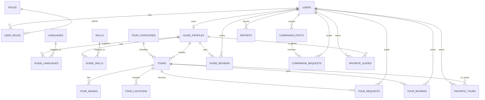

# PHÂN TÍCH VÀ THIẾT KẾ DỮ LIỆU CHO WEBSITE DU LỊCH KẾT NỐI HƯỚNG DẪN VIÊN, KHÁCH DU LỊCH VÀ NGƯỜI TÌM BẠN ĐỒNG HÀNH

## 1. Nhận xét về bản markdown hiện tại

Bản markdown trước đó **chưa hoàn toàn chuẩn** nếu mục tiêu là bám sát **schema final triển khai trên Supabase PostgreSQL**. Các điểm chưa thống nhất gồm:

- đang mô tả theo hướng **SQL Server** với các kiểu như `nvarchar`, `datetime2`, `bit`, `GETDATE()`; trong khi hệ thống triển khai trên **Supabase PostgreSQL**;
- đang dùng mô hình `USER(PasswordHash, ...)` như một bảng xác thực độc lập; trong khi với Supabase, phần xác thực phải đi qua **`auth.users`**, còn bảng nghiệp vụ là **`public.users`**;
- mới dừng ở **36 thực thể**, trong khi bản schema final để khớp gần như 100% với phạm vi màn hình quản trị cần **38 bảng**, bổ sung thêm:
  - `admin_activity_logs`
  - `user_role_change_logs`
- tên bảng, tên cột và miền giá trị trạng thái chưa đồng bộ hoàn toàn với bản schema final;
- phần mô tả bảng mới chi tiết tới nhóm lõi, còn nhóm bảng mở rộng chưa được diễn giải đầy đủ theo cùng một chuẩn.

Vì vậy, dưới đây là **bản markdown đã chỉnh sửa lại**, thống nhất theo các nguyên tắc:

1. bám sát schema final triển khai thực tế trên Supabase;
2. đồng bộ với phạm vi chức năng và màn hình của hệ thống;
3. dùng văn phong học thuật, phù hợp đưa vào báo cáo đồ án;
4. giữ cấu trúc đủ rõ để backend/frontend có thể đối chiếu nhanh.

---

## 2. Định hướng thiết kế dữ liệu

Thiết kế dữ liệu được xây dựng theo định hướng:

- đáp ứng đầy đủ các nhóm chức năng cốt lõi của hệ thống;
- hỗ trợ tốt cho phân quyền theo vai trò người dùng, hướng dẫn viên và quản trị viên;
- phù hợp với kiến trúc **Supabase Auth + PostgreSQL + RLS**;
- bảo đảm tính mở rộng cho các nhóm chức năng như chat, thông báo, AI chatbot, lưu trú, thanh toán và audit quản trị;
- hạn chế dư thừa dữ liệu, ưu tiên chuẩn hóa và tách rõ các quan hệ nhiều – nhiều bằng bảng liên kết.

Trong kiến trúc này:

- **`auth.users`** là nơi Supabase quản lý xác thực;
- **`public.users`** là bảng hồ sơ nghiệp vụ mở rộng của người dùng;
- các bảng còn lại phục vụ nghiệp vụ, kiểm duyệt, tương tác và quản trị hệ thống.

---

## 3. Mô tả các thực thể

Tổng thể mô hình gồm **38 bảng**, chia thành 5 nhóm chính.

### 3.1. Nhóm tài khoản, phân quyền và kiểm soát truy cập

1. **users**: Lưu hồ sơ nghiệp vụ mở rộng của người dùng trong hệ thống, tham chiếu tới `auth.users`.
2. **roles**: Lưu danh mục vai trò như `USER`, `GUIDE`, `SYSTEM_ADMIN`, `CONTENT_MODERATOR`, `SUPPORT_STAFF`.
3. **user_roles**: Liên kết giữa người dùng và vai trò, cho phép một tài khoản mang nhiều vai trò.
4. **user_role_change_logs**: Lưu lịch sử thay đổi vai trò quản trị và phân quyền, phục vụ truy vết.

### 3.2. Nhóm hồ sơ hướng dẫn viên

5. **guide_profiles**: Lưu hồ sơ nghề nghiệp của hướng dẫn viên.
6. **languages**: Danh mục ngôn ngữ.
7. **guide_languages**: Liên kết nhiều – nhiều giữa hướng dẫn viên và ngôn ngữ hỗ trợ.
8. **skills**: Danh mục kỹ năng.
9. **guide_skills**: Liên kết nhiều – nhiều giữa hướng dẫn viên và kỹ năng.
10. **guide_verification_requests**: Yêu cầu xác minh hồ sơ hướng dẫn viên.
11. **guide_verification_documents**: Tài liệu đi kèm yêu cầu xác minh.
12. **guide_availabilities**: Lịch rảnh hoặc lịch hoạt động của hướng dẫn viên.

### 3.3. Nhóm tour và khai thác tour

13. **tour_categories**: Danh mục loại tour.
14. **tours**: Thông tin tour do hướng dẫn viên tạo.
15. **tour_images**: Ảnh đại diện và bộ ảnh tour.
16. **tour_locations**: Địa điểm trong hành trình tour theo thứ tự.
17. **tour_requests**: Yêu cầu tham gia tour của người dùng.
18. **tour_reviews**: Đánh giá tour.
19. **guide_reviews**: Đánh giá hướng dẫn viên gắn với tour đã tham gia.

### 3.4. Nhóm bài tìm bạn đồng hành và tương tác cộng đồng

20. **companion_posts**: Bài đăng tìm bạn đồng hành.
21. **companion_requests**: Yêu cầu tham gia bài đồng hành.
22. **favorite_tours**: Tour yêu thích của người dùng.
23. **favorite_guides**: Hướng dẫn viên yêu thích của người dùng.
24. **reports**: Báo cáo vi phạm hoặc phản ánh.
25. **report_processing_history**: Lịch sử xử lý báo cáo.
26. **user_activity_logs**: Nhật ký hoạt động người dùng.
27. **user_preferences**: Hồ sơ sở thích du lịch.
28. **user_preferred_categories**: Liên kết người dùng với loại tour ưa thích.

### 3.5. Nhóm giao tiếp, AI, lưu trú, thanh toán và quản trị mở rộng

29. **conversations**: Cuộc trò chuyện trực tiếp hoặc chat nhóm.
30. **conversation_participants**: Danh sách thành viên cuộc trò chuyện.
31. **messages**: Tin nhắn trong cuộc trò chuyện.
32. **notifications**: Thông báo gửi cho người dùng.
33. **ai_chat_sessions**: Phiên làm việc với chatbot AI.
34. **ai_chat_messages**: Tin nhắn trong phiên chatbot AI.
35. **partner_accommodations**: Thông tin đối tác lưu trú.
36. **tour_accommodations**: Liên kết giữa tour và nơi lưu trú.
37. **payment_transactions**: Giao dịch thanh toán trực tuyến.
38. **admin_activity_logs**: Nhật ký hoạt động quản trị, phục vụ truy vết thao tác ở Admin Area.

---

## 4. ERD tổng quan

### 4.1. ERD lõi



### 4.2. ERD mở rộng

```mermaid
erDiagram
    REPORTS ||--o{ REPORT_PROCESSING_HISTORY : has
    USERS ||--o{ REPORT_PROCESSING_HISTORY : processes

    USERS ||--o{ USER_ACTIVITY_LOGS : creates
    USERS ||--o| USER_PREFERENCES : sets
    USERS ||--o{ USER_PREFERRED_CATEGORIES : prefers
    TOUR_CATEGORIES ||--o{ USER_PREFERRED_CATEGORIES : chosen

    CONVERSATIONS ||--o{ CONVERSATION_PARTICIPANTS : has
    USERS ||--o{ CONVERSATION_PARTICIPANTS : joins
    CONVERSATIONS ||--o{ MESSAGES : contains
    USERS ||--o{ MESSAGES : sends

    GUIDE_PROFILES ||--o{ GUIDE_VERIFICATION_REQUESTS : submits
    GUIDE_VERIFICATION_REQUESTS ||--o{ GUIDE_VERIFICATION_DOCUMENTS : includes
    GUIDE_PROFILES ||--o{ GUIDE_AVAILABILITIES : has

    USERS ||--o{ NOTIFICATIONS : receives

    USERS ||--o{ AI_CHAT_SESSIONS : opens
    AI_CHAT_SESSIONS ||--o{ AI_CHAT_MESSAGES : contains

    TOURS ||--o{ TOUR_ACCOMMODATIONS : uses
    PARTNER_ACCOMMODATIONS ||--o{ TOUR_ACCOMMODATIONS : linked

    TOUR_REQUESTS ||--o{ PAYMENT_TRANSACTIONS : pays
    USERS ||--o{ PAYMENT_TRANSACTIONS : makes

    USERS ||--o{ ADMIN_ACTIVITY_LOGS : performs
    USERS ||--o{ USER_ROLE_CHANGE_LOGS : changes_role_for
    ROLES ||--o{ USER_ROLE_CHANGE_LOGS : changed_role
```



---

## 5. Chuyển sang mô hình dữ liệu quan hệ

### 5.1. Nhóm tài khoản và phân quyền

```text
USERS(id, email, full_name, phone, avatar_url, date_of_birth, gender, status, created_at, updated_at, last_seen_at)
ROLES(role_code, description, created_at)
USER_ROLES(user_id, role_code, assigned_by, assigned_at)
USER_ROLE_CHANGE_LOGS(id, target_user_id, changed_role_code, action_type, changed_by_user_id, old_snapshot, new_snapshot, note, created_at)
```

### 5.2. Nhóm hướng dẫn viên

```text
GUIDE_PROFILES(id, user_id, bio, years_of_experience, working_area, avatar_url, verification_status, visibility_status, is_accepting_tours, is_deleted, deleted_at, created_at, updated_at)
LANGUAGES(id, name, is_active, created_at)
GUIDE_LANGUAGES(guide_profile_id, language_id)
SKILLS(id, name, is_active, created_at)
GUIDE_SKILLS(guide_profile_id, skill_id)
GUIDE_VERIFICATION_REQUESTS(id, guide_profile_id, submitted_at, status, submission_note, processed_by_user_id, processed_at, result_note, created_at, updated_at)
GUIDE_VERIFICATION_DOCUMENTS(id, verification_request_id, document_type, file_url, uploaded_at, status, note)
GUIDE_AVAILABILITIES(id, guide_profile_id, available_date, start_time, end_time, status, note, created_at, updated_at)
```

### 5.3. Nhóm tour

```text
TOUR_CATEGORIES(id, name, description, is_active, created_at)
TOURS(id, guide_profile_id, category_id, title, province, district, start_date, end_date, price, currency_code, max_participants, meet_point, meet_latitude, meet_longitude, description, participant_requirements, business_status, visibility_status, published_at, is_deleted, deleted_at, created_at, updated_at)
TOUR_IMAGES(id, tour_id, image_url, caption, sort_order, is_cover, created_at)
TOUR_LOCATIONS(id, tour_id, sequence_no, location_name, address, latitude, longitude, visit_time, notes, created_at)
TOUR_REQUESTS(id, tour_id, user_id, participant_count, note, response_note, status, requested_at, processed_at, processed_by_user_id, cancelled_at, created_at, updated_at)
TOUR_REVIEWS(id, tour_id, tour_request_id, user_id, rating, comment, visibility_status, created_at, updated_at)
GUIDE_REVIEWS(id, guide_profile_id, tour_id, tour_request_id, user_id, rating, comment, visibility_status, created_at, updated_at)
```

### 5.4. Nhóm bài đồng hành và tương tác

```text
COMPANION_POSTS(id, user_id, title, destination, start_date, end_date, estimated_cost, currency_code, expected_members, description, requirements, business_status, visibility_status, is_deleted, deleted_at, created_at, updated_at)
COMPANION_REQUESTS(id, post_id, user_id, message, response_note, status, requested_at, processed_at, processed_by_user_id, cancelled_at, created_at, updated_at)
FAVORITE_TOURS(user_id, tour_id, created_at)
FAVORITE_GUIDES(user_id, guide_profile_id, created_at)
REPORTS(id, reporter_user_id, target_type, tour_id, companion_post_id, reported_user_id, guide_profile_id, tour_review_id, guide_review_id, reason, description, status, assigned_to_user_id, processed_by_user_id, processed_at, resolution_note, created_at, updated_at)
REPORT_PROCESSING_HISTORY(id, report_id, action_by_user_id, action_type, old_status, new_status, note, created_at)
USER_ACTIVITY_LOGS(id, user_id, activity_type, entity_type, entity_id, metadata, created_at)
USER_PREFERENCES(user_id, budget_min, budget_max, preferred_trip_style, preferred_language_id, extra_preferences, updated_at)
USER_PREFERRED_CATEGORIES(user_id, category_id, created_at)
```

### 5.5. Nhóm mở rộng hệ thống

```text
CONVERSATIONS(id, conversation_type, title, created_by_user_id, related_tour_id, related_companion_post_id, created_at, updated_at)
CONVERSATION_PARTICIPANTS(conversation_id, user_id, joined_at, left_at, is_muted, last_read_at)
MESSAGES(id, conversation_id, sender_user_id, content, message_type, attachment_url, sent_at, edited_at, is_deleted, deleted_at)
NOTIFICATIONS(id, user_id, notification_type, title, content, entity_type, entity_id, payload, is_read, created_at, read_at)
AI_CHAT_SESSIONS(id, user_id, status, context, started_at, last_interaction_at)
AI_CHAT_MESSAGES(id, session_id, sender_type, content, model_name, token_usage, created_at)
PARTNER_ACCOMMODATIONS(id, name, accommodation_type, address, province, contact_phone, website_url, image_url, status, created_at, updated_at)
TOUR_ACCOMMODATIONS(tour_id, accommodation_id, check_in_date, check_out_date, notes, sort_order, created_at)
PAYMENT_TRANSACTIONS(id, tour_request_id, user_id, amount, currency_code, payment_method, status, transaction_code, provider_transaction_code, gateway_response, created_at, paid_at, expires_at)
ADMIN_ACTIVITY_LOGS(id, actor_user_id, actor_role_code, module_name, entity_type, entity_pk, action_type, reason, old_data, new_data, metadata, ip_address, user_agent, created_at)
```

---

## 6. Mô tả chi tiết các bảng

### 6.1. Bảng `users`

Bảng `users` lưu hồ sơ nghiệp vụ mở rộng của người dùng, tham chiếu trực tiếp tới `auth.users(id)`.

| Thuộc tính | Kiểu dữ liệu | Ràng buộc | Ghi chú |
|---|---|---|---|
| id | uuid | PK, FK, NOT NULL | Tham chiếu `auth.users(id)` |
| email | text | NOT NULL, UNIQUE INDEX theo `lower(email)` | Email người dùng |
| full_name | text | NULL | Họ tên |
| phone | text | NULL, UNIQUE có điều kiện | Số điện thoại |
| avatar_url | text | NULL | Ảnh đại diện |
| date_of_birth | date | NULL | Ngày sinh |
| gender | text | NULL, CHECK | `male`, `female`, `other` |
| status | text | NOT NULL, DEFAULT, CHECK | `active`, `suspended`, `locked` |
| created_at | timestamptz | NOT NULL, DEFAULT now() | Thời điểm tạo |
| updated_at | timestamptz | NOT NULL, DEFAULT now() | Thời điểm cập nhật |
| last_seen_at | timestamptz | NULL | Lần hoạt động gần nhất |

### 6.2. Bảng `roles`

Bảng `roles` lưu danh mục vai trò chuẩn của hệ thống.

| Thuộc tính | Kiểu dữ liệu | Ràng buộc | Ghi chú |
|---|---|---|---|
| role_code | text | PK, NOT NULL, CHECK | `USER`, `GUIDE`, `SYSTEM_ADMIN`, `CONTENT_MODERATOR`, `SUPPORT_STAFF` |
| description | text | NOT NULL | Mô tả vai trò |
| created_at | timestamptz | NOT NULL, DEFAULT now() | Thời điểm tạo |

### 6.3. Bảng `user_roles`

Bảng `user_roles` là bảng liên kết nhiều – nhiều giữa người dùng và vai trò.

| Thuộc tính | Kiểu dữ liệu | Ràng buộc | Ghi chú |
|---|---|---|---|
| user_id | uuid | PK, FK, NOT NULL | Người dùng |
| role_code | text | PK, FK, NOT NULL | Vai trò được gán |
| assigned_by | uuid | FK, NULL | Người thực hiện gán |
| assigned_at | timestamptz | NOT NULL, DEFAULT now() | Thời điểm gán |

### 6.4. Bảng `user_role_change_logs`

Bảng này phục vụ lịch sử thay đổi quyền quản trị.

| Thuộc tính | Kiểu dữ liệu | Ràng buộc |
|---|---|---|
| id | uuid | PK, NOT NULL |
| target_user_id | uuid | FK, NOT NULL |
| changed_role_code | text | FK, NOT NULL |
| action_type | text | NOT NULL, CHECK (`assign`, `revoke`) |
| changed_by_user_id | uuid | FK, NULL |
| old_snapshot | jsonb | NOT NULL |
| new_snapshot | jsonb | NOT NULL |
| note | text | NULL |
| created_at | timestamptz | NOT NULL, DEFAULT now() |

### 6.5. Bảng `guide_profiles`

| Thuộc tính | Kiểu dữ liệu | Ràng buộc |
|---|---|---|
| id | uuid | PK, NOT NULL |
| user_id | uuid | FK, UNIQUE, NOT NULL |
| bio | text | NULL |
| years_of_experience | integer | NOT NULL, DEFAULT 0, CHECK `>= 0` |
| working_area | text | NULL |
| avatar_url | text | NULL |
| verification_status | text | NOT NULL, CHECK |
| visibility_status | text | NOT NULL, CHECK |
| is_accepting_tours | boolean | NOT NULL, DEFAULT true |
| is_deleted | boolean | NOT NULL, DEFAULT false |
| deleted_at | timestamptz | NULL |
| created_at | timestamptz | NOT NULL |
| updated_at | timestamptz | NOT NULL |

### 6.6. Bảng `tours`

| Thuộc tính | Kiểu dữ liệu | Ràng buộc |
|---|---|---|
| id | uuid | PK, NOT NULL |
| guide_profile_id | uuid | FK, NOT NULL |
| category_id | bigint | FK, NULL |
| title | text | NOT NULL |
| province | text | NOT NULL |
| district | text | NULL |
| start_date | date | NOT NULL |
| end_date | date | NOT NULL, CHECK `end_date >= start_date` |
| price | numeric(12,2) | NOT NULL, CHECK `>= 0` |
| currency_code | char(3) | NOT NULL, DEFAULT `'VND'` |
| max_participants | integer | NOT NULL, CHECK `> 0` |
| meet_point | text | NULL |
| meet_latitude | numeric(9,6) | NULL |
| meet_longitude | numeric(9,6) | NULL |
| description | text | NULL |
| participant_requirements | text | NULL |
| business_status | text | NOT NULL, CHECK |
| visibility_status | text | NOT NULL, CHECK |
| published_at | timestamptz | NULL |
| is_deleted | boolean | NOT NULL, DEFAULT false |
| deleted_at | timestamptz | NULL |
| created_at | timestamptz | NOT NULL |
| updated_at | timestamptz | NOT NULL |

### 6.7. Bảng `tour_requests`

| Thuộc tính | Kiểu dữ liệu | Ràng buộc |
|---|---|---|
| id | uuid | PK, NOT NULL |
| tour_id | uuid | FK, NOT NULL |
| user_id | uuid | FK, NOT NULL |
| participant_count | integer | NOT NULL, CHECK `> 0` |
| note | text | NULL |
| response_note | text | NULL |
| status | text | NOT NULL, CHECK |
| requested_at | timestamptz | NOT NULL |
| processed_at | timestamptz | NULL |
| processed_by_user_id | uuid | FK, NULL |
| cancelled_at | timestamptz | NULL |
| created_at | timestamptz | NOT NULL |
| updated_at | timestamptz | NOT NULL |

### 6.8. Bảng `companion_posts`

| Thuộc tính | Kiểu dữ liệu | Ràng buộc |
|---|---|---|
| id | uuid | PK, NOT NULL |
| user_id | uuid | FK, NOT NULL |
| title | text | NOT NULL |
| destination | text | NOT NULL |
| start_date | date | NOT NULL |
| end_date | date | NOT NULL, CHECK `end_date >= start_date` |
| estimated_cost | numeric(12,2) | NULL, CHECK `>= 0` |
| currency_code | char(3) | NOT NULL, DEFAULT `'VND'` |
| expected_members | integer | NOT NULL, CHECK `> 0` |
| description | text | NULL |
| requirements | text | NULL |
| business_status | text | NOT NULL, CHECK |
| visibility_status | text | NOT NULL, CHECK |
| is_deleted | boolean | NOT NULL, DEFAULT false |
| deleted_at | timestamptz | NULL |
| created_at | timestamptz | NOT NULL |
| updated_at | timestamptz | NOT NULL |

### 6.9. Bảng `reports`

| Thuộc tính | Kiểu dữ liệu | Ràng buộc |
|---|---|---|
| id | uuid | PK, NOT NULL |
| reporter_user_id | uuid | FK, NOT NULL |
| target_type | text | NOT NULL, CHECK |
| tour_id | uuid | FK, NULL |
| companion_post_id | uuid | FK, NULL |
| reported_user_id | uuid | FK, NULL |
| guide_profile_id | uuid | FK, NULL |
| tour_review_id | uuid | FK, NULL |
| guide_review_id | uuid | FK, NULL |
| reason | text | NOT NULL |
| description | text | NULL |
| status | text | NOT NULL, CHECK |
| assigned_to_user_id | uuid | FK, NULL |
| processed_by_user_id | uuid | FK, NULL |
| processed_at | timestamptz | NULL |
| resolution_note | text | NULL |
| created_at | timestamptz | NOT NULL |
| updated_at | timestamptz | NOT NULL |

### 6.10. Bảng `admin_activity_logs`

Đây là bảng bổ sung quan trọng để hỗ trợ các màn hình quản trị như phân quyền, quản lý người dùng, kiểm duyệt và nhật ký hoạt động quản trị.

| Thuộc tính | Kiểu dữ liệu | Ràng buộc |
|---|---|---|
| id | uuid | PK, NOT NULL |
| actor_user_id | uuid | FK, NULL |
| actor_role_code | text | FK, NULL |
| module_name | text | NOT NULL, CHECK |
| entity_type | text | NOT NULL, CHECK |
| entity_pk | text | NULL |
| action_type | text | NOT NULL, CHECK |
| reason | text | NULL |
| old_data | jsonb | NOT NULL |
| new_data | jsonb | NOT NULL |
| metadata | jsonb | NOT NULL |
| ip_address | inet | NULL |
| user_agent | text | NULL |
| created_at | timestamptz | NOT NULL, DEFAULT now() |

> Các bảng còn lại như `tour_images`, `tour_locations`, `tour_reviews`, `guide_reviews`, `notifications`, `messages`, `payment_transactions`, `partner_accommodations`... được định nghĩa đầy đủ trong file SQL final đi kèm và có thể giữ ở phần phụ lục kỹ thuật nếu báo cáo cần tinh gọn.

---

## 7. Xác định khóa chính và khóa ngoại

### 7.1. Khóa chính

- `users`: `id`
- `roles`: `role_code`
- `user_roles`: `(user_id, role_code)`
- `user_role_change_logs`: `id`
- `guide_profiles`: `id`
- `languages`: `id`
- `guide_languages`: `(guide_profile_id, language_id)`
- `skills`: `id`
- `guide_skills`: `(guide_profile_id, skill_id)`
- `guide_verification_requests`: `id`
- `guide_verification_documents`: `id`
- `guide_availabilities`: `id`
- `tour_categories`: `id`
- `tours`: `id`
- `tour_images`: `id`
- `tour_locations`: `id`
- `tour_requests`: `id`
- `tour_reviews`: `id`
- `guide_reviews`: `id`
- `companion_posts`: `id`
- `companion_requests`: `id`
- `favorite_tours`: `(user_id, tour_id)`
- `favorite_guides`: `(user_id, guide_profile_id)`
- `reports`: `id`
- `report_processing_history`: `id`
- `user_activity_logs`: `id`
- `user_preferences`: `user_id`
- `user_preferred_categories`: `(user_id, category_id)`
- `conversations`: `id`
- `conversation_participants`: `(conversation_id, user_id)`
- `messages`: `id`
- `notifications`: `id`
- `ai_chat_sessions`: `id`
- `ai_chat_messages`: `id`
- `partner_accommodations`: `id`
- `tour_accommodations`: `(tour_id, accommodation_id)`
- `payment_transactions`: `id`
- `admin_activity_logs`: `id`

### 7.2. Khóa ngoại tiêu biểu

- `users.id -> auth.users.id`
- `user_roles.user_id -> users.id`
- `user_roles.role_code -> roles.role_code`
- `guide_profiles.user_id -> users.id`
- `guide_languages.guide_profile_id -> guide_profiles.id`
- `guide_skills.guide_profile_id -> guide_profiles.id`
- `tours.guide_profile_id -> guide_profiles.id`
- `tours.category_id -> tour_categories.id`
- `tour_requests.tour_id -> tours.id`
- `tour_requests.user_id -> users.id`
- `companion_posts.user_id -> users.id`
- `companion_requests.post_id -> companion_posts.id`
- `reports.reporter_user_id -> users.id`
- `reports.assigned_to_user_id -> users.id`
- `notifications.user_id -> users.id`
- `messages.conversation_id -> conversations.id`
- `payment_transactions.tour_request_id -> tour_requests.id`
- `admin_activity_logs.actor_user_id -> users.id`
- `user_role_change_logs.target_user_id -> users.id`

---

## 8. Dạng chuẩn của mô hình dữ liệu

Mô hình dữ liệu đạt chuẩn **3NF** ở phần lõi vì:

- các bảng đều có thuộc tính nguyên tố, không chứa nhóm lặp;
- các thuộc tính không khóa phụ thuộc đầy đủ vào khóa chính;
- thông tin danh mục như vai trò, kỹ năng, ngôn ngữ, loại tour được tách riêng để tránh dư thừa;
- các quan hệ nhiều – nhiều được chuẩn hóa qua bảng liên kết như `user_roles`, `guide_languages`, `guide_skills`, `favorite_tours`, `favorite_guides`, `user_preferred_categories`, `conversation_participants`, `tour_accommodations`.

---

## 9. Ràng buộc toàn vẹn dữ liệu

### 9.1. Toàn vẹn thực thể

- Mỗi bảng phải có khóa chính duy nhất và không rỗng.
- Một người dùng chỉ có tối đa một hồ sơ hướng dẫn viên.
- Một người dùng chỉ có một cấu hình sở thích du lịch.

### 9.2. Toàn vẹn tham chiếu

- Không thể tạo hồ sơ hướng dẫn viên nếu người dùng không tồn tại.
- Không thể tạo tour nếu hồ sơ hướng dẫn viên không tồn tại.
- Không thể tạo yêu cầu tham gia tour nếu tour hoặc người dùng không tồn tại.
- Không thể tạo yêu cầu tham gia bài đồng hành nếu bài đăng hoặc người dùng không tồn tại.
- Không thể tạo giao dịch thanh toán nếu yêu cầu tham gia tour không tồn tại.

### 9.3. Toàn vẹn miền giá trị

- `years_of_experience >= 0`
- `price >= 0`
- `estimated_cost >= 0`
- `amount >= 0`
- `max_participants > 0`
- `expected_members > 0`
- `participant_count > 0`
- `rating between 1 and 5`
- `latitude between -90 and 90`
- `longitude between -180 and 180`
- `end_date >= start_date`
- `end_time > start_time`

### 9.4. Toàn vẹn duy nhất

- Email người dùng là duy nhất.
- Số điện thoại là duy nhất nếu có nhập.
- Tên kỹ năng, ngôn ngữ, loại tour là duy nhất.
- Mỗi tour chỉ có tối đa một ảnh cover.
- `(tour_id, sequence_no)` trong `tour_locations` là duy nhất.
- `(tour_id, user_id)` với yêu cầu tour đang hoạt động cần được kiểm soát.
- `(post_id, user_id)` với yêu cầu bài đồng hành đang hoạt động cần được kiểm soát.
- `(user_id, tour_id)` ở `favorite_tours` là duy nhất.
- `(user_id, guide_profile_id)` ở `favorite_guides` là duy nhất.

### 9.5. Toàn vẹn nghiệp vụ

- Hướng dẫn viên không được gửi yêu cầu tham gia chính tour của mình.
- Chủ bài đồng hành không được gửi yêu cầu tham gia chính bài của mình.
- Chỉ người dùng đủ điều kiện sau tour mới được đánh giá tour và hướng dẫn viên.
- Tổng số người được duyệt vào tour không được vượt quá `max_participants`.
- Tổng số người được duyệt vào bài đồng hành không được vượt quá `expected_members`.
- Trạng thái nghiệp vụ và trạng thái hiển thị phải tách biệt để phục vụ kiểm duyệt.

---

## 10. Kết luận

Mô hình dữ liệu cuối cùng gồm **38 bảng**, được tổ chức theo hướng vừa đủ sâu để triển khai thực tế trên Supabase, vừa đủ rõ để dùng trong báo cáo đồ án.

Thiết kế này có các ưu điểm:

- bám sát chức năng nghiệp vụ của hệ thống;
- phù hợp với kiến trúc **Supabase Auth + PostgreSQL + RLS**;
- hỗ trợ được cả phần lõi, phần mở rộng và phần quản trị nâng cao;
- đủ khả năng mở rộng sang chat, AI chatbot, notification, lưu trú, thanh toán và audit quản trị;
- tạo nền tảng thuận lợi cho backend, frontend và tài liệu phân tích thiết kế hệ thống.

Nếu cần tinh gọn báo cáo bản chính, nhóm có thể:
- giữ phần mô tả chi tiết cho các bảng lõi;
- đưa các bảng mở rộng và audit vào phụ lục kỹ thuật;
- đính kèm file SQL final như phụ lục triển khai.
