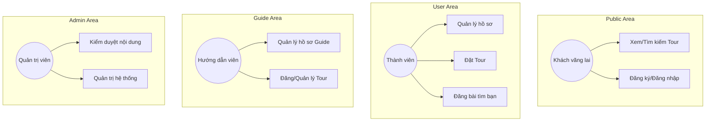

# SPRINT 01 DOCS – Nền tảng kỹ thuật & Kiến trúc tổng thể

Tài liệu này xác lập các quy chuẩn kỹ thuật và cấu trúc nền móng cho dự án TravelConnectVN, phục vụ việc phát triển đồng bộ trong 14 sprint.

---

## 1. Kiến trúc hệ thống (System Architecture)

Hệ thống được xây dựng theo mô hình **Full-stack decoupled**:
- **Frontend:** ReactJS (Vite) + TypeScript. Tổ chức theo mô hình Area-based Routing.
- **Backend:** NestJS (Modular Monolith) + TypeScript.
- **Database:** PostgreSQL (Supabase) + Prisma ORM.
- **Auth:** Supabase Auth (GoTrue).

### Cấu trúc 4 Area chức năng
Toàn bộ hệ thống được chia thành 4 khu vực độc lập về Layout và Route:
1.  **Public Area:** Dành cho khách vãng lai (Trang chủ, Tìm kiếm Tour, Xem bài đồng hành, Đăng ký/Đăng nhập).
2.  **User Area:** Dành cho người dùng cá nhân (Quản lý hồ sơ, Yêu cầu tham gia tour, Bài đăng của tôi).
3.  **Guide Area:** Dành cho Hướng dẫn viên (Quản lý tour, Lịch trình, Yêu cầu của khách).
4.  **Admin Area:** Dành cho Quản trị viên (Kiểm duyệt, Thống kê, Quản lý người dùng).

---

## 2. Quy chuẩn đặt tên (Naming Conventions)

### 2.1. Database
- **Table names:** `snake_case` (số nhiều), ví dụ: `users`, `tours`.
- **Column names:** `snake_case`, ví dụ: `full_name`, `created_at`.
- **Primary keys:** `id` (UUID hoặc Serial).

### 2.2. Backend (NestJS)
- **Files:** `kebab-case`, ví dụ: `auth.controller.ts`, `users.service.ts`.
- **Classes:** `PascalCase`, ví dụ: `ToursController`.
- **Variables/Methods:** `camelCase`.
- **DTOs:** Hậu tố `Dto`, ví dụ: `CreateTourDto`.

### 2.3. Frontend (React)
- **Components:** `PascalCase`, ví dụ: `Button.tsx`.
- **Folders:** `PascalCase` (cho component) hoặc `kebab-case` (cho modules).
- **Hooks:** Tiền tố `use`, ví dụ: `useAuth`.

---

## 3. Sơ đồ Use Case tổng quát (Global Use Case)

---

## 4. Baseline Schema (38 Bảng)
Dự án đã chốt và import thành công schema 38 bảng vào Supabase Public Schema. 
Các bảng lõi đã được kiểm tra: `users`, `roles`, `user_roles`, `languages`, `skills`.

---

## 5. Danh mục chức năng & Màn hình
- Tổng số chức năng: **29** (F01 - F29).
- Tổng số màn hình: **47** (M01 - M47).
Chi tiết tham chiếu tại `TRAVEL_PROJECT_MASTER_SPEC_v3_FINAL.md`.
