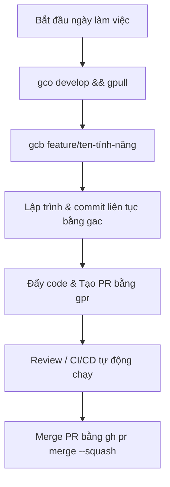

# 🚀 QUY TRÌNH LÀM VIỆC GIT HIỆU SUẤT CAO (DỰ ÁN TRAVELCONNECTVN)

> Tài liệu hướng dẫn sử dụng phím tắt (Aliases) và GitHub CLI để tối ưu hóa quy trình làm việc Git, nâng cao năng suất và giữ lịch sử repo sạch sẽ.

---

## 1. BẢNG TRA CỨU PHÍM TẮT (ALIASES)

Các phím tắt đã được cấu hình trong `~/.zshrc` để thay thế cho các lệnh Git dài dòng:

| Phím tắt | Lệnh Git đầy đủ | Ý nghĩa |
| :--- | :--- | :--- |
| `gs` | `git status` | Kiểm tra trạng thái các file (đã stage, chưa stage). |
| `gd` | `git diff` | Xem chi tiết các thay đổi trong code. |
| `gco` | `git checkout` | Chuyển đổi giữa các nhánh. |
| `gcb` | `git checkout -b` | Tạo và chuyển sang một nhánh mới. |
| `gpull` | `git pull origin develop` | Kéo code mới nhất từ nhánh develop trên GitHub về. |
| `gpush` | `git push` | Đẩy commit lên nhánh hiện tại ở remote. |

---

## 2. CÁC HÀM TỰ ĐỘNG HÓA NHANH

### 2.1. Lưu nhanh (Micro-commit) với `gac`
Thay vì gõ nhiều bước `git add` và `git commit`, hãy sử dụng:
```bash
gac "loại(scope): nội dung commit"
```
*Ví dụ:* `gac "style(frontend): chỉnh sửa màu sắc nút thanh toán"`
*(Hàm này sẽ tự động chạy `git add .` và tạo commit với tin nhắn bạn nhập).*

### 2.2. Đẩy code & Tạo Pull Request tự động với `gpr`
Khi đã hoàn thành tính năng trên nhánh cá nhân, bạn không cần vào web GitHub để tạo PR:
```bash
gpr "feat: thêm trang quản lý lịch trình"
```
*(Hàm này sẽ tự động đẩy nhánh hiện tại lên GitHub và tạo luôn một Pull Request gộp vào nhánh `develop`).*

---

## 3. WORKFLOW THỰC TẾ HẰNG NGÀY

Quy trình làm việc chuẩn từ bây giờ của bạn sẽ trở nên vô cùng ngắn gọn:



### Bước 1: Khởi đầu công việc
Đảm bảo bạn luôn có code mới nhất từ `develop` và tạo nhánh riêng:
```bash
gco develop && gpull
gcb feature/user-profile
```

### Bước 2: Viết code & Lưu nhỏ liên tục (Micro-commits)
Nên commit thường xuyên sau khi hoàn thành mỗi bước nhỏ để tránh mất mát code và dễ debug:
```bash
gac "feat(frontend): tạo giao diện form thông tin cá nhân"
# ... code tiếp ...
gac "fix(frontend): sửa lỗi responsive nút cập nhật"
```

### Bước 3: Tạo Pull Request cực nhanh
```bash
gpr "feat: hoàn thiện giao diện thông tin cá nhân"
```

### Bước 4: Squash and Merge
Để lịch sử nhánh `develop` luôn gọn gàng (gộp nhiều commit nhỏ của bạn thành 1 commit sạch duy nhất):
```bash
gh pr merge --squash
```

---

## 4. LƯU Ý QUAN TRỌNG
* **Luôn duyệt PR vào `develop`**: Tuyệt đối không tạo PR thẳng vào nhánh `main`.
* **Kích hoạt phím tắt mới**: Nếu mở terminal cũ mà lệnh chưa nhận, hãy chạy:
  ```bash
  source ~/.zshrc
  ```
